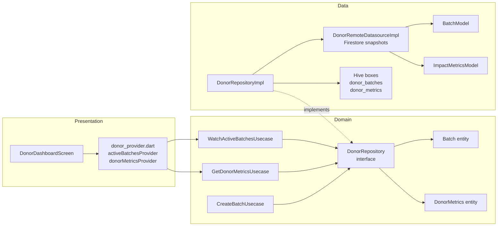

# SPEC-0002: Donor Dashboard — real-time batch tracking and impact metrics

**Status:** APPROVED
**Author:** Kim Taeman
**Date:** 2026-05-23
**Proposal:** [PROP-0002](../tech-proposals/0002-donor-dashboard.md)
**Approved by:** Kim Taeman

---

## Overview

The donor dashboard is the post-login home screen for users with `UserRole.donor`. It surfaces two live data feeds — a list of the donor's active (non-closed) batches and a summary of their cumulative impact metrics — backed by Firestore real-time listeners with a Hive write-through cache for instant render on reconnect or cold start. This spec closes all stub gaps in the donor feature slice: the `DonorRepository` interface, all three use cases, the remote datasource contract, the repository implementation, two Riverpod `StreamProvider`s, the router sub-routes, and the `DonorDashboardScreen` layout.

---

## Architecture



**Layer constraints:**

- `domain/` — zero Flutter or Firebase imports. Pure Dart only. `DonorRepository`, all use cases, `Batch`, and `DonorMetrics` live here.
- `data/` — may import `cloud_firestore`, `hive_flutter`, `BatchModel`, `ImpactMetricsModel`. Must not be imported by `presentation/` directly.
- `presentation/` — may import `flutter`, `flutter_riverpod`, `go_router`, and domain entities/use cases. Must not import `data/` or Firestore directly.

---

## File map

| Action | Path | Responsibility |
|---|---|---|
| **Create** | `lib/features/donor/domain/entities/donor_metrics.dart` | `DonorMetrics` pure Dart entity + `empty` factory |
| **Modify** | `lib/features/donor/domain/repositories/donor_repository.dart` | Add three method signatures to the abstract class |
| **Modify** | `lib/features/donor/domain/usecases/create_batch_usecase.dart` | Add `call(Batch batch)` method |
| **Modify** | `lib/features/donor/domain/usecases/get_donor_metrics_usecase.dart` | Add `call(String donorId)` method returning `Stream<DonorMetrics>` |
| **Create** | `lib/features/donor/domain/usecases/watch_active_batches_usecase.dart` | New use case returning `Stream<List<Batch>>` |
| **Modify** | `lib/features/donor/data/datasources/donor_remote_datasource.dart` | Add three method signatures to abstract class and stub impl |
| **Modify** | `lib/features/donor/data/repositories/donor_repository_impl.dart` | Implement all three interface methods with Firestore + Hive logic |
| **Modify** | `lib/features/donor/presentation/providers/donor_provider.dart` | Add `activeBatchesProvider`, `donorMetricsProvider`, repository provider, datasource provider, use case providers |
| **Modify** | `lib/features/donor/presentation/screens/donor_dashboard_screen.dart` | Full `ConsumerWidget` implementation |
| **Modify** | `lib/features/donor/presentation/screens/log_batch_screen.dart` | Accept `batchId` constructor param; scaffold only (full form out of scope) |
| **Modify** | `lib/features/donor/presentation/screens/batch_qr_screen.dart` | Accept `batchId` constructor param; scaffold only (QR display out of scope) |
| **Create** | `lib/features/donor/presentation/widgets/donor_bottom_nav.dart` | `DonorBottomNav` — 4-tab `NavigationBar`: Home, Impact, Batches, Account |
| **Modify** | `lib/app/router.dart` | Add `/donor/log`, `/donor/batch/:batchId/qr`, `/donor/impact`, `/donor/batches` sub-routes under `/donor` |
| **No change** | `lib/features/donor/domain/entities/batch.dart` | Already correct — do not modify |
| **No change** | `lib/core/models/batch_model.dart` | Already correct — do not modify |
| **No change** | `lib/core/models/impact_metrics_model.dart` | Already correct — do not modify |
| **No change** | `lib/core/constants/firestore_constants.dart` | Already correct — do not modify |

---

## API contracts

All interfaces below are the exact Dart signatures the engineer must implement. No pseudocode.

### 1. New domain entity — `DonorMetrics`

```dart
// lib/features/donor/domain/entities/donor_metrics.dart
// Pure Dart entity — no Flutter or backend imports.

class DonorMetrics {
  const DonorMetrics({
    required this.donorId,
    required this.totalKg,
    required this.totalMeals,
    required this.totalCO2e,
    required this.totalDeliveries,
  });

  final String donorId;
  final double totalKg;
  final int totalMeals;
  final double totalCO2e;
  final int totalDeliveries;

  static const empty = DonorMetrics(
    donorId: '',
    totalKg: 0.0,
    totalMeals: 0,
    totalCO2e: 0.0,
    totalDeliveries: 0,
  );
}
```

`DonorMetrics.empty` is the value emitted from the Hive seed path when no cached metrics exist for a donorId. It ensures the metrics card always renders zeros rather than a missing-data error.

`DonorMetrics` maps 1-to-1 from `ImpactMetricsModel`: `ImpactMetricsModel.id` → `DonorMetrics.donorId`, all other fields are name-identical.

---

### 2. Updated `DonorRepository` interface

```dart
// lib/features/donor/domain/repositories/donor_repository.dart
// Pure Dart interface — no Flutter or backend imports.
import 'package:saveameal/features/donor/domain/entities/batch.dart';
import 'package:saveameal/features/donor/domain/entities/donor_metrics.dart';

abstract class DonorRepository {
  /// Emits the donor's active batches (status != closed) in real time.
  /// First emission comes from Hive cache; subsequent emissions from Firestore.
  Stream<List<Batch>> watchActiveBatches(String donorId);

  /// Emits the donor's cumulative impact metrics in real time.
  /// First emission comes from Hive cache (or DonorMetrics.empty if cold).
  Stream<DonorMetrics> watchMetrics(String donorId);

  /// Writes a new batch document to Firestore.
  Future<void> createBatch(Batch batch);
}
```

---

### 3. Updated use cases

#### `CreateBatchUsecase`

```dart
// lib/features/donor/domain/usecases/create_batch_usecase.dart
// Pure Dart use case — no Flutter or backend imports.
import 'package:saveameal/features/donor/domain/entities/batch.dart';
import 'package:saveameal/features/donor/domain/repositories/donor_repository.dart';

class CreateBatchUsecase {
  const CreateBatchUsecase(this._repository);

  final DonorRepository _repository;

  Future<void> call(Batch batch) => _repository.createBatch(batch);
}
```

#### `GetDonorMetricsUsecase`

The file name stays `get_donor_metrics_usecase.dart` (no rename). The method semantics are "watch" (stream), not "get" (one-shot future) — this is intentional and documented by the return type.

```dart
// lib/features/donor/domain/usecases/get_donor_metrics_usecase.dart
// Pure Dart use case — no Flutter or backend imports.
import 'package:saveameal/features/donor/domain/entities/donor_metrics.dart';
import 'package:saveameal/features/donor/domain/repositories/donor_repository.dart';

class GetDonorMetricsUsecase {
  const GetDonorMetricsUsecase(this._repository);

  final DonorRepository _repository;

  Stream<DonorMetrics> call(String donorId) =>
      _repository.watchMetrics(donorId);
}
```

#### `WatchActiveBatchesUsecase` (new)

```dart
// lib/features/donor/domain/usecases/watch_active_batches_usecase.dart
// Pure Dart use case — no Flutter or backend imports.
import 'package:saveameal/features/donor/domain/entities/batch.dart';
import 'package:saveameal/features/donor/domain/repositories/donor_repository.dart';

class WatchActiveBatchesUsecase {
  const WatchActiveBatchesUsecase(this._repository);

  final DonorRepository _repository;

  Stream<List<Batch>> call(String donorId) =>
      _repository.watchActiveBatches(donorId);
}
```

---

### 4. Updated `DonorRemoteDatasource`

```dart
// lib/features/donor/data/datasources/donor_remote_datasource.dart
import 'package:saveameal/core/models/batch_model.dart';
import 'package:saveameal/core/models/impact_metrics_model.dart';

abstract class DonorRemoteDatasource {
  /// Firestore snapshots() on batches where donorId == donorId
  /// and status is not 'closed', ordered by createdAt descending.
  /// Requires a composite Firestore index on (donorId ASC, createdAt DESC).
  Stream<List<BatchModel>> watchActiveBatches(String donorId);

  /// Firestore snapshots() on impactMetrics/{donorId}.
  Stream<ImpactMetricsModel> watchMetrics(String donorId);

  /// Writes a new batch document to Firestore using batch.id as the doc ID.
  Future<void> createBatch(BatchModel batch);
}

class DonorRemoteDatasourceImpl implements DonorRemoteDatasource {
  const DonorRemoteDatasourceImpl(this._firestore);

  // FirebaseFirestore injected — no direct import of firebase_core in domain.
  final dynamic _firestore; // concrete type: FirebaseFirestore

  @override
  Stream<List<BatchModel>> watchActiveBatches(String donorId) {
    // Implementation: FirestoreConstants.batches collection,
    // where('donorId', isEqualTo: donorId),
    // where('status', whereNotIn: ['closed']),
    // orderBy('createdAt', descending: true),
    // .snapshots()
    // .map((qs) => qs.docs.map((d) => BatchModel.fromJson(d.data())).toList())
    throw UnimplementedError();
  }

  @override
  Stream<ImpactMetricsModel> watchMetrics(String donorId) {
    // Implementation: FirestoreConstants.impactMetrics collection,
    // doc(donorId).snapshots()
    // .map((ds) => ds.exists
    //     ? ImpactMetricsModel.fromJson(ds.data()!..['id'] = donorId)
    //     : ImpactMetricsModel(id: donorId))
    throw UnimplementedError();
  }

  @override
  Future<void> createBatch(BatchModel batch) {
    // Implementation: FirestoreConstants.batches collection,
    // doc(batch.id).set(batch.toJson())
    throw UnimplementedError();
  }
}
```

Note on `watchMetrics`: when the `impactMetrics/{donorId}` document does not exist yet (donor has never completed a delivery), the datasource emits `ImpactMetricsModel(id: donorId)` with all numeric fields at their `@Default` values (0 / 0.0). This keeps the metrics stream always-emitting and prevents the UI from hanging in a loading state.

---

### 5. `DonorRepositoryImpl` — Hive caching strategy

Box names are untyped (no `TypeAdapter`). Keys and value shapes:

| Box name | Key | Value type | Value content |
|---|---|---|---|
| `'donor_batches'` | `donorId` (String) | `List<Map<String, dynamic>>` | `BatchModel.toJson()` for each active batch |
| `'donor_metrics'` | `donorId` (String) | `Map<String, dynamic>` | `ImpactMetricsModel.toJson()` |

Both boxes must be opened during app startup (or lazily before first read — the implementation may choose either, but must guarantee they are open before `watchActiveBatches` or `watchMetrics` is called).

```dart
// lib/features/donor/data/repositories/donor_repository_impl.dart
import 'package:hive_flutter/hive_flutter.dart';
import 'package:saveameal/core/models/batch_model.dart';
import 'package:saveameal/core/models/impact_metrics_model.dart';
import 'package:saveameal/features/donor/data/datasources/donor_remote_datasource.dart';
import 'package:saveameal/features/donor/domain/entities/batch.dart';
import 'package:saveameal/features/donor/domain/entities/donor_metrics.dart';
import 'package:saveameal/features/donor/domain/repositories/donor_repository.dart';

class DonorRepositoryImpl implements DonorRepository {
  const DonorRepositoryImpl(this._datasource);

  final DonorRemoteDatasource _datasource;

  static const _batchesBox = 'donor_batches';
  static const _metricsBox = 'donor_metrics';

  @override
  Stream<List<Batch>> watchActiveBatches(String donorId);
  // Contract:
  // 1. Seed: read Hive box _batchesBox key donorId.
  //    If present, yield List<Batch> mapped from cached JSON immediately
  //    via Stream.value or a StreamController before yielding Firestore events.
  // 2. Merge: listen to _datasource.watchActiveBatches(donorId).
  //    On each emission: write through to Hive (box.put(donorId, models.map((m)=>m.toJson()).toList())).
  //    Yield List<Batch> mapped from models using _batchModelToBatch(model).
  // Mapper _batchModelToBatch must convert BatchModel → Batch field-by-field.
  // BatchStatus enum names are identical in both types — use BatchStatus.values.byName(model.status.name).

  @override
  Stream<DonorMetrics> watchMetrics(String donorId);
  // Contract:
  // 1. Seed: read Hive box _metricsBox key donorId.
  //    If present, yield DonorMetrics from ImpactMetricsModel.fromJson(cached).
  //    If absent, yield DonorMetrics.empty.
  // 2. Merge: listen to _datasource.watchMetrics(donorId).
  //    On each emission: write through to Hive (box.put(donorId, model.toJson())).
  //    Yield DonorMetrics mapped from model.

  @override
  Future<void> createBatch(Batch batch);
  // Contract:
  // Convert Batch → BatchModel field-by-field.
  // Call _datasource.createBatch(batchModel).
  // Do NOT write to Hive here — the watchActiveBatches stream will pick up the
  // new document on the next Firestore snapshot and write through automatically.
}
```

**Seed-then-live stream pattern** — the implementation must use a `StreamController` (or `rxdart`'s `startWith`) to ensure the Hive-seeded value is emitted synchronously before the first async Firestore event. The controller must be closed when the Riverpod provider is disposed. `rxdart` is not currently in `pubspec.yaml`; the engineer may use a plain `StreamController` + `addStream` pattern without adding a new dependency.

---

### 6. Riverpod providers

All providers use `@riverpod` codegen. File: `lib/features/donor/presentation/providers/donor_provider.dart`.

```dart
// lib/features/donor/presentation/providers/donor_provider.dart
import 'package:riverpod_annotation/riverpod_annotation.dart';
import 'package:saveameal/features/donor/data/datasources/donor_remote_datasource.dart';
import 'package:saveameal/features/donor/data/repositories/donor_repository_impl.dart';
import 'package:saveameal/features/donor/domain/entities/batch.dart';
import 'package:saveameal/features/donor/domain/entities/donor_metrics.dart';
import 'package:saveameal/features/donor/domain/repositories/donor_repository.dart';
import 'package:saveameal/features/donor/domain/usecases/get_donor_metrics_usecase.dart';
import 'package:saveameal/features/donor/domain/usecases/watch_active_batches_usecase.dart';

part 'donor_provider.g.dart';

@riverpod
DonorRemoteDatasource donorRemoteDatasource(Ref ref);
// Implementation must inject FirebaseFirestore from a service provider
// (pattern mirrors authDatasourceProvider in auth_provider.dart).

@riverpod
DonorRepository donorRepository(Ref ref) =>
    DonorRepositoryImpl(ref.watch(donorRemoteDatasourceProvider));

@riverpod
WatchActiveBatchesUsecase watchActiveBatchesUsecase(Ref ref) =>
    WatchActiveBatchesUsecase(ref.watch(donorRepositoryProvider));

@riverpod
GetDonorMetricsUsecase getDonorMetricsUsecase(Ref ref) =>
    GetDonorMetricsUsecase(ref.watch(donorRepositoryProvider));

@riverpod
Stream<List<Batch>> activeBatches(Ref ref, String donorId) =>
    ref.watch(watchActiveBatchesUsecaseProvider).call(donorId);

@riverpod
Stream<DonorMetrics> donorMetrics(Ref ref, String donorId) =>
    ref.watch(getDonorMetricsUsecaseProvider).call(donorId);
```

`activeBatchesProvider` and `donorMetricsProvider` are family providers (they take `donorId` as a parameter). Riverpod codegen generates `activeBatchesProvider(donorId)` and `donorMetricsProvider(donorId)` automatically from the function signature.

---

### 7. Router changes

The `/donor` route becomes a `ShellRoute` with sub-routes. The existing flat `GoRoute(path: '/donor')` is replaced as follows:

```dart
// lib/app/router.dart — replace the existing flat /donor GoRoute with:
GoRoute(
  path: '/donor',
  builder: (context, state) => const DonorDashboardScreen(),
  routes: [
    GoRoute(
      path: 'log',
      // full path: /donor/log
      builder: (context, state) => const LogBatchScreen(),
    ),
    GoRoute(
      path: 'batch/:batchId/qr',
      // full path: /donor/batch/:batchId/qr
      builder: (context, state) => BatchQrScreen(
        batchId: state.pathParameters['batchId']!,
      ),
    ),
    GoRoute(
      path: 'impact',
      // full path: /donor/impact — stub screen (out of scope)
      builder: (context, state) => const Scaffold(body: Center(child: Text('Impact'))),
    ),
    GoRoute(
      path: 'batches',
      // full path: /donor/batches — stub screen (out of scope)
      builder: (context, state) => const Scaffold(body: Center(child: Text('All Batches'))),
    ),
    GoRoute(
      path: 'account',
      // full path: /donor/account — stub screen (out of scope)
      builder: (context, state) => const Scaffold(body: Center(child: Text('Account'))),
    ),
  ],
),
```

`LogBatchScreen` and `BatchQrScreen` constructors must accept the parameters shown. `BatchQrScreen` must add `final String batchId` to its constructor. `LogBatchScreen` needs no additional constructor parameters for this spec (form fields are out of scope).

---

### 8. `DonorDashboardScreen` layout contract

> **Design reference:** `Donor Dashboard (Cleaned Batch View).png` in the project root and Figma file `LIdE6qDQzKpV3L5bAbO24w`. All layout decisions below are grounded in the Figma design.

`DonorDashboardScreen` is a `ConsumerWidget`. It reads the current user from `authStateProvider`:

```dart
final user = ref.watch(authStateProvider).valueOrNull;
final donorId = user?.uid ?? '';
```

If `donorId` is empty the widget renders `CircularProgressIndicator` centered (auth not yet resolved).

The widget watches both family providers using `donorId`. It renders one of three UI states:

**State 1 — Loading (Hive cold + no Firestore emission yet):**
Both providers are `AsyncLoading` and no data has been emitted. Render `CircularProgressIndicator` centered inside the `Scaffold` body.

**State 2 — Error with cache available:**
Either provider is `AsyncError` after having emitted at least one value (offline scenario). Render the loaded layout (State 3) with a thin `Container` pinned at the top of the body column, using `AppColors.warning` background and `AppColors.onWarning` text: `"You are offline. Showing last known data."`.

**State 3 — Loaded:**

```
Scaffold
  backgroundColor: ColorScheme.surface  [light green-tinted bg from AppTheme]
  body: SafeArea
    Column
      ─── _DashboardHeader (logo row + notification bell)
      ─── Expanded
            SingleChildScrollView
              Column
                ─── _WelcomeSection(orgName: user.orgName ?? user.name)
                ─── _TotalDonatedCard(metrics: DonorMetrics)
                ─── _LogBatchButton
                ─── _RecentDonationsSection(batches: batches)
  bottomNavigationBar: DonorBottomNav(currentIndex: 0)
```

**`_DashboardHeader` sub-widget contract:**
- Full-width `Row` with `mainAxisAlignment: spaceBetween`.
- Left: `Row` with `Icon(Icons.location_on, color: cs.primary)` + `Text('SaveAMeal', style: textTheme.titleLarge)`.
- Right: `IconButton(icon: Icon(Icons.notifications_outlined), onPressed: null)` (notifications out of scope — disabled for now).
- Padding: `EdgeInsets.symmetric(horizontal: Spacing.md, vertical: Spacing.sm)`.
- No hardcoded colors.

**`_WelcomeSection` sub-widget contract:**
- Accepts `String orgName` as a named parameter.
- `Column(crossAxisAlignment: CrossAxisAlignment.start)` with:
  - `Text('Welcome back, $orgName', style: textTheme.headlineMedium)` — bold.
  - `Text('Here is your impact summary for this month.', style: textTheme.bodyMedium)`.
- Padding: `EdgeInsets.symmetric(horizontal: Spacing.md)`, vertical gap `Spacing.xs` between lines.

**`_TotalDonatedCard` sub-widget contract:**
- Accepts `DonorMetrics metrics` as a named parameter.
- White `Card` with rounded corners (`BorderRadius.circular(16)`) and a 4px top border in `cs.primary`.
- Margin: `EdgeInsets.all(Spacing.md)`. Internal padding: `EdgeInsets.all(Spacing.md)`.
- Left side `Column`:
  - `Text('TOTAL DONATED', style: textTheme.labelSmall?.copyWith(color: cs.onSurfaceVariant))` — uppercase label.
  - `RichText`: value `"${metrics.totalKg}"` in `textTheme.displaySmall` weight bold colored `AppColors.warning` (amber), followed by `" kg"` in `textTheme.titleMedium` colored `cs.onSurface`.
- Right side: `Icon(Icons.recycling, size: 32, color: cs.primary)` inside a `CircleAvatar(backgroundColor: cs.primaryContainer)`.
- No hardcoded colors or text styles.
- Note: `totalMeals`, `totalCO2e`, `totalDeliveries` are displayed on the separate Impact tab (out of scope for this screen).

**`_LogBatchButton` sub-widget contract:**
- Full-width `FilledButton.icon` with `icon: Icon(Icons.add_circle_outline)` and `label: Text('Log Surplus Batch')`.
- `style: FilledButton.styleFrom(minimumSize: Size(double.infinity, 52), shape: StadiumBorder())`.
- Margin: `EdgeInsets.symmetric(horizontal: Spacing.md)`.
- `onPressed: () => context.push('/donor/log')`.
- No hardcoded colors — inherits `cs.primary` fill from theme.

**`_RecentDonationsSection` sub-widget contract:**
- Accepts `List<Batch> batches` as a named parameter.
- Header `Row` (`mainAxisAlignment: spaceBetween`):
  - `Text('Recent Donations', style: textTheme.titleMedium)`.
  - `TextButton(onPressed: () => context.push('/donor/batches'), child: Text('View All'))`.
- Padding: `EdgeInsets.symmetric(horizontal: Spacing.md)`.
- When `batches` is non-empty: `ListView.builder(shrinkWrap: true, physics: NeverScrollableScrollPhysics(), itemCount: batches.length, itemBuilder: (_, i) => _BatchCard(batch: batches[i]))`.
- When `batches` is empty: `_EmptyBatchesCard()`.

**`_BatchCard` sub-widget contract:**
- Accepts `Batch batch` as a named parameter.
- `Card(color: cs.surfaceContainerLow)` with `shape: RoundedRectangleBorder(borderRadius: BorderRadius.circular(12))`.
- Internal `ListTile`:
  - `leading`: square `Container` with `cs.surfaceContainerHigh` background and `BorderRadius.circular(8)`, containing `Icon(Icons.inventory_2_outlined, color: cs.onSurfaceVariant)`.
  - `title`: `Text('Batch #${batch.id.substring(0, 8).toUpperCase()}', style: textTheme.bodyMedium?.copyWith(fontWeight: FontWeight.bold))`.
  - `subtitle`: `Text('${batch.portions} items • ${batch.weightKg}kg • ${_statusLabel(batch.status)} • ${_formatDate(batch.createdAt)}', style: textTheme.bodySmall)`.
  - `trailing`: `Icon(Icons.check_circle_outline, color: ac.success)` — always shown (represents submission confirmed). For `open` status, replace trailing with `IconButton(icon: Icon(Icons.qr_code), onPressed: () => context.push('/donor/batch/${batch.id}/qr'))`.
- `_statusLabel(BatchStatus)` helper maps enum values to human-readable strings: `open → 'Pending'`, `claimed → 'Claimed'`, `pickedUp → 'Collected'`, `delivered → 'Delivered'`, `closed → 'Closed'`.
- `_formatDate(DateTime?)` returns `'Today, h:mm a'` if today, `'Yesterday'` if yesterday, `'MMM d'` otherwise. Returns `''` if null.
- No hardcoded colors.

**`_EmptyBatchesCard` sub-widget contract:**
- No parameters.
- Centered `Column` with `Spacing.xl` padding all sides:
  - `Icon(Icons.volunteer_activism, size: 64, color: cs.primary)`.
  - `Text('No donations yet', style: textTheme.titleMedium)`.
  - `FilledButton(onPressed: () => context.push('/donor/log'), child: Text('Log your first batch'))`.

**`DonorBottomNav` widget contract:**
- File: `lib/features/donor/presentation/widgets/donor_bottom_nav.dart`.
- Accepts `int currentIndex` and `ValueChanged<int> onDestinationSelected` as named parameters.
- Material 3 `NavigationBar` with four `NavigationDestination`s:
  - index 0: `icon: Icon(Icons.home_outlined)`, `selectedIcon: Icon(Icons.home)`, `label: 'Home'`
  - index 1: `icon: Icon(Icons.favorite_outline)`, `selectedIcon: Icon(Icons.favorite)`, `label: 'Impact'`
  - index 2: `icon: Icon(Icons.assignment_outlined)`, `selectedIcon: Icon(Icons.assignment)`, `label: 'Batches'`
  - index 3: `icon: Icon(Icons.person_outline)`, `selectedIcon: Icon(Icons.person)`, `label: 'Account'`
- Navigation targets for indices 1–3 (`/donor/impact`, `/donor/batches`, `/donor/account`) are stub screens — out of scope for this spec.
- No hardcoded colors.

---

## Firestore query requirements

`watchActiveBatches` requires a **composite Firestore index** on the `batches` collection:

| Field | Order |
|---|---|
| `donorId` | Ascending |
| `status` | Ascending (for `whereNotIn` filter) |
| `createdAt` | Descending |

This index must be added to `firestore.indexes.json` before the feature can be tested against a live Firestore instance. The engineer must add the index definition file if it does not exist, or append to it if it does.

The `whereNotIn` filter on `status` excludes `'closed'`. Firestore requires that a `whereNotIn` field be the first `orderBy` field or that no `orderBy` on a different field precedes it — the query must be structured to satisfy this constraint (either omit `orderBy` and sort client-side, or use `orderBy('status')` as the first order clause then `orderBy('createdAt', descending: true)` as secondary). The engineer must validate this against the Firestore SDK version in use.

---

## Hive box lifecycle

Both Hive boxes (`'donor_batches'`, `'donor_metrics'`) must be opened before first use. The recommended approach is to open them in `main.dart` alongside other Hive box openings (consistent with the existing pattern for any auth-related Hive boxes). If no Hive boxes are currently opened in `main.dart`, the engineer must add the `Hive.openBox` calls there.

---

## Test plan

| Test file | Covers | Type |
|---|---|---|
| `test/unit/features/donor/domain/usecases/create_batch_usecase_test.dart` | `CreateBatchUsecase.call` delegates to `DonorRepository.createBatch`; mock repository verifies call with correct `Batch` | Unit |
| `test/unit/features/donor/domain/usecases/get_donor_metrics_usecase_test.dart` | `GetDonorMetricsUsecase.call` delegates to `DonorRepository.watchMetrics`; stream emits mocked `DonorMetrics` | Unit |
| `test/unit/features/donor/domain/usecases/watch_active_batches_usecase_test.dart` | `WatchActiveBatchesUsecase.call` delegates to `DonorRepository.watchActiveBatches`; stream emits mocked `List<Batch>` | Unit |
| `test/unit/features/donor/data/repositories/donor_repository_impl_test.dart` | (1) Hive cold path: no cache → stream emits `DonorMetrics.empty` then Firestore data. (2) Hive warm path: cache present → stream emits cached data immediately, then Firestore data. (3) Write-through: each Firestore emission writes correct JSON to Hive box. (4) `createBatch` converts `Batch` → `BatchModel` and calls datasource. Mock `DonorRemoteDatasource`. | Unit |
| `test/unit/features/donor/data/datasources/donor_remote_datasource_test.dart` | (1) `watchActiveBatches` maps Firestore `QuerySnapshot` to `List<BatchModel>`. (2) `watchMetrics` maps `DocumentSnapshot` to `ImpactMetricsModel`; emits `ImpactMetricsModel(id: donorId)` when doc absent. (3) `createBatch` calls Firestore `set` with correct data. Use `fake_cloud_firestore`. | Unit |
| `test/unit/features/donor/presentation/providers/donor_provider_test.dart` | `activeBatchesProvider` and `donorMetricsProvider` emit values from mock use cases. Use `ProviderContainer` with overrides. | Unit |
| `test/widget/features/donor/donor_dashboard_screen_test.dart` | (1) Loading state: `CircularProgressIndicator` shown when both providers are `AsyncLoading`. (2) Loaded state: `_TotalDonatedCard` shows correct `totalKg`, at least one `_BatchCard` rendered. (3) Empty state: `_EmptyBatchesCard` shown when batch list is empty. (4) Offline state: warning banner shown when providers are in error state with cached data. (5) "Log Surplus Batch" button present and tapping pushes `/donor/log`. (6) QR icon on `open` batch pushes `/donor/batch/:batchId/qr`. (7) "View All" link pushes `/donor/batches`. (8) `DonorBottomNav` rendered with Home selected. Override providers with `ProviderScope`. | Widget |

---

## Out of scope

- `LogBatchScreen` full implementation (create batch form, photo upload, QR generation). The screen is scaffolded with the correct constructor signature only.
- `BatchQrScreen` full implementation (QR code display, sharing). The screen is scaffolded with `batchId` constructor param only.
- Impact tab (`/donor/impact`) — detailed breakdown of `totalMeals`, `totalCO2e`, `totalDeliveries`. Stub screen only.
- Batches tab (`/donor/batches`) — full paginated batch history. Stub screen only.
- Account tab (`/donor/account`) — profile management and sign-out. Stub screen only.
- Push notifications. FCM message handling is delegated to Cloud Functions and a future FCM spec.
- Pagination or infinite scroll in the "Recent Donations" list (shows last N batches only; N to be decided by engineer based on query cost).
- Driver location map or live driver tracking on the donor dashboard.
- The `onDeliveryComplete` Cloud Function itself — it is assumed deployed and writing correct data to `impactMetrics/{donorId}`.
- Deep-link handling for batch QR scan by a driver — that is a driver-side feature.
- Notification bell functionality — icon is rendered but `onPressed` is `null`.

---

## Open questions

- [ ] **OQ-1 — Firestore `whereNotIn` + `orderBy` compatibility.** The compound query `where('donorId', isEqualTo: x).where('status', whereNotIn: ['closed']).orderBy('createdAt', descending: true)` may require `orderBy('status')` to precede `orderBy('createdAt')` depending on the SDK version. The engineer must validate the query shape against the installed `cloud_firestore` version and document the chosen query structure in the datasource implementation. If client-side sorting is needed, the repository sorts by `createdAt` descending after the stream emission.

- [ ] **OQ-2 — Hive box opening location.** No Hive boxes are currently opened in `main.dart` (auth flow may not use Hive). The engineer must confirm whether `Hive.initFlutter()` is already called and where, and add `await Hive.openBox('donor_batches')` and `await Hive.openBox('donor_metrics')` in the correct location before `runApp`.

- [ ] **OQ-3 — `donorRemoteDatasourceProvider` Firestore injection.** The datasource impl requires a `FirebaseFirestore` instance. The auth datasource receives this via `firestoreServiceProvider` from `lib/services/service_providers.dart`. The donor datasource must follow the same pattern. The engineer must verify that `firestoreServiceProvider` is already exported and accessible, or create a parallel provider if the service layer is not yet shared.

- [x] **OQ-4 — `ImpactMetricsModel` field names (RESOLVED).** Field names confirmed from the existing model: `id, totalKg, totalMeals, totalCO2e, totalDeliveries`. The `DonorMetrics` entity uses identical field names. No discrepancy.

- [x] **OQ-5 — Active vs. historical batch scope (RESOLVED).** `watchActiveBatches` returns only `status != closed`. Closed batch history is explicitly out of scope for this spec.

- [ ] **OQ-6 — Metrics update latency shimmer.** If the Cloud Function cold-start latency consistently exceeds five seconds, a shimmer on `_TotalDonatedCard` may be needed to mask the visible inconsistency between batch status (`delivered`) and metrics (not yet incremented). Decision deferred to QA acceptance testing — add shimmer if latency is observed in staging.

- [ ] **OQ-7 — Public Sans font.** The Figma design uses the "Public Sans" typeface. The current `AppTheme` does not specify a custom font family, so Flutter uses the platform default. The engineer must decide: (a) add `google_fonts` package and apply Public Sans via `ThemeData.textTheme`, or (b) accept the platform default for now. Decision must be made before implementing the screen to avoid a visible mismatch with the design.

- [ ] **OQ-8 — Batch display name.** The design shows "Batch #8492" — a short numeric identifier, not a Firestore document UID. The current `Batch` entity has only `id` (a full Firestore document ID string). The engineer must decide whether to: (a) display the last 8 characters of `batch.id` as a short code (spec currently uses `batch.id.substring(0, 8).toUpperCase()`), or (b) add a sequential `batchNumber` field to `BatchModel` and the `Batch` entity. If (b), this requires a schema change and must be coordinated with the Cloud Function that creates batches.

---

## Acceptance criteria

These criteria are the pass/fail gate for the QA engineer before the spec status moves to `IMPLEMENTED`.

**Real-time updates**
- When a driver claims a batch in Firestore, the batch card on the donor dashboard transitions from `open` to `claimed` within five seconds, without the donor manually refreshing.
- When a batch reaches `delivered`, the impact metrics card increments within ten seconds of the Cloud Function completing.

**Offline / cached data**
- With network connectivity disabled after at least one successful Firestore emission, the dashboard renders the last-known list of batches and metrics from Hive cache within two seconds of navigating to the screen.
- The offline warning banner (`AppColors.warning`) is visible when the device is offline and cached data is being shown.
- No empty screen or unhandled error state is shown when the device is offline and Hive has previously cached data.
- When connectivity is restored, the dashboard silently re-syncs with Firestore without user action.

**Impact metrics**
- The `_TotalDonatedCard` displays `totalKg` prominently as "TOTAL DONATED X kg".
- For a donor with no completed deliveries, `totalKg` displays as `0.0 kg` (not a missing/error state).

**Batch list**
- The "Recent Donations" section renders each batch as a `_BatchCard` showing batch short ID, portions, weight, status label, and date.
- Batches with `status == open` display a QR icon button that navigates to `/donor/batch/:batchId/qr`.
- When no batches exist, `_EmptyBatchesCard` is shown with a CTA to log the first batch.

**Bottom navigation**
- `DonorBottomNav` renders with 4 destinations: Home, Impact, Batches, Account.
- Home tab is selected (index 0) on `DonorDashboardScreen`.
- Tapping Impact/Batches/Account navigates to their respective stub routes.

**Architecture constraints**
- `flutter analyze` produces zero errors or warnings on the donor feature slice.
- Domain layer files (`domain/entities/`, `domain/repositories/`, `domain/usecases/`) contain zero `import 'package:flutter` or `import 'package:cloud_firestore` statements.
- `DonorDashboardScreen` contains no direct `FirebaseFirestore` or `Hive` calls.
- Batch list uses `ListView.builder` with `shrinkWrap: true` inside `SingleChildScrollView` — no unbounded `ListView`.

**Navigation**
- The "Log Surplus Batch" button on `DonorDashboardScreen` navigates to `/donor/log`.
- The QR icon on an `open` batch navigates to `/donor/batch/{batchId}/qr` with the correct `batchId`.
- The "View All" link navigates to `/donor/batches`.
- Back navigation from `/donor/log` and `/donor/batch/:batchId/qr` returns to `/donor`.
