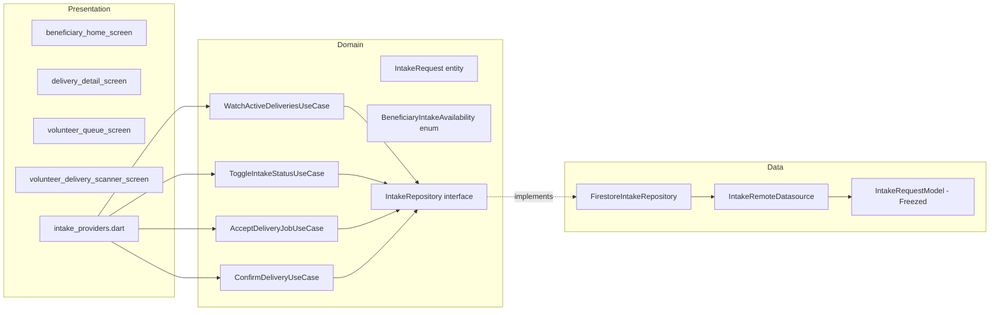

# SPEC-0004: Beneficiary Intake Status

**Status:** ACCEPTED
**Author:** architect
**Date:** 2026-05-26
**Proposal:** [PROP-0004](../tech-proposals/0004-beneficiary-intake-status.md)
**ADR:** [0007 — Intake Status Real-Time Strategy](../docs/decisions/0007-intake-status-realtime-strategy.md)
**Approved by:** ALORA

---

## Overview

This feature delivers the Beneficiary facility home screen shown in Figma: a two-segment `Accepting / Full-Busy` availability toggle that controls whether the facility appears on the donor map, an "Active Deliveries" section that streams live in-transit batches with volunteer name and ETA, contextual visibility-inactive messaging, and a static "How Pausing Works" education section. On the Volunteer side it delivers a queue screen listing all `open` (pending) batches system-wide plus the volunteer's own `claimed` (dispatched) batches, with Accept Job and QR Delivery Scanner actions. The implementation reuses the existing `batches` Firestore collection — treating `IntakeRequest` as a read projection over that collection filtered to `beneficiaryId == currentUser.uid` — and extends the `beneficiaries` collection with an `intakeStatus` field for the availability toggle. State machine transitions are enforced by Firestore Security Rules. The Domain layer remains zero-Flutter / zero-Firebase: the repository interface returns `Stream<IntakeRequest>` and `Future<void>`, and use cases are plain Dart classes.

---

## Architecture



The dependency rule flows strictly inward. No Presentation file imports from Data. No Domain file imports from Presentation or Data. `cloud_firestore` is imported in `C2` and `C3` only.

---

## Batch Status Mapping

`BatchModel.status` (`BatchStatus` enum) is the ground truth in Firestore. `IntakeStatus` is the Domain projection used in this feature. The mapping is:

| `BatchStatus` (Firestore / Data) | `IntakeStatus` (Domain) | Notes                                                     |
| -------------------------------- | ----------------------- | --------------------------------------------------------- |
| `open`                           | `pending`               | Awaiting volunteer                                        |
| `claimed`                        | `dispatched`            | Volunteer accepted; en route to donor                     |
| `pickedUp`                       | `dispatched`            | Volunteer picked up from donor; in transit to beneficiary |
| `delivered`                      | `collected`             | Volunteer confirmed delivery via QR scan                  |
| `closed`                         | `collected`             | Terminal — same display as collected                      |

`cancelled` is a new terminal value added to `BatchStatus` (see Firestore Schema section). `IntakeStatus.cancelled` maps directly to it.

---

## File Map

| Action     | Path                                                                                 | Responsibility                                                                        |
| ---------- | ------------------------------------------------------------------------------------ | ------------------------------------------------------------------------------------- |
| **CREATE** | `lib/features/beneficiary/domain/entities/intake_request.dart`                       | `IntakeRequest` entity + `IntakeStatus` enum — pure Dart                              |
| **CREATE** | `lib/features/beneficiary/domain/repositories/intake_repository.dart`                | `IntakeRepository` abstract interface                                                 |
| **CREATE** | `lib/features/beneficiary/domain/usecases/watch_active_deliveries_usecase.dart`      | Streams active deliveries for a beneficiary                                           |
| **CREATE** | `lib/features/beneficiary/domain/usecases/toggle_intake_status_usecase.dart`         | Writes `intakeStatus` on the beneficiary document                                     |
| **CREATE** | `lib/features/beneficiary/domain/usecases/accept_delivery_job_usecase.dart`          | Volunteer accepts a pending batch                                                     |
| **CREATE** | `lib/features/beneficiary/domain/usecases/confirm_delivery_usecase.dart`             | Volunteer confirms delivery; writes `collected`                                       |
| **CREATE** | `lib/features/beneficiary/data/models/intake_request_model.dart`                     | Freezed model; `fromBatch(BatchModel)` factory                                        |
| **CREATE** | `lib/features/beneficiary/data/datasources/intake_remote_datasource.dart`            | Abstract datasource interface (Firestore-aware types kept here)                       |
| **CREATE** | `lib/features/beneficiary/data/repositories/firestore_intake_repository.dart`        | Only file that imports `cloud_firestore`                                              |
| **MODIFY** | `lib/features/beneficiary/presentation/providers/beneficiary_provider.dart`          | Add intake providers using `@riverpod` codegen                                        |
| **MODIFY** | `lib/features/beneficiary/presentation/screens/beneficiary_dashboard_screen.dart`    | Full Figma implementation replacing TODO stub                                         |
| **CREATE** | `lib/features/beneficiary/presentation/screens/delivery_detail_screen.dart`          | Tapped from "View Details →" link on active delivery card                             |
| **CREATE** | `lib/features/beneficiary/presentation/widgets/intake_status_toggle.dart`            | Accepting / Full-Busy two-segment toggle                                              |
| **CREATE** | `lib/features/beneficiary/presentation/widgets/active_delivery_card.dart`            | IN TRANSIT badge + ETA + volunteer name + portions                                    |
| **CREATE** | `lib/features/beneficiary/presentation/widgets/visibility_inactive_card.dart`        | Crossed-eye card shown when Full-Busy is active                                       |
| **CREATE** | `lib/features/beneficiary/presentation/widgets/how_pausing_works_section.dart`       | Numbered-list education section                                                       |
| **CREATE** | `lib/features/volunteer/presentation/screens/volunteer_queue_screen.dart`            | Lists pending + own dispatched batches                                                |
| **CREATE** | `lib/features/volunteer/presentation/screens/volunteer_delivery_scanner_screen.dart` | QR scan → confirmed delivery write                                                    |
| **CREATE** | `lib/features/volunteer/presentation/widgets/pending_request_card.dart`              | Single card for a pending intake in the queue                                         |
| **MODIFY** | `lib/app/router.dart`                                                                | Add `/beneficiary/delivery/:batchId`, `/volunteer`, `/volunteer/scan/:batchId` routes |

### Notes on existing files touched

- `beneficiary_provider.dart` is currently an empty TODO comment — this spec fills it in.
- `beneficiary_dashboard_screen.dart` is currently a `TODO` stub — this spec replaces it entirely.
- `beneficiary_repository.dart` remains unchanged; `IntakeRepository` is a separate interface.
- No changes to `batch_model.dart` except adding `cancelled` to `BatchStatus` (additive, non-breaking).

---

## API Contracts

All interfaces below are the exact Dart signatures the Flutter Engineer must implement. No pseudocode.

### Domain — Entities and Enums

```dart
// lib/features/beneficiary/domain/entities/intake_request.dart
// Pure Dart — zero Flutter or Firebase imports.

enum IntakeStatus { pending, dispatched, collected, cancelled }

enum BeneficiaryIntakeAvailability { accepting, fullBusy }

class IntakeRequest {
  const IntakeRequest({
    required this.batchId,
    required this.beneficiaryId,
    required this.donorId,
    required this.status,
    required this.portions,
    required this.mealDescription,
    required this.weightKg,
    this.volunteerId,
    this.volunteerName,
    this.estimatedArrivalMinutes,
    this.cancellationReason,
    this.createdAt,
    this.updatedAt,
  });

  final String batchId;
  final String beneficiaryId;
  final String donorId;
  final IntakeStatus status;
  final int portions;
  final String mealDescription;
  final double weightKg;
  final String? volunteerId;
  final String? volunteerName;     // denormalised from users collection at read time
  final int? estimatedArrivalMinutes;
  final String? cancellationReason;
  final DateTime? createdAt;
  final DateTime? updatedAt;
}
```

### Domain — Repository Interface

```dart
// lib/features/beneficiary/domain/repositories/intake_repository.dart
// Pure Dart — zero Flutter or Firebase imports.

import 'package:saveameal/features/beneficiary/domain/entities/intake_request.dart';

abstract class IntakeRepository {
  /// Streams all active deliveries (status: pending | dispatched)
  /// for the given beneficiary, ordered by createdAt descending.
  Stream<List<IntakeRequest>> watchActiveDeliveries(String beneficiaryId);

  /// Streams a single intake request by batchId.
  Stream<IntakeRequest?> watchIntakeRequest(String batchId);

  /// Streams all pending (open) batches visible to volunteers,
  /// plus the volunteer's own dispatched batches.
  Stream<List<IntakeRequest>> watchVolunteerQueue(String volunteerId);

  /// Volunteer accepts a pending batch.
  /// Fails if current status != pending.
  Future<void> acceptDeliveryJob({
    required String batchId,
    required String volunteerId,
    required String volunteerName,
  });

  /// Volunteer confirms delivery by presenting the scanned batchId.
  /// Fails if current status != dispatched or volunteerId != caller.
  Future<void> confirmDelivery({
    required String batchId,
    required String volunteerId,
  });

  /// Beneficiary toggles their facility's intake availability.
  Future<void> toggleIntakeStatus({
    required String beneficiaryId,
    required BeneficiaryIntakeAvailability availability,
  });

  /// Streams the current intake availability for a beneficiary facility.
  Stream<BeneficiaryIntakeAvailability> watchIntakeAvailability(
    String beneficiaryId,
  );
}
```

### Domain — Use Cases

```dart
// lib/features/beneficiary/domain/usecases/watch_active_deliveries_usecase.dart
import 'package:saveameal/features/beneficiary/domain/entities/intake_request.dart';
import 'package:saveameal/features/beneficiary/domain/repositories/intake_repository.dart';

class WatchActiveDeliveriesUseCase {
  const WatchActiveDeliveriesUseCase(this._repository);
  final IntakeRepository _repository;

  Stream<List<IntakeRequest>> call(String beneficiaryId) =>
      _repository.watchActiveDeliveries(beneficiaryId);
}
```

```dart
// lib/features/beneficiary/domain/usecases/toggle_intake_status_usecase.dart
import 'package:saveameal/features/beneficiary/domain/entities/intake_request.dart';
import 'package:saveameal/features/beneficiary/domain/repositories/intake_repository.dart';

class ToggleIntakeStatusUseCase {
  const ToggleIntakeStatusUseCase(this._repository);
  final IntakeRepository _repository;

  Future<void> call({
    required String beneficiaryId,
    required BeneficiaryIntakeAvailability availability,
  }) =>
      _repository.toggleIntakeStatus(
        beneficiaryId: beneficiaryId,
        availability: availability,
      );
}
```

```dart
// lib/features/beneficiary/domain/usecases/accept_delivery_job_usecase.dart
import 'package:saveameal/features/beneficiary/domain/repositories/intake_repository.dart';

class AcceptDeliveryJobUseCase {
  const AcceptDeliveryJobUseCase(this._repository);
  final IntakeRepository _repository;

  Future<void> call({
    required String batchId,
    required String volunteerId,
    required String volunteerName,
  }) =>
      _repository.acceptDeliveryJob(
        batchId: batchId,
        volunteerId: volunteerId,
        volunteerName: volunteerName,
      );
}
```

```dart
// lib/features/beneficiary/domain/usecases/confirm_delivery_usecase.dart
import 'package:saveameal/features/beneficiary/domain/repositories/intake_repository.dart';

class ConfirmDeliveryUseCase {
  const ConfirmDeliveryUseCase(this._repository);
  final IntakeRepository _repository;

  Future<void> call({
    required String batchId,
    required String volunteerId,
  }) =>
      _repository.confirmDelivery(
        batchId: batchId,
        volunteerId: volunteerId,
      );
}
```

### Data — Model

```dart
// lib/features/beneficiary/data/models/intake_request_model.dart
import 'package:freezed_annotation/freezed_annotation.dart';
import 'package:saveameal/core/models/batch_model.dart';
import 'package:saveameal/features/beneficiary/domain/entities/intake_request.dart';

part 'intake_request_model.freezed.dart';
part 'intake_request_model.g.dart';

@freezed
sealed class IntakeRequestModel with _$IntakeRequestModel {
  const factory IntakeRequestModel({
    required String batchId,
    required String beneficiaryId,
    required String donorId,
    required String status,          // raw Firestore string, e.g. "open"
    required int portions,
    required String mealDescription,
    required double weightKg,
    String? driverId,
    String? volunteerName,
    int? estimatedArrivalMinutes,
    String? cancellationReason,
    DateTime? createdAt,
    DateTime? updatedAt,
  }) = _IntakeRequestModel;

  factory IntakeRequestModel.fromJson(Map<String, dynamic> json) =>
      _$IntakeRequestModelFromJson(json);

  // Factory from an existing BatchModel (used by the repository when
  // mapping Firestore snapshots that are already deserialized).
  // volunteerName must be fetched separately and passed in.
  factory IntakeRequestModel.fromBatch(
    BatchModel batch, {
    String? volunteerName,
    int? estimatedArrivalMinutes,
  }) =>
      IntakeRequestModel(
        batchId: batch.id,
        beneficiaryId: batch.beneficiaryId ?? '',
        donorId: batch.donorId,
        status: batch.status.name,          // BatchStatus.name → string
        portions: batch.items.length,       // best available proxy; update if BatchModel adds a portions field
        mealDescription: batch.items.map((i) => i.name).join(', '),
        weightKg: batch.items.fold(0.0, (sum, i) => sum + i.weightKg),
        driverId: batch.driverId,
        volunteerName: volunteerName,
        estimatedArrivalMinutes: estimatedArrivalMinutes,
        cancellationReason: null,
        createdAt: batch.createdAt,
        updatedAt: batch.updatedAt,
      );
}

// Extension to convert the model to the domain entity.
extension IntakeRequestModelX on IntakeRequestModel {
  IntakeRequest toDomain() => IntakeRequest(
        batchId: batchId,
        beneficiaryId: beneficiaryId,
        donorId: donorId,
        status: _mapStatus(status),
        portions: portions,
        mealDescription: mealDescription,
        weightKg: weightKg,
        volunteerId: driverId,
        volunteerName: volunteerName,
        estimatedArrivalMinutes: estimatedArrivalMinutes,
        cancellationReason: cancellationReason,
        createdAt: createdAt,
        updatedAt: updatedAt,
      );

  static IntakeStatus _mapStatus(String raw) => switch (raw) {
        'open' => IntakeStatus.pending,
        'claimed' => IntakeStatus.dispatched,
        'pickedUp' => IntakeStatus.dispatched,
        'delivered' => IntakeStatus.collected,
        'closed' => IntakeStatus.collected,
        'cancelled' => IntakeStatus.cancelled,
        _ => IntakeStatus.pending,
      };
}
```

### Data — Datasource Interface

```dart
// lib/features/beneficiary/data/datasources/intake_remote_datasource.dart
// This file MAY import cloud_firestore types — it is a Data-layer boundary.
import 'package:saveameal/core/models/batch_model.dart';

abstract class IntakeRemoteDatasource {
  Stream<List<BatchModel>> watchActiveDeliveriesForBeneficiary(
    String beneficiaryId,
  );

  Stream<BatchModel?> watchBatch(String batchId);

  /// Returns pending batches (open) plus the volunteer's own claimed/pickedUp batches.
  Stream<List<BatchModel>> watchVolunteerQueue(String volunteerId);

  /// Atomically writes status=claimed and driverId=volunteerId.
  Future<void> acceptJob({
    required String batchId,
    required String volunteerId,
    required String volunteerName,
  });

  /// Atomically writes status=delivered.
  Future<void> confirmDelivery({
    required String batchId,
    required String volunteerId,
  });

  /// Writes intakeStatus field on the beneficiaries/{beneficiaryId} document.
  Future<void> setIntakeAvailability({
    required String beneficiaryId,
    required String intakeStatus, // 'accepting' | 'full'
  });

  Stream<String> watchIntakeAvailability(String beneficiaryId);
}
```

### Data — Repository Implementation (signature only)

```dart
// lib/features/beneficiary/data/repositories/firestore_intake_repository.dart
// THE ONLY FILE IN THIS FEATURE THAT IMPORTS cloud_firestore.

import 'package:cloud_firestore/cloud_firestore.dart';
import 'package:saveameal/features/beneficiary/data/datasources/intake_remote_datasource.dart';
import 'package:saveameal/features/beneficiary/domain/entities/intake_request.dart';
import 'package:saveameal/features/beneficiary/domain/repositories/intake_repository.dart';

class FirestoreIntakeRepository implements IntakeRepository {
  const FirestoreIntakeRepository(this._datasource);
  final IntakeRemoteDatasource _datasource;

  @override
  Stream<List<IntakeRequest>> watchActiveDeliveries(String beneficiaryId) { ... }

  @override
  Stream<IntakeRequest?> watchIntakeRequest(String batchId) { ... }

  @override
  Stream<List<IntakeRequest>> watchVolunteerQueue(String volunteerId) { ... }

  @override
  Future<void> acceptDeliveryJob({
    required String batchId,
    required String volunteerId,
    required String volunteerName,
  }) { ... }

  @override
  Future<void> confirmDelivery({
    required String batchId,
    required String volunteerId,
  }) { ... }

  @override
  Future<void> toggleIntakeStatus({
    required String beneficiaryId,
    required BeneficiaryIntakeAvailability availability,
  }) { ... }

  @override
  Stream<BeneficiaryIntakeAvailability> watchIntakeAvailability(
    String beneficiaryId,
  ) { ... }
}
```

### Presentation — Providers

```dart
// lib/features/beneficiary/presentation/providers/beneficiary_provider.dart
// Replaces the current empty-TODO file.
// All @riverpod annotations — run build_runner after creating.

import 'package:riverpod_annotation/riverpod_annotation.dart';
import 'package:saveameal/features/beneficiary/data/datasources/intake_remote_datasource.dart';
import 'package:saveameal/features/beneficiary/data/repositories/firestore_intake_repository.dart';
import 'package:saveameal/features/beneficiary/domain/entities/intake_request.dart';
import 'package:saveameal/features/beneficiary/domain/repositories/intake_repository.dart';
import 'package:saveameal/features/beneficiary/domain/usecases/accept_delivery_job_usecase.dart';
import 'package:saveameal/features/beneficiary/domain/usecases/confirm_delivery_usecase.dart';
import 'package:saveameal/features/beneficiary/domain/usecases/toggle_intake_status_usecase.dart';
import 'package:saveameal/features/beneficiary/domain/usecases/watch_active_deliveries_usecase.dart';

part 'beneficiary_provider.g.dart';

// --- DI wiring ---
@riverpod
IntakeRemoteDatasource intakeRemoteDatasource(Ref ref);
// Implementation: IntakeRemoteDatasourceImpl(ref.watch(firestoreServiceProvider))

@riverpod
IntakeRepository intakeRepository(Ref ref) =>
    FirestoreIntakeRepository(ref.watch(intakeRemoteDatasourceProvider));

@riverpod
WatchActiveDeliveriesUseCase watchActiveDeliveriesUseCase(Ref ref) =>
    WatchActiveDeliveriesUseCase(ref.watch(intakeRepositoryProvider));

@riverpod
ToggleIntakeStatusUseCase toggleIntakeStatusUseCase(Ref ref) =>
    ToggleIntakeStatusUseCase(ref.watch(intakeRepositoryProvider));

@riverpod
AcceptDeliveryJobUseCase acceptDeliveryJobUseCase(Ref ref) =>
    AcceptDeliveryJobUseCase(ref.watch(intakeRepositoryProvider));

@riverpod
ConfirmDeliveryUseCase confirmDeliveryUseCase(Ref ref) =>
    ConfirmDeliveryUseCase(ref.watch(intakeRepositoryProvider));

// --- Stream providers ---

/// Active deliveries for the current beneficiary.
@riverpod
Stream<List<IntakeRequest>> activeDeliveries(Ref ref, String beneficiaryId) =>
    ref.watch(watchActiveDeliveriesUseCaseProvider).call(beneficiaryId);

/// Single intake request — used by DeliveryDetailScreen.
@riverpod
Stream<IntakeRequest?> intakeRequest(Ref ref, String batchId) =>
    ref.watch(intakeRepositoryProvider).watchIntakeRequest(batchId);

/// Volunteer queue — all pending + own dispatched.
@riverpod
Stream<List<IntakeRequest>> volunteerQueue(Ref ref, String volunteerId) =>
    ref.watch(intakeRepositoryProvider).watchVolunteerQueue(volunteerId);

/// Beneficiary availability toggle state.
@riverpod
Stream<BeneficiaryIntakeAvailability> intakeAvailability(
  Ref ref,
  String beneficiaryId,
) =>
    ref.watch(intakeRepositoryProvider).watchIntakeAvailability(beneficiaryId);
```

### Router Changes

```dart
// lib/app/router.dart — add inside the existing routes list:

GoRoute(
  path: '/beneficiary',
  builder: (context, state) => const BeneficiaryHomeScreen(),
  routes: [
    GoRoute(
      path: 'delivery/:batchId',
      builder: (context, state) => DeliveryDetailScreen(
        batchId: state.pathParameters['batchId']!,
      ),
    ),
  ],
),
GoRoute(
  path: '/volunteer',
  builder: (context, state) => const VolunteerQueueScreen(),
  routes: [
    GoRoute(
      path: 'scan/:batchId',
      builder: (context, state) => VolunteerDeliveryScannerScreen(
        batchId: state.pathParameters['batchId']!,
      ),
    ),
  ],
),
```

Note: the existing `/driver` route pointing to `DriverMapScreen` is retained unchanged.

---

## Firestore Schema

### `batches` collection — additive changes only

No fields are removed or renamed. One new enum value is added to `status`.

| Field           | Type      | Change                             | Notes                                                                    |
| --------------- | --------- | ---------------------------------- | ------------------------------------------------------------------------ |
| `status`        | `String`  | Add `"cancelled"` as a valid value | Existing values: `open`, `claimed`, `pickedUp`, `delivered`, `closed`    |
| `driverId`      | `String?` | No change                          | Set when volunteer accepts                                               |
| `beneficiaryId` | `String?` | No change                          | Used for beneficiary-scoped queries                                      |
| `qrCode`        | `String?` | No change — semantics clarified    | Must contain the raw `batchId`; this is the QR payload the scanner reads |
| `volunteerName` | `String?` | **NEW field**                      | Denormalised from `users` at accept time; avoids a join on every read    |

`qrCode` field semantics: the value stored must equal the document ID (`batchId`). Any batch creation path that writes `qrCode` must write the document ID. If `qrCode` is null, the scanner cannot confirm delivery — surface this as an error, not a crash.

### `beneficiaries` collection — additive change

| Field          | Type     | Change        | Notes                                                                                       |
| -------------- | -------- | ------------- | ------------------------------------------------------------------------------------------- |
| `intakeStatus` | `String` | **NEW field** | `"accepting"` (default) or `"full"`. Controls donor-map visibility. Absent = `"accepting"`. |

`BeneficiaryStatus` on `UserModel` (`accepting` / `full`) already models this concept. The `beneficiaries` collection document is the canonical write target; `UserModel.status` may be derived from it or kept in sync at write time — the Flutter Engineer must choose one source of truth and document the decision.

---

## Firestore Security Rules

The rules below are additive to the existing `firestore.rules` file. They extend (or replace) any existing rules for the `batches` and `beneficiaries` collections.

```javascript
rules_version = '2';
service cloud.firestore {
  match /databases/{database}/documents {

    // Helper functions
    function isSignedIn() {
      return request.auth != null;
    }

    function hasRole(role) {
      return isSignedIn() && request.auth.token.role == role;
    }

    function isBeneficiary() { return hasRole('beneficiary'); }
    function isVolunteer()    { return hasRole('driver'); }   // UserRole.driver == volunteer in current enum
    function isDonor()        { return hasRole('donor'); }

    // ----------------------------------------------------------------
    // batches/{batchId}
    // ----------------------------------------------------------------
    match /batches/{batchId} {

      // Beneficiary reads only their own batches.
      allow read: if isSignedIn() &&
        (
          resource.data.beneficiaryId == request.auth.uid ||
          isVolunteer() ||
          isDonor() && resource.data.donorId == request.auth.uid
        );

      // Volunteer reads pending (open) batches or their own claimed/pickedUp batches.
      // Already covered by the read rule above (isVolunteer() grants read).
      // The Firestore query in the datasource adds the client-side filter;
      // these rules are the server-side enforcement.

      // Donor creates new batches.
      allow create: if isDonor() &&
        request.resource.data.donorId == request.auth.uid &&
        request.resource.data.status == 'open';

      // Volunteer: accept job (open → claimed).
      allow update: if isVolunteer() &&
        resource.data.status == 'open' &&
        request.resource.data.status == 'claimed' &&
        request.resource.data.driverId == request.auth.uid &&
        // Must not change immutable fields.
        request.resource.data.donorId == resource.data.donorId &&
        request.resource.data.beneficiaryId == resource.data.beneficiaryId;

      // Volunteer: pick up from donor (claimed → pickedUp).
      allow update: if isVolunteer() &&
        resource.data.status == 'claimed' &&
        resource.data.driverId == request.auth.uid &&
        request.resource.data.status == 'pickedUp' &&
        request.resource.data.driverId == request.auth.uid;

      // Volunteer: confirm delivery via QR scan (pickedUp → delivered).
      allow update: if isVolunteer() &&
        resource.data.status == 'pickedUp' &&
        resource.data.driverId == request.auth.uid &&
        request.resource.data.status == 'delivered' &&
        request.resource.data.driverId == request.auth.uid;

      // Volunteer: release a claimed batch back to open (claimed → open).
      // Volunteer name/id must be cleared on release.
      allow update: if isVolunteer() &&
        resource.data.status == 'claimed' &&
        resource.data.driverId == request.auth.uid &&
        request.resource.data.status == 'open' &&
        request.resource.data.driverId == null;

      // Volunteer: cancel their own dispatched batch (claimed|pickedUp → cancelled).
      allow update: if isVolunteer() &&
        (resource.data.status == 'claimed' || resource.data.status == 'pickedUp') &&
        resource.data.driverId == request.auth.uid &&
        request.resource.data.status == 'cancelled';

      // Beneficiary: cancel their own pending batch (open → cancelled).
      allow update: if isBeneficiary() &&
        resource.data.beneficiaryId == request.auth.uid &&
        resource.data.status == 'open' &&
        request.resource.data.status == 'cancelled' &&
        // Only status (and optionally cancellationReason) may change.
        request.resource.data.donorId == resource.data.donorId &&
        request.resource.data.driverId == resource.data.driverId;

      // No deletes permitted.
      allow delete: if false;
    }

    // ----------------------------------------------------------------
    // beneficiaries/{beneficiaryId}
    // ----------------------------------------------------------------
    match /beneficiaries/{beneficiaryId} {

      // Any authenticated user may read a beneficiary document
      // (needed for donor map to filter on intakeStatus).
      allow read: if isSignedIn();

      // Beneficiary may write intakeStatus on their own document only.
      allow update: if isBeneficiary() &&
        beneficiaryId == request.auth.uid &&
        request.resource.data.diff(resource.data).affectedKeys()
          .hasOnly(['intakeStatus']);

      allow create: if isBeneficiary() && beneficiaryId == request.auth.uid;

      allow delete: if false;
    }

  }
}
```

**Security Rules notes:**

- `request.auth.token.role` assumes the Firebase custom claim `role` is set at sign-up time (per `AuthRepository.signUp`). The current `UserRole` enum values are `donor`, `driver`, `beneficiary` — the rules use `'driver'` for the volunteer/driver role to match the existing enum.
- The `hasOnly(['intakeStatus'])` guard on the beneficiary update rule ensures a beneficiary cannot modify their own name, address, or other fields via a client call — only the toggle field.
- All other transitions not listed above are implicitly denied (`allow` rules are whitelists).

---

## UI Behaviour Specification

### BeneficiaryHomeScreen (replaces BeneficiaryDashboardScreen)

Screen is a `ConsumerWidget`. Uses `ref.watch(intakeAvailabilityProvider(uid))` and `ref.watch(activeDeliveriesProvider(uid))`.

**Layout (top to bottom):**

1. `AppBar` — "SaveAMeal" text + green pin icon (left), notification bell `IconButton` (right). No hardcoded colors; use `cs.primary` for icon tint.
2. `IntakeStatusToggle` — two-segment control. Left = "Accepting", right = "Full / Busy". Active segment uses `cs.primary` background with `cs.onPrimary` text; inactive uses `cs.surfaceVariant` with `cs.onSurfaceVariant` text. On tap calls `ref.read(toggleIntakeStatusUseCaseProvider).call(...)` then shows a `SnackBar` with `ScaffoldMessenger`.
3. When `availability == fullBusy`: `VisibilityInactiveCard` (crossed-eye icon + "Intake Paused" heading + body text explaining map hiding).
4. Section heading "Active Deliveries" using `Theme.of(context).textTheme.titleMedium`.
5. `ListView.builder` over `activeDeliveries` list. Each item: `ActiveDeliveryCard`. If list is empty: centered `Text('No active deliveries')` using `textTheme.bodyMedium`.
6. When `availability == fullBusy`: second `VisibilityInactiveCard` variant — "Visibility Inactive" heading + "Donors cannot see your location. Existing batches in transit will still arrive."
7. `HowPausingWorksSection` — always shown.
8. `BottomNavigationBar` with 4 tabs: Home, Track, Impact, Account. Active tab index maintained in local `useState` or a dedicated `StateProvider`.

**Offline / error handling:**

- `AsyncError` from either provider: show non-dismissible `Banner` with "Could not load data. Check your connection." using `cs.error` background.
- `AsyncLoading`: `Center(child: CircularProgressIndicator())`.

### DeliveryDetailScreen

Receives `batchId` as constructor parameter. Watches `ref.watch(intakeRequestProvider(batchId))`. Displays full intake details: donor name (if available), item list, weight, status step indicator (Submitted → In Transit → Delivered), volunteer name when dispatched, ETA when available, cancellation reason when cancelled.

### VolunteerQueueScreen

Two sections rendered in a `CustomScrollView` with `SliverList`:

1. "Pending Requests" — `SliverList` of `PendingRequestCard` for all items with `status == pending`. Empty state: `SliverToBoxAdapter` with `Text('No pending requests')`.
2. "My Deliveries" — `SliverList` of items with `status == dispatched` and `volunteerId == currentUser.uid`. Empty state: same pattern.

Each `PendingRequestCard`:

- Tap → push `DeliveryDetailScreen` (read-only summary for volunteers).
- "Accept Job" button on pending cards: calls `acceptDeliveryJobUseCase`. On success: `SnackBar` confirmation. On failure: `SnackBar` error (do not mutate local state).
- "Scan QR" button on dispatched cards (own only): pushes `/volunteer/scan/:batchId`.

### VolunteerDeliveryScannerScreen

Wraps a QR code scanner widget (existing `ScannerScreen` pattern from donor feature may be referenced for implementation pattern). On successful scan, reads the scanned string as `batchId`. Before writing:

1. Verify `batchId` matches the route parameter (wrong-batch guard).
2. Call `confirmDeliveryUseCase(batchId, volunteerId)`.
3. On success: `SnackBar` + pop to queue.
4. On `permission-denied` (wrong volunteer or illegal transition): show error `SnackBar`, do not pop.

---

## Test Plan

| Test file                                                                                  | Type   | Covers                                                                                                                                                                                                                       |
| ------------------------------------------------------------------------------------------ | ------ | ---------------------------------------------------------------------------------------------------------------------------------------------------------------------------------------------------------------------------- |
| `test/unit/features/beneficiary/domain/usecases/watch_active_deliveries_usecase_test.dart` | Unit   | `WatchActiveDeliveriesUseCase.call` — delegates to repository; stream passthrough                                                                                                                                            |
| `test/unit/features/beneficiary/domain/usecases/toggle_intake_status_usecase_test.dart`    | Unit   | `ToggleIntakeStatusUseCase.call` — correct args forwarded to repository                                                                                                                                                      |
| `test/unit/features/beneficiary/domain/usecases/accept_delivery_job_usecase_test.dart`     | Unit   | `AcceptDeliveryJobUseCase.call` — delegates; returns repository future                                                                                                                                                       |
| `test/unit/features/beneficiary/domain/usecases/confirm_delivery_usecase_test.dart`        | Unit   | `ConfirmDeliveryUseCase.call` — delegates; error surface on exception                                                                                                                                                        |
| `test/unit/features/beneficiary/data/models/intake_request_model_test.dart`                | Unit   | `fromBatch` factory — all `BatchStatus` values map to correct `IntakeStatus`; `toDomain()` round-trip; `fromJson/toJson`                                                                                                     |
| `test/unit/features/beneficiary/data/repositories/firestore_intake_repository_test.dart`   | Unit   | `watchActiveDeliveries` maps datasource stream; `acceptDeliveryJob` forwards call; `confirmDelivery` forwards call; `toggleIntakeStatus` maps enum to string                                                                 |
| `test/widget/features/beneficiary/screens/beneficiary_home_screen_test.dart`               | Widget | Renders toggle; shows `VisibilityInactiveCard` when `fullBusy`; shows `ActiveDeliveryCard` per delivery; shows empty state when list is empty; shows error banner on `AsyncError`; shows loading indicator on `AsyncLoading` |
| `test/widget/features/beneficiary/screens/delivery_detail_screen_test.dart`                | Widget | Renders status step indicator for each `IntakeStatus`; shows cancellation reason when present; shows loading/error states                                                                                                    |
| `test/widget/features/beneficiary/widgets/intake_status_toggle_test.dart`                  | Widget | Correct segment highlighted for each `BeneficiaryIntakeAvailability` value; tap triggers callback                                                                                                                            |
| `test/widget/features/beneficiary/widgets/active_delivery_card_test.dart`                  | Widget | Renders IN TRANSIT badge, volunteer name, ETA, portions; "View Details →" link fires navigation callback                                                                                                                     |
| `test/widget/features/beneficiary/widgets/visibility_inactive_card_test.dart`              | Widget | Both message variants render correctly ("Intake Paused" vs "Visibility Inactive")                                                                                                                                            |
| `test/widget/features/beneficiary/widgets/how_pausing_works_section_test.dart`             | Widget | All three numbered points render                                                                                                                                                                                             |
| `test/widget/features/volunteer/screens/volunteer_queue_screen_test.dart`                  | Widget | Renders pending section and my-deliveries section; empty states; Accept Job button present on pending cards                                                                                                                  |
| `test/widget/features/volunteer/screens/volunteer_delivery_scanner_screen_test.dart`       | Widget | Error snackbar on wrong-batch scan; success path shows confirmation snackbar                                                                                                                                                 |
| `test/widget/features/volunteer/widgets/pending_request_card_test.dart`                    | Widget | Renders batch details; Accept Job / Scan QR buttons present for correct status                                                                                                                                               |

---

## Out of Scope

The following items are explicitly NOT part of this spec. They require separate proposals.

- Push notifications (FCM) triggered by status changes — receiving updates requires the app to be foregrounded.
- Full audit history or event log beyond the current status field on the batch document.
- Analytics or aggregate reporting on intake throughput.
- Volunteer auto-assignment or geographic routing of pending requests to nearby volunteers.
- Offline mutations by volunteers — status writes (`acceptJob`, `confirmDelivery`) require connectivity. Beneficiary read-only offline cache is deferred.
- Rating or feedback after delivery (the `rating`/`feedback` fields on `BatchModel` are out of scope here; `RateDeliveryScreen` already exists as a separate screen).
- Donor map hiding based on `intakeStatus` — the `intakeStatus` field is written by this spec but the donor-side map filter is a donor feature change out of this spec's scope.
- Manual staff approval at any step — the marketplace is fully automated.
- One-time QR tokens — raw `batchId` is used for the QR payload (see Open Questions).
- Beneficiary cancellation of a `dispatched` batch — only `open` (pending) batches may be cancelled by the beneficiary.

---

## Open Questions

- [ ] **QR one-time token safety.** The current design encodes the raw `batchId` in the QR code. This exposes the Firestore document path. Firestore Security Rules guard the write (only the assigned volunteer at the correct transition can write `delivered`), so the immediate risk is limited. A one-time-token approach would require a Cloud Function lookup and is deferred. This must be revisited if a security review flags the raw-ID approach as unacceptable.

- [ ] **`portions` field on `BatchModel`.** `IntakeRequestModel.fromBatch` currently approximates `portions` as `batch.items.length`. If portions represent individual servings (not item lines), `BatchModel` needs a top-level `portions: int` field. The Flutter Engineer should confirm with the product owner and, if needed, add the field to `BatchModel` under a separate PR before implementing the factory.

- [x] **`BeneficiaryStatus` on `UserModel` vs `intakeStatus` on `beneficiaries` doc.** **Resolved 2026-05-26:** `beneficiaries/{id}.intakeStatus` is the single source of truth. `UserModel.status` (`BeneficiaryStatus`) is not used for this feature and should not be read or written by `FirestoreIntakeRepository`. The flutter-engineer may remove `UserModel.status` in a follow-up cleanup PR if it has no other callers.

- [ ] **Volunteer name denormalisation.** `IntakeRequestModel` includes `volunteerName` as a field written to the batch document at accept time. This is a denormalisation trade-off (stale name risk vs. join cost). If the team prefers a join, `volunteerName` should be removed from `IntakeRequestModel` and looked up from `users/{driverId}` at read time in the repository. The Flutter Engineer must confirm the approach before writing `acceptJob`.

- [ ] **`UserRole.driver` vs volunteer terminology.** The existing enum uses `driver`; the Figma and proposal use `volunteer`. Firestore Security Rules in this spec use `'driver'` to match the existing custom claim. If the team renames the role, the rules must be updated. Resolve before security rules are deployed.
