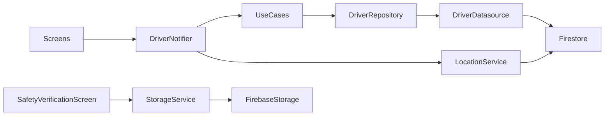

# SPEC-0004: Driver flow — browse, claim, pickup, and deliver batches

**Status:** APPROVED
**Author:** Kim Taeman (architect)
**Date:** 2026-05-26
**Proposal:** [PROP-0004](../tech-proposals/0004-driver-flow.md)
**Figma:** `LIdE6qDQzKpV3L5bAbO24w` (Page 1 — driver screens)
**Approved by:** Kim Taeman

---

## Overview

Implement the complete driver experience for SaveAMeal across 7 screens. A driver browses open surplus batches as food-category markers on a Google Map, reviews job details, claims the job, navigates to the donor, verifies pickup via QR scan + safety checklist + photo, navigates to the beneficiary, verifies handover, and sees impact stats on completion. Live location is shared every 30 s throughout. This delivers the first end-to-end path through the app (`open → claimed → picked_up → delivered`).

---

## Screen Inventory & Navigation

```
DriverMapScreen (browse)
  └─ [View Job →]         → JobDetailScreen
       └─ [Accept Job]    → ClaimRescueScreen (phase: en_route_pickup)
            └─ [Arrived at Pick-up] → PickupVerificationScreen (QR scanner)
                 └─ [QR verified]   → SafetyVerificationScreen (checklist + photo)
                      └─ [Confirm & Complete Pickup]
                           → ClaimRescueScreen (phase: en_route_beneficiary)
                                └─ [Arrived at Beneficiary] → VerifyDeliveryScreen
                                     └─ [Confirm Delivery Completion]
                                          → DeliveryCompletedScreen
                                               └─ [Done / Back to Dashboard]
                                                    → DriverMapScreen (browse)
```

### 1 — DriverMapScreen (`driver_map_screen.dart` — replace stub)

**Figma node:** `13:1356`

- `GoogleMap` fills screen; bottom nav bar: Home · Impact · Account.
- Open batches rendered as food-category chip `Marker`s (icon derived from `batch.foodCategory`, e.g. `local_pizza`, `bakery_dining`).
- Tapping a marker shows a bottom preview card: batch name, distance, pickup window, item count, "View Job →" button.
- "View Job →" pushes `JobDetailScreen` via GoRouter.
- When no active batch: browse state. When driver has an active batch on app resume: deep-link back to `ClaimRescueScreen`.

### 2 — JobDetailScreen (`job_detail_screen.dart` — new)

**Figma node:** `13:1046`

- Full screen: "Pickup Details" title + "Available" badge.
- **PICKUP FROM** card: donor name + address.
- **DROP-OFF TO** card: beneficiary name + address.
- **DETAILS** card: pickup window + special instructions.
- **Batch Summary** card: total portions + item breakdown chips.
- "Accept Job" primary button → calls `claimBatch` → navigates to `ClaimRescueScreen(phase: en_route_pickup)`.
- Claim failure (race condition): snackbar "Batch already taken — try another", pops back to map.

### 3 — ClaimRescueScreen (`claim_rescue_screen.dart` — new, replaces PickupScreen + DeliveryScreen stubs)

**Figma node:** `53:524` (en-route to pickup) / `53:848` (en-route to beneficiary)

Shared screen, parameterised by `ClaimRescuePhase` enum:

| Phase | Destination shown | Primary CTA |
|---|---|---|
| `en_route_pickup` | Donor address | "Arrived at Pick-up" → push `PickupVerificationScreen` |
| `en_route_beneficiary` | Beneficiary address | "Arrived at Beneficiary" → push `VerifyDeliveryScreen` |

- Mini-map with navigation polyline and ETA chip.
- Destination card: name, address, contact.
- Batch summary chip ("4x Family Meal Packs — View Details").
- Location timer active; camera follows driver position.

### 4 — PickupVerificationScreen (`pickup_verification_screen.dart` — new, uses `scanner_screen.dart` stub)

**Figma node:** `13:1156`

- Title: "Verify Pickup". Subtitle: "Scan the QR code on the donor's device."
- Camera viewfinder (uses `mobile_scanner` package) with green-corner overlay.
- Batch info strip below viewfinder: donor name, distance, expected portions + food type.
- "Problems scanning? Enter code manually" → text input dialog.
- On successful scan/manual entry: validates `batchId` matches active batch → pushes `SafetyVerificationScreen`.
- On mismatch: shows error snackbar "Wrong QR code — try again."

> Note: the existing `scanner_screen.dart` stub in the driver feature is repurposed for this screen.

### 5 — SafetyVerificationScreen (`safety_verification_screen.dart` — new)

**Figma node:** `13:989`

- Title: "Safety Verification".
- **Pickup Checklist** (all 3 must be checked to enable CTA):
  1. "Food is stored in clean, food-grade containers"
  2. "Temperature-sensitive items are in thermal bags"
  3. "Vehicle storage area is clean and clear of contaminants"
- **Photo Confirmation**: tap to open image picker (camera or gallery). Preview shown after selection.
- "Confirm & Complete Pickup" button (disabled until all boxes checked + photo selected).
- On confirm: uploads photo to Firebase Storage at `batch_photos/{batchId}/pickup.jpg`, then calls `confirmPickup` → navigates to `ClaimRescueScreen(phase: en_route_beneficiary)`.

### 6 — VerifyDeliveryScreen (`verify_delivery_screen.dart` — new)

**Figma node:** `53:621`

- Title: "Verify Delivery".
- Batch identifier + volume header.
- **Handover Verification** (both must be selected):
  1. "Food batch handed over securely to shelter staff"
  2. "Shelter staff confirmed item quantities match"
- **Notes or Feedback** (optional): free-text field.
- "Confirm Delivery Completion" → calls `confirmDelivery(notes)` → navigates to `DeliveryCompletedScreen`.

### 7 — DeliveryCompletedScreen (`delivery_completed_screen.dart` — new)

**Figma node:** `53:775`

- Green checkmark hero + "Delivery Completed!" heading.
- Summary: "You've successfully rescued and delivered N portions of food to [Beneficiary]."
- **Impact Earned** card: CO2 saved (kg) + Meals Provided.
- **+N Points Earned** badge (read from `users/{uid}.points` delta after `onDeliveryComplete` Cloud Function runs).
- "Done" (pops to DriverMapScreen) and "Back to Dashboard" (same, via GoRouter `go`).

---

## Architecture



---

## File Map

| Action | Path | Responsibility |
|---|---|---|
| Replace stub | `lib/features/driver/presentation/screens/driver_map_screen.dart` | Map + marker browse |
| Create | `lib/features/driver/presentation/screens/job_detail_screen.dart` | Job detail + Accept Job |
| Create | `lib/features/driver/presentation/screens/claim_rescue_screen.dart` | En-route navigation (2 phases) |
| Repurpose stub | `lib/features/driver/presentation/screens/scanner_screen.dart` → rename to `pickup_verification_screen.dart` | QR scanner + manual entry |
| Create | `lib/features/driver/presentation/screens/safety_verification_screen.dart` | Checklist + photo upload |
| Delete | `lib/features/driver/presentation/screens/pickup_screen.dart` | Dead stub |
| Delete | `lib/features/driver/presentation/screens/delivery_screen.dart` | Dead stub |
| Create | `lib/features/driver/presentation/screens/verify_delivery_screen.dart` | Handover verification |
| Create | `lib/features/driver/presentation/screens/delivery_completed_screen.dart` | Impact + points |
| Create | `lib/features/driver/presentation/providers/driver_state.dart` | DriverState + DriverStep + ClaimRescuePhase |
| Create | `lib/features/driver/presentation/providers/driver_notifier.dart` | AsyncNotifier (codegen) |
| Create | `lib/features/driver/domain/repositories/driver_repository.dart` | Abstract interface |
| Create | `lib/features/driver/domain/usecases/get_open_batches_usecase.dart` | Stream open batches |
| Create | `lib/features/driver/domain/usecases/get_active_batch_usecase.dart` | Stream driver's active batch |
| Create | `lib/features/driver/domain/usecases/claim_batch_usecase.dart` | Firestore transaction |
| Create | `lib/features/driver/domain/usecases/confirm_pickup_usecase.dart` | Status → picked_up |
| Create | `lib/features/driver/domain/usecases/confirm_delivery_usecase.dart` | Status → delivered |
| Create | `lib/features/driver/data/datasources/driver_datasource.dart` | Firestore + Storage calls |
| Create | `lib/features/driver/data/repositories/driver_repository_impl.dart` | Implements interface |
| Create/extend | `lib/services/location_service.dart` | 30 s location writes to driverLocations |
| Create/extend | `lib/services/storage_service.dart` | Firebase Storage upload |
| Implement | `lib/features/donor/presentation/screens/batch_qr_screen.dart` | Donor-side QR display (`qr_flutter`) |
| Create | `test/widget/driver/driver_map_screen_test.dart` | |
| Create | `test/widget/driver/job_detail_screen_test.dart` | |
| Create | `test/widget/driver/claim_rescue_screen_test.dart` | |
| Create | `test/widget/driver/pickup_verification_screen_test.dart` | |
| Create | `test/widget/driver/safety_verification_screen_test.dart` | |
| Create | `test/widget/driver/verify_delivery_screen_test.dart` | |
| Create | `test/widget/driver/delivery_completed_screen_test.dart` | |
| Create | `test/unit/driver/claim_batch_usecase_test.dart` | |
| Create | `test/unit/driver/driver_notifier_test.dart` | |

---

## API Contracts

```dart
// domain/repositories/driver_repository.dart
abstract class DriverRepository {
  Stream<List<Batch>> getOpenBatches();
  Stream<Batch?> getActiveBatch(String uid);
  Future<void> claimBatch(String batchId, String uid);
  Future<void> confirmPickup(String batchId, String photoUrl);
  Future<void> confirmDelivery(String batchId, String? notes);
}

// presentation/providers/driver_state.dart
enum ClaimRescuePhase { enRoutePickup, enRouteBeneficiary }

enum DriverStep { browsing, claimed, pickedUp, delivered }

@freezed
class DriverState with _$DriverState {
  const factory DriverState({
    BatchModel? activeBatch,
    BatchModel? selectedBatch,
    @Default(DriverStep.browsing) DriverStep step,
    @Default(ClaimRescuePhase.enRoutePickup) ClaimRescuePhase rescuePhase,
  }) = _DriverState;
}

// presentation/providers/driver_notifier.dart
@riverpod
class DriverNotifier extends _$DriverNotifier {
  Future<void> selectBatch(BatchModel batch);
  Future<void> claimBatch(String batchId);
  Future<void> confirmPickup(String batchId, String photoPath);
  Future<void> confirmDelivery(String batchId, String? notes);
}
```

---

## Data Layer Detail

### Firestore reads

| Provider | Query |
|---|---|
| `openBatchesProvider` | `batches` where `status == "open"` (stream) |
| `activeBatchProvider` | `batches` where `claimedBy == uid` and `status` in `[claimed, picked_up]`, limit 1 (stream) |

### Firestore writes

| Method | Operation |
|---|---|
| `claimBatch(batchId, uid)` | Transaction: assert `status == "open"`, write `status = "claimed"`, `claimedBy`, `claimedAt`. Throws `BatchAlreadyClaimedException` on conflict. |
| `confirmPickup(batchId, photoUrl)` | Write `status = "picked_up"`, `pickedUpAt`, `pickupPhotoUrl` |
| `confirmDelivery(batchId, notes)` | Write `status = "delivered"`, `deliveredAt`, `deliveryNotes`. Triggers `onDeliveryComplete` Cloud Function. |

### Firebase Storage

- Upload path: `batch_photos/{batchId}/pickup.jpg`
- `StorageService.uploadPickupPhoto(batchId, filePath)` → returns download URL stored on the batch doc.

### Location writes

- `LocationService.startTracking(uid)` — `Timer.periodic(30 s)` writes `{lat, lng, updatedAt}` to `driverLocations/{uid}`.
- `LocationService.stopTracking()` — cancels timer, removes `driverLocations/{uid}` doc.
- Start: on successful `claimBatch`. Stop: on `confirmDelivery` or `AppLifecycleState.paused`.

---

## Error Handling

| Error | Surface |
|---|---|
| `BatchAlreadyClaimedException` | Snackbar "Batch already taken — try another", pop to map |
| `LocationPermissionDeniedException` | Dialog on first claim; driver cannot proceed without permission |
| QR mismatch | Snackbar "Wrong QR code — try again" |
| Photo upload failure | Snackbar with retry; CTA stays disabled |
| Firestore stream error | `AsyncValue.error` widget with retry button |

---

## Test Plan

| Test file | Covers |
|---|---|
| `test/widget/driver/driver_map_screen_test.dart` | Browse state; marker tap shows preview card; "View Job →" navigates |
| `test/widget/driver/job_detail_screen_test.dart` | Pickup/dropoff/batch-summary rendered; Accept Job calls notifier; claim failure snackbar |
| `test/widget/driver/claim_rescue_screen_test.dart` | en_route_pickup shows donor address + "Arrived at Pick-up"; en_route_beneficiary shows beneficiary address |
| `test/widget/driver/pickup_verification_screen_test.dart` | QR mismatch shows error; manual entry dialog; success navigates to SafetyVerificationScreen |
| `test/widget/driver/safety_verification_screen_test.dart` | CTA disabled until all 3 checked + photo; enabled after; tapping confirms |
| `test/widget/driver/verify_delivery_screen_test.dart` | CTA disabled until both checkboxes; notes field optional; confirm navigates |
| `test/widget/driver/delivery_completed_screen_test.dart` | Impact stats shown; Done pops to map |
| `test/unit/driver/claim_batch_usecase_test.dart` | Success path; `BatchAlreadyClaimedException` when `status != "open"` |
| `test/unit/driver/driver_notifier_test.dart` | Location timer starts on claim; stops on delivery |

All widget tests override Riverpod providers with fakes. `GoogleMap` replaced by a `Key`-findable stub.

---

## Out of Scope

- Push notifications (FCM) — separate feature.
- Beneficiary live-tracking screen — separate feature.
- `onDeliveryComplete` Cloud Function implementation.
- Driver earnings / history / past deliveries dashboard.
- Foreground service / background location (foreground-only assumed for this build).

---

## Open Questions

- [ ] Is foreground-only location permission sufficient, or does the assignment require background location?
- [ ] Points value ("+50") — hardcoded or read from Firestore config? (Assumed: read from `users/{uid}.points` delta after Cloud Function.)
