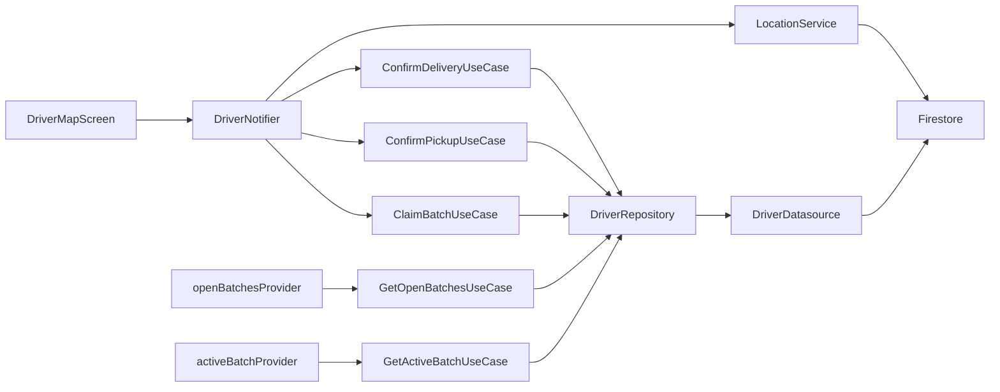

# SPEC-0004: Driver flow — browse, claim, pickup, and deliver batches

**Status:** APPROVED
**Author:** Kim Taeman (architect)
**Date:** 2026-05-26
**Proposal:** [PROP-0004](../tech-proposals/0004-driver-flow.md)
**Approved by:** Kim Taeman

---

## Overview

Implement the driver experience for SaveAMeal. A driver opens the app, sees open surplus batches as pins on a Google Map, taps one to claim it, navigates to the donor for pickup (confirmed via QR scan), shares live location every 30 s during transit, and marks the batch delivered at the beneficiary. This completes the `open → claimed → picked_up → delivered` lifecycle and creates the first full end-to-end path through the app.

## Architecture



## Screens & Navigation

### DriverMapScreen (replaces stub)

Two visual states driven by `DriverState.step`:

**Browse state** (`step == DriverStep.browsing`)
- `GoogleMap` fills the screen.
- Open batches rendered as custom `Marker`s from `openBatchesProvider`.
- Tapping a marker sets `DriverState.selectedBatch` and slides up a `DraggableScrollableSheet` with: donor name, pickup address, item count, "Claim Batch" primary button.
- Claim failure (race condition) → dismiss sheet, show snackbar: "Batch already taken — try another."
- Location permission not yet requested at this state.

**Active delivery state** (`step != DriverStep.browsing`)
- Map stays live; camera animates to the relevant destination.
- Bottom sheet is non-dismissible; renders a `Stepper` with three steps:
  1. **Claimed** — "Navigate to Donor" (Maps deep-link) + "Confirm Pickup" button → pushes `BatchQrScreen`.
  2. **Picked Up** — "Navigate to Beneficiary" (Maps deep-link) + "Mark Delivered" button.
  3. **Delivered** — completion message; sheet collapses after 2 s, screen returns to browse state.

**Navigation:** `BatchQrScreen` is pushed via GoRouter. On successful QR validation it pops; the notifier receives the result and transitions to `pickedUp`. No other new routes needed.

**Stubs removed:** `PickupScreen`, `DeliveryScreen` — their responsibility is absorbed into `DriverMapScreen`.

### BatchQrScreen (implement existing stub)

Displays a `qr_flutter`-generated QR code containing the `batchId`. No scanning logic here — the QR is shown to the donor/beneficiary to verify the correct batch.

## File Map

| Action | Path | Responsibility |
|---|---|---|
| Create | `lib/features/driver/domain/repositories/driver_repository.dart` | Abstract interface |
| Create | `lib/features/driver/domain/usecases/get_open_batches_usecase.dart` | Stream open batches |
| Create | `lib/features/driver/domain/usecases/get_active_batch_usecase.dart` | Stream driver's active batch |
| Create | `lib/features/driver/domain/usecases/claim_batch_usecase.dart` | Claim via transaction |
| Create | `lib/features/driver/domain/usecases/confirm_pickup_usecase.dart` | Status → picked_up |
| Create | `lib/features/driver/domain/usecases/confirm_delivery_usecase.dart` | Status → delivered |
| Create | `lib/features/driver/data/datasources/driver_datasource.dart` | Firestore calls |
| Create | `lib/features/driver/data/repositories/driver_repository_impl.dart` | Implements interface |
| Create | `lib/features/driver/presentation/providers/driver_state.dart` | DriverState + DriverStep |
| Create | `lib/features/driver/presentation/providers/driver_notifier.dart` | AsyncNotifier (codegen) |
| Replace | `lib/features/driver/presentation/screens/driver_map_screen.dart` | Full implementation |
| Delete | `lib/features/driver/presentation/screens/pickup_screen.dart` | Dead stub |
| Delete | `lib/features/driver/presentation/screens/delivery_screen.dart` | Dead stub |
| Implement | `lib/features/donor/presentation/screens/batch_qr_screen.dart` | QR display |
| Create/extend | `lib/services/location_service.dart` | 30 s location writes |
| Create | `test/widget/driver/driver_map_screen_test.dart` | Widget tests |
| Create | `test/unit/driver/claim_batch_usecase_test.dart` | Transaction unit tests |
| Create | `test/unit/driver/driver_notifier_test.dart` | Notifier unit tests |

## API Contracts

```dart
// domain/repositories/driver_repository.dart
abstract class DriverRepository {
  Stream<List<Batch>> getOpenBatches();
  Stream<Batch?> getActiveBatch(String uid);
  Future<void> claimBatch(String batchId, String uid);
  Future<void> confirmPickup(String batchId);
  Future<void> confirmDelivery(String batchId);
}

// presentation/providers/driver_state.dart
enum DriverStep { browsing, claimed, pickedUp, delivered }

@freezed
class DriverState with _$DriverState {
  const factory DriverState({
    BatchModel? activeBatch,
    BatchModel? selectedBatch,
    @Default(DriverStep.browsing) DriverStep step,
  }) = _DriverState;
}

// presentation/providers/driver_notifier.dart
@riverpod
class DriverNotifier extends _$DriverNotifier {
  Future<void> selectBatch(BatchModel batch);
  Future<void> claimBatch(String batchId);
  Future<void> confirmPickup(String batchId);
  Future<void> confirmDelivery(String batchId);
}
```

## Data Layer Detail

### Firestore reads

| Provider | Query |
|---|---|
| `openBatchesProvider` | `batches` where `status == "open"` (stream) |
| `activeBatchProvider` | `batches` where `claimedBy == uid` and `status` in `[claimed, picked_up]`, limit 1 (stream) |

### Firestore writes

| Method | Operation |
|---|---|
| `claimBatch(batchId, uid)` | Transaction: assert `status == "open"`, write `status = "claimed"`, `claimedBy = uid`, `claimedAt = serverTimestamp()`. Throws `BatchAlreadyClaimedException` on conflict. |
| `confirmPickup(batchId)` | Write `status = "picked_up"`, `pickedUpAt = serverTimestamp()` |
| `confirmDelivery(batchId)` | Write `status = "delivered"`, `deliveredAt = serverTimestamp()` — triggers `onDeliveryComplete` Cloud Function |

### Location writes

- `geolocator` package (already in architecture).
- `Timer.periodic(const Duration(seconds: 30))` in `DriverNotifier` writes `{lat, lng, updatedAt: FieldValue.serverTimestamp()}` to `driverLocations/{uid}`.
- Timer **starts** on successful `claimBatch`.
- Timer **cancels** on `confirmDelivery` or `AppLifecycleState.paused`.
- `LocationService` exposes `startTracking(uid)` and `stopTracking()` to encapsulate the timer and Firestore write.

## Error Handling

| Error | Surface |
|---|---|
| `BatchAlreadyClaimedException` | Snackbar: "Batch already taken — try another." |
| `LocationPermissionDeniedException` | Dialog on first claim attempt; driver cannot proceed without permission. |
| Firestore stream error | `AsyncValue.error` → error widget with retry button. |

## Test Plan

| Test file | Covers |
|---|---|
| `test/widget/driver/driver_map_screen_test.dart` | Browse state renders map; marker tap opens sheet; claimed/pickedUp stepper states; "already taken" snackbar |
| `test/unit/driver/claim_batch_usecase_test.dart` | Success path; `BatchAlreadyClaimedException` when `status != "open"` |
| `test/unit/driver/driver_notifier_test.dart` | Location timer starts on claim; timer cancels on delivery |

Widget tests override all Riverpod providers with fakes. `GoogleMap` is replaced by a stub widget findable by `Key`.

## Out of Scope

- Push notifications (FCM) for batch claimed / driver en route / delivered — separate feature.
- Beneficiary live-tracking screen — separate feature.
- Driver earnings / history dashboard.
- `onDeliveryComplete` Cloud Function implementation (triggered by the write, but not written here).

## Open Questions

- [ ] Does `geolocator` need background location permission, or is foreground-only sufficient? (Assumed: foreground-only for now — driver keeps app open during delivery.)
