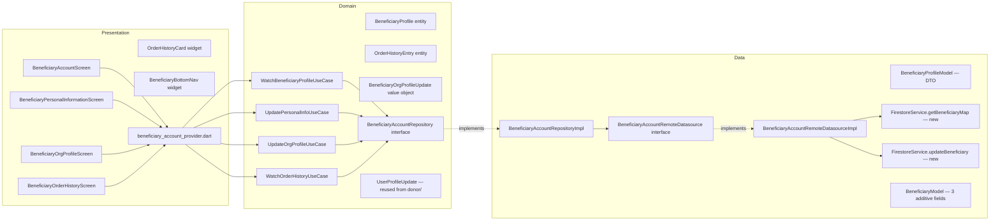

# SPEC-0005: Beneficiary Account & Profile

**Status:** APPROVED
**Author:** architect
**Date:** 2026-06-03
**Proposal:** [PROP-0005](../tech-proposals/0005-beneficiary-account-profile.md)
**ADR:** [0009 — Beneficiary Account Pattern](../docs/decisions/0009-beneficiary-account-profile-architecture.md)
**Approved by:** architect

---

## Overview

The beneficiary shell `NavigationBar` has four destinations. Indices 0–2 route correctly; index 3 calls `context.go('/beneficiary/account')` which matches no `GoRoute`, producing a silent navigation failure visible to every beneficiary on every launch. This spec delivers the full account surface that fixes that failure: four screens (`BeneficiaryAccountScreen`, `BeneficiaryPersonalInformationScreen`, `BeneficiaryOrgProfileScreen`, `BeneficiaryOrderHistoryScreen`), two reusable widgets (`OrderHistoryCard`, `BeneficiaryBottomNav`), the complete Clean Architecture stack beneath them (domain entity, repository interface, four use cases, data model, datasource, repository implementation, and Riverpod providers), and the GoRouter additions that wire everything together. Data is sourced exclusively from existing Firestore collections (`users/{uid}`, `beneficiaries/{uid}`, `batches`) — no new collections, no security-rules changes. The `beneficiaries/{uid}` document gains three additive optional fields (`orgType`, `contactEmail`, `missionStatement`). `FirestoreService` gains two methods (`getBeneficiaryMap`, `updateBeneficiary`) needed by the datasource. `BeneficiaryModel` (Freezed) is extended additively with the same three fields.

---

## Architecture



The dependency rule flows strictly inward. No Presentation file imports from Data. No Domain file imports from Presentation or Data. `cloud_firestore` is imported in `FirestoreService` only (already true today). `BeneficiaryAccountRemoteDatasourceImpl` imports `FirestoreService` — it is the only file in `features/beneficiary/` that does so.

---

## Batch Status — `mealsReceived` and Order History Mapping

`BatchItemModel` has `weightKg: double` but no `quantity` field. `mealsReceived` is therefore computed client-side as the sum of `(item.weightKg * 2.5).round()` per item across all loaded order-history entries — the same approximation used by `FirestoreService.watchDonorMetrics`. This is noted as an open question pending product confirmation.

The `mealsReceived` aggregate travels as a field on `BeneficiaryProfile` so all four account screens have access to it without a separate provider read. It is populated by the datasource when building `BeneficiaryProfileModel`, computed from the most recently loaded order history entries.

| `BatchStatus` (Firestore) | Shown in Order History? | `OrderHistoryEntryStatus` |
|---|---|---|
| `delivered` | Yes | `delivered` |
| `closed` | Yes | `closed` |
| `open`, `claimed`, `pickedUp`, `cancelled` | No — filtered out by query | N/A |

---

## File Map

| Action | Path | Responsibility |
|---|---|---|
| **CREATE** | `lib/features/beneficiary/domain/entities/beneficiary_profile.dart` | `BeneficiaryProfile` entity — pure Dart, union of `users/{uid}` + `beneficiaries/{uid}` data; includes `mealsReceived` aggregate |
| **CREATE** | `lib/features/beneficiary/domain/entities/order_history_entry.dart` | `OrderHistoryEntry` entity — pure Dart, carries one delivered batch projection |
| **CREATE** | `lib/features/beneficiary/domain/entities/beneficiary_org_profile_update.dart` | `BeneficiaryOrgProfileUpdate` value object — pure Dart, org profile write payload |
| **CREATE** | `lib/features/beneficiary/domain/repositories/beneficiary_account_repository.dart` | `BeneficiaryAccountRepository` abstract interface |
| **CREATE** | `lib/features/beneficiary/domain/usecases/watch_beneficiary_profile_usecase.dart` | Watches merged profile stream from repository |
| **CREATE** | `lib/features/beneficiary/domain/usecases/update_personal_info_usecase.dart` | Writes `users/{uid}` personal info via repository |
| **CREATE** | `lib/features/beneficiary/domain/usecases/update_org_profile_usecase.dart` | Writes `beneficiaries/{uid}` org fields via repository |
| **CREATE** | `lib/features/beneficiary/domain/usecases/watch_order_history_usecase.dart` | Watches streaming paginated order history from repository |
| **CREATE** | `lib/features/beneficiary/data/models/beneficiary_profile_model.dart` | `BeneficiaryProfileModel` — DTO, merges two document models, `toDomain()` extension |
| **MODIFY** | `lib/core/models/beneficiary_model.dart` | Add three optional Freezed fields: `orgType`, `contactEmail`, `missionStatement` |
| **CREATE** | `lib/features/beneficiary/data/datasources/beneficiary_account_remote_datasource.dart` | Abstract datasource interface + `BeneficiaryAccountRemoteDatasourceImpl`; only file in this feature that imports `FirestoreService` |
| **CREATE** | `lib/features/beneficiary/data/repositories/beneficiary_account_repository_impl.dart` | `BeneficiaryAccountRepositoryImpl` implementing `BeneficiaryAccountRepository` |
| **CREATE** | `lib/features/beneficiary/presentation/providers/beneficiary_account_provider.dart` | All `@riverpod` providers: datasource, repository, use cases, `currentBeneficiaryProfileProvider`, `orderHistoryNotifierProvider` |
| **CREATE** | `lib/features/beneficiary/presentation/screens/beneficiary_account_screen.dart` | Account hub screen at `/beneficiary/account` |
| **CREATE** | `lib/features/beneficiary/presentation/screens/beneficiary_personal_information_screen.dart` | Personal info edit at `/beneficiary/account/personal` |
| **CREATE** | `lib/features/beneficiary/presentation/screens/beneficiary_org_profile_screen.dart` | Org profile edit at `/beneficiary/account/org` |
| **CREATE** | `lib/features/beneficiary/presentation/screens/beneficiary_order_history_screen.dart` | Paginated order history at `/beneficiary/account/orders` |
| **CREATE** | `lib/features/beneficiary/presentation/widgets/order_history_card.dart` | `OrderHistoryCard` — single order card with accent bar, status badge, item sub-card |
| **CREATE** | `lib/features/beneficiary/presentation/widgets/beneficiary_bottom_nav.dart` | `BeneficiaryBottomNav` — extracted `NavigationBar` widget, used by all four account screens and the dashboard screen |
| **MODIFY** | `lib/services/firestore_service.dart` | Add `updateBeneficiary(String uid, Map<String, dynamic> data)` and `getBeneficiaryMap(String uid)` methods |
| **MODIFY** | `lib/app/router.dart` | Add four new `GoRoute` entries nested under `/beneficiary` |
| **MODIFY** | `lib/features/beneficiary/presentation/screens/beneficiary_dashboard_screen.dart` | Fix `onDestinationSelected` index 3: `context.go('/beneficiary/account')` |

### Notes on existing files touched

- `beneficiary_repository.dart` (the existing stub with `// TODO`) is left unchanged by this spec. `BeneficiaryAccountRepository` is a new, separate interface. The stub may be removed in a follow-up cleanup PR.
- `BeneficiaryModel` modification is additive only — all three new fields are `String?` with no `@Default`, so existing `fromJson` calls that omit the fields will continue to work. Regenerate with `dart run build_runner build` after modification.
- `FirestoreService.getBeneficiary` currently returns `BeneficiaryModel?`. That method must remain unchanged to avoid regressions in existing callers (e.g. `claimBatch` logic). The new `getBeneficiaryMap` parallel method returns the raw Firestore map; the datasource calls this to get the raw map and constructs `BeneficiaryModel` using `BeneficiaryModel.fromJson(map)` after `BeneficiaryModel` has been extended with the three new fields.
- No changes to `firestore.rules` — the existing rules already permit a beneficiary to read and write their own `users/{uid}` and `beneficiaries/{uid}` documents.

---

## API Contracts

All interfaces below are the exact Dart signatures the Flutter Engineer must implement. These are contracts, not full implementations.

### Domain — Entities and Value Objects

```dart
// lib/features/beneficiary/domain/entities/beneficiary_profile.dart
// Pure Dart — zero Flutter or Firebase imports.

class BeneficiaryProfile {
  const BeneficiaryProfile({
    required this.uid,
    required this.name,
    required this.email,
    required this.role,
    required this.mealsReceived,
    this.phone,
    this.location,
    this.photoUrl,
    this.orgName,
    this.address,
    this.orgType,
    this.contactEmail,
    this.missionStatement,
    this.joinedAt,
  });

  final String uid;
  final String name;              // from users/{uid}.name
  final String email;             // from users/{uid}.email
  final String role;              // from users/{uid}.role
  final int mealsReceived;        // computed aggregate: sum of (entry.totalWeightKg * 2.5).round()
  final String? phone;            // from users/{uid}.phone
  final String? location;         // from users/{uid}.location (free-text)
  final String? photoUrl;         // from users/{uid}.photoUrl
  final String? orgName;          // from beneficiaries/{uid}.name
  final String? address;          // from beneficiaries/{uid}.address
  final String? orgType;          // from beneficiaries/{uid}.orgType  — NEW
  final String? contactEmail;     // from beneficiaries/{uid}.contactEmail — NEW
  final String? missionStatement; // from beneficiaries/{uid}.missionStatement — NEW
  final DateTime? joinedAt;       // derived in datasource from FirebaseAuth metadata
}
```

```dart
// lib/features/beneficiary/domain/entities/order_history_entry.dart
// Pure Dart — zero Flutter or Firebase imports.

enum OrderHistoryEntryStatus { inTransit, delivered, closed }

class OrderHistoryEntry {
  const OrderHistoryEntry({
    required this.id,
    required this.displayId,
    required this.donorName,
    required this.itemDescription,
    required this.status,
    required this.totalWeightKg,
    this.foodCategory,
    this.date,
  });

  final String id;                       // Firestore batch document ID
  final String displayId;                // 'SH-' + id.substring(id.length - 4).toUpperCase()
  final String donorName;                // from BatchModel.donorName (denormalised)
  final String itemDescription;          // first item name, or comma-joined item names
  final OrderHistoryEntryStatus status;  // inTransit | delivered | closed
  final double totalWeightKg;            // sum of item.weightKg across all items in the batch
  final String? foodCategory;            // first item category — drives icon selection in OrderHistoryCard
  final DateTime? date;                  // from BatchModel.deliveredAt
}
```

```dart
// lib/features/beneficiary/domain/entities/beneficiary_org_profile_update.dart
// Pure Dart — zero Flutter or Firebase imports.

class BeneficiaryOrgProfileUpdate {
  const BeneficiaryOrgProfileUpdate({
    this.orgName,
    this.address,
    this.orgType,
    this.contactEmail,
    this.missionStatement,
  });

  final String? orgName;
  final String? address;
  final String? orgType;
  final String? contactEmail;
  final String? missionStatement;
}
```

> `UserProfileUpdate` from `lib/features/donor/domain/entities/user_profile_update.dart` is reused as-is for personal info writes (name, phone, location, photoUrl). The Flutter Engineer must import it using its existing package path; do not copy it.

---

### Domain — Repository Interface

```dart
// lib/features/beneficiary/domain/repositories/beneficiary_account_repository.dart
// Pure Dart — zero Flutter or Firebase imports.

import 'package:saveameal/features/beneficiary/domain/entities/beneficiary_profile.dart';
import 'package:saveameal/features/beneficiary/domain/entities/beneficiary_org_profile_update.dart';
import 'package:saveameal/features/beneficiary/domain/entities/order_history_entry.dart';
import 'package:saveameal/features/donor/domain/entities/user_profile_update.dart';

abstract class BeneficiaryAccountRepository {
  /// Emits the merged profile (users/{uid} + beneficiaries/{uid}) whenever either
  /// document changes. Emits null when the user document does not exist.
  /// joinedAt is derived from FirebaseAuth.currentUser.metadata.creationTime
  /// and passed through the datasource — the repository does not call Firebase Auth.
  Stream<BeneficiaryProfile?> watchProfile(String uid);

  /// Writes personal info fields to users/{uid}.
  /// Only non-null fields in [update] are written (merge semantics).
  Future<void> updatePersonalInfo(String uid, UserProfileUpdate update);

  /// Writes org profile fields to beneficiaries/{uid}.
  /// Only non-null fields in [update] are written (merge semantics).
  Future<void> updateOrgProfile(String uid, BeneficiaryOrgProfileUpdate update);

  /// Emits one page of delivered/closed batches for [uid],
  /// ordered by createdAt descending, page size [limit].
  /// Pass [cursor] (the ID of the last loaded entry) for cursor pagination
  /// (the datasource resolves this ID to a Firestore DocumentSnapshot internally).
  Stream<List<OrderHistoryEntry>> watchOrderHistory(
    String uid, {
    String? cursor,
    int limit = 10,
  });
}
```

---

### Domain — Use Cases

```dart
// lib/features/beneficiary/domain/usecases/watch_beneficiary_profile_usecase.dart
import 'package:saveameal/features/beneficiary/domain/entities/beneficiary_profile.dart';
import 'package:saveameal/features/beneficiary/domain/repositories/beneficiary_account_repository.dart';

class WatchBeneficiaryProfileUseCase {
  const WatchBeneficiaryProfileUseCase(this._repository);
  final BeneficiaryAccountRepository _repository;

  Stream<BeneficiaryProfile?> call(String uid) => _repository.watchProfile(uid);
}
```

```dart
// lib/features/beneficiary/domain/usecases/update_personal_info_usecase.dart
import 'package:saveameal/features/beneficiary/domain/repositories/beneficiary_account_repository.dart';
import 'package:saveameal/features/donor/domain/entities/user_profile_update.dart';

class UpdatePersonalInfoUseCase {
  const UpdatePersonalInfoUseCase(this._repository);
  final BeneficiaryAccountRepository _repository;

  Future<void> call(String uid, UserProfileUpdate update) =>
      _repository.updatePersonalInfo(uid, update);
}
```

```dart
// lib/features/beneficiary/domain/usecases/update_org_profile_usecase.dart
import 'package:saveameal/features/beneficiary/domain/entities/beneficiary_org_profile_update.dart';
import 'package:saveameal/features/beneficiary/domain/repositories/beneficiary_account_repository.dart';

class UpdateOrgProfileUseCase {
  const UpdateOrgProfileUseCase(this._repository);
  final BeneficiaryAccountRepository _repository;

  Future<void> call(String uid, BeneficiaryOrgProfileUpdate update) =>
      _repository.updateOrgProfile(uid, update);
}
```

```dart
// lib/features/beneficiary/domain/usecases/watch_order_history_usecase.dart
import 'package:saveameal/features/beneficiary/domain/entities/order_history_entry.dart';
import 'package:saveameal/features/beneficiary/domain/repositories/beneficiary_account_repository.dart';

class WatchOrderHistoryUseCase {
  const WatchOrderHistoryUseCase(this._repository);
  final BeneficiaryAccountRepository _repository;

  Stream<List<OrderHistoryEntry>> call(
    String uid, {
    String? cursor,
    int limit = 10,
  }) =>
      _repository.watchOrderHistory(uid, cursor: cursor, limit: limit);
}
```

---

### Data — Models

#### Extended `BeneficiaryModel` (Freezed)

```dart
// lib/core/models/beneficiary_model.dart — MODIFY, additive only
// Add three optional fields after the existing `lng` field:

@freezed
sealed class BeneficiaryModel with _$BeneficiaryModel {
  const factory BeneficiaryModel({
    required String id,
    required String name,
    String? address,
    double? lat,
    double? lng,
    String? orgType,          // NEW — one of the six org-type values
    String? contactEmail,     // NEW — primary org contact email
    String? missionStatement, // NEW — free-text bio / mission
  }) = _BeneficiaryModel;

  factory BeneficiaryModel.fromJson(Map<String, dynamic> json) =>
      _$BeneficiaryModelFromJson(json);
}
```

Run `dart run build_runner build` after this change to regenerate `.freezed.dart` and `.g.dart`.

#### `BeneficiaryProfileModel` datasource DTO

```dart
// lib/features/beneficiary/data/models/beneficiary_profile_model.dart
// This is a Data-layer DTO — it MAY import core models.

import 'package:saveameal/core/models/user_model.dart';
import 'package:saveameal/core/models/beneficiary_model.dart';
import 'package:saveameal/features/beneficiary/domain/entities/beneficiary_profile.dart';

/// A thin holder that merges data from two Firestore documents.
/// Not a Freezed model — no JSON serialization needed; it is constructed
/// directly by the datasource from two already-deserialized models.
class BeneficiaryProfileModel {
  const BeneficiaryProfileModel({
    required this.userModel,
    required this.beneficiaryModel,
    required this.mealsReceived,
    this.joinedAt,
  });

  final UserModel userModel;
  final BeneficiaryModel? beneficiaryModel;
  final int mealsReceived;
  final DateTime? joinedAt;

  BeneficiaryProfile toDomain() => BeneficiaryProfile(
        uid: userModel.uid,
        name: userModel.name,
        email: userModel.email,
        role: userModel.role.name,
        mealsReceived: mealsReceived,
        phone: userModel.phone,
        location: userModel.location,
        photoUrl: userModel.photoUrl,
        orgName: beneficiaryModel?.name,
        address: beneficiaryModel?.address,
        orgType: beneficiaryModel?.orgType,
        contactEmail: beneficiaryModel?.contactEmail,
        missionStatement: beneficiaryModel?.missionStatement,
        joinedAt: joinedAt,
      );
}
```

---

### Data — Datasource Interface and Implementation Signature

```dart
// lib/features/beneficiary/data/datasources/beneficiary_account_remote_datasource.dart
// This file imports FirestoreService — it is the Data-layer boundary for this feature.

import 'package:firebase_auth/firebase_auth.dart';
import 'package:saveameal/core/models/beneficiary_model.dart';
import 'package:saveameal/core/models/user_model.dart';
import 'package:saveameal/features/beneficiary/data/models/beneficiary_profile_model.dart';
import 'package:saveameal/features/beneficiary/domain/entities/beneficiary_org_profile_update.dart';
import 'package:saveameal/features/donor/domain/entities/user_profile_update.dart';
import 'package:saveameal/services/firestore_service.dart';

abstract class BeneficiaryAccountRemoteDatasource {
  /// Emits BeneficiaryProfileModel whenever users/{uid} or beneficiaries/{uid} changes.
  /// Reads joinedAt from FirebaseAuth.instance.currentUser?.metadata.creationTime.
  Stream<BeneficiaryProfileModel?> watchProfile(String uid);

  /// Writes personal info to users/{uid} with merge semantics.
  Future<void> updatePersonalInfo(String uid, UserProfileUpdate update);

  /// Writes org profile fields to beneficiaries/{uid} with merge semantics.
  Future<void> updateOrgProfile(String uid, BeneficiaryOrgProfileUpdate update);

  /// Emits one page of delivered/closed BatchModels for [uid],
  /// ordered by createdAt descending, page size [limit].
  /// [cursor]: if provided, fetches the document snapshot for this ID
  ///   and passes it as startAfter cursor to Firestore.
  Stream<List<Map<String, dynamic>>> watchOrderHistory(
    String uid, {
    String? cursor,
    int limit = 10,
  });
}

class BeneficiaryAccountRemoteDatasourceImpl
    implements BeneficiaryAccountRemoteDatasource {
  const BeneficiaryAccountRemoteDatasourceImpl(this._firestoreService);

  final FirestoreService _firestoreService;

  // Implementation notes (not shown — engineer fills in body):
  // watchProfile: combines _firestoreService.watchUser(uid) stream with
  //   _firestoreService.watchBeneficiary(uid) stream using Rx.combineLatest2;
  //   reads joinedAt from FirebaseAuth.instance.currentUser?.metadata.creationTime;
  //   constructs BeneficiaryProfileModel.
  // updatePersonalInfo: calls _firestoreService.updateUser(uid, _toUserMap(update))
  // updateOrgProfile: calls _firestoreService.updateBeneficiary(uid, _toOrgMap(update))
  // watchOrderHistory: if cursor != null, fetches the document snapshot for that
  //   batch ID first, then opens a Firestore snapshot stream on 'batches' collection
  //   with beneficiaryId == uid, status whereIn ['delivered','closed'],
  //   orderBy createdAt DESC, limit [limit], startAfterDocument if cursor provided.
  //   Returns raw maps (with 'id' injected from doc.id).
}
```

> `firebase_auth` is imported in the datasource implementation only (to read `FirebaseAuth.instance.currentUser?.metadata.creationTime`). It is not imported in any Domain file.

---

### Data — Repository Implementation Signature

```dart
// lib/features/beneficiary/data/repositories/beneficiary_account_repository_impl.dart

import 'package:saveameal/core/models/batch_model.dart';
import 'package:saveameal/features/beneficiary/data/datasources/beneficiary_account_remote_datasource.dart';
import 'package:saveameal/features/beneficiary/domain/entities/beneficiary_org_profile_update.dart';
import 'package:saveameal/features/beneficiary/domain/entities/beneficiary_profile.dart';
import 'package:saveameal/features/beneficiary/domain/entities/order_history_entry.dart';
import 'package:saveameal/features/beneficiary/domain/repositories/beneficiary_account_repository.dart';
import 'package:saveameal/features/donor/domain/entities/user_profile_update.dart';

class BeneficiaryAccountRepositoryImpl implements BeneficiaryAccountRepository {
  const BeneficiaryAccountRepositoryImpl(this._datasource);

  final BeneficiaryAccountRemoteDatasource _datasource;

  @override
  Stream<BeneficiaryProfile?> watchProfile(String uid) =>
      _datasource.watchProfile(uid).map((model) => model?.toDomain());

  @override
  Future<void> updatePersonalInfo(String uid, UserProfileUpdate update) =>
      _datasource.updatePersonalInfo(uid, update);

  @override
  Future<void> updateOrgProfile(String uid, BeneficiaryOrgProfileUpdate update) =>
      _datasource.updateOrgProfile(uid, update);

  @override
  Stream<List<OrderHistoryEntry>> watchOrderHistory(
    String uid, {
    String? cursor,
    int limit = 10,
  }) =>
      _datasource
          .watchOrderHistory(uid, cursor: cursor, limit: limit)
          .map((rawMaps) => rawMaps
              .map((map) => _toEntry(BatchModel.fromJson(map)))
              .toList());

  OrderHistoryEntry _toEntry(BatchModel batch) {
    final id = batch.id;
    final displayId =
        'SH-${id.substring(id.length >= 4 ? id.length - 4 : 0).toUpperCase()}';
    final firstItem = batch.items.isNotEmpty ? batch.items.first : null;
    final status = batch.status == BatchStatus.delivered
        ? OrderHistoryEntryStatus.delivered
        : batch.status == BatchStatus.closed
            ? OrderHistoryEntryStatus.closed
            : OrderHistoryEntryStatus.inTransit;
    return OrderHistoryEntry(
      id: id,
      displayId: displayId,
      donorName: batch.donorName ?? batch.donorId,
      itemDescription: batch.items.map((i) => i.name).join(', '),
      foodCategory: firstItem?.category,
      status: status,
      totalWeightKg:
          batch.items.fold(0.0, (sum, i) => sum + i.weightKg),
      date: batch.deliveredAt,
    );
  }
}
```

---

### FirestoreService — New and Modified Methods

```dart
// lib/services/firestore_service.dart — add these two methods:

/// Writes [data] to beneficiaries/{uid} with merge semantics.
/// New method — no existing callers.
Future<void> updateBeneficiary(String uid, Map<String, dynamic> data) =>
    _db
        .collection(FirestoreConstants.beneficiaries)
        .doc(uid)
        .set(data, SetOptions(merge: true));

/// Returns the raw Firestore map for beneficiaries/{uid}, or null.
/// The existing getBeneficiary() method that returns BeneficiaryModel? must remain
/// unchanged to avoid regressions in existing callers (e.g. claimBatch logic).
Future<Map<String, dynamic>?> getBeneficiaryMap(String uid) async {
  final doc = await _db
      .collection(FirestoreConstants.beneficiaries)
      .doc(uid)
      .get();
  if (!doc.exists || doc.data() == null) return null;
  return {...doc.data()!, 'id': doc.id};
}
```

> The existing `getBeneficiary(String)` method that returns `BeneficiaryModel?` must remain unchanged to avoid regressions in existing callers (e.g. `claimBatch` logic). The datasource calls `getBeneficiaryMap` to get the raw map and constructs `BeneficiaryModel` using `BeneficiaryModel.fromJson(map)` after `BeneficiaryModel` has been extended with the three new fields.

---

### Presentation — Providers

```dart
// lib/features/beneficiary/presentation/providers/beneficiary_account_provider.dart
// New file — run build_runner after creating.

import 'package:riverpod_annotation/riverpod_annotation.dart';
import 'package:saveameal/features/auth/presentation/providers/auth_provider.dart';
import 'package:saveameal/features/beneficiary/data/datasources/beneficiary_account_remote_datasource.dart';
import 'package:saveameal/features/beneficiary/data/repositories/beneficiary_account_repository_impl.dart';
import 'package:saveameal/features/beneficiary/domain/entities/beneficiary_profile.dart';
import 'package:saveameal/features/beneficiary/domain/entities/order_history_entry.dart';
import 'package:saveameal/features/beneficiary/domain/repositories/beneficiary_account_repository.dart';
import 'package:saveameal/features/beneficiary/domain/usecases/watch_beneficiary_profile_usecase.dart';
import 'package:saveameal/features/beneficiary/domain/usecases/watch_order_history_usecase.dart';
import 'package:saveameal/features/beneficiary/domain/usecases/update_org_profile_usecase.dart';
import 'package:saveameal/features/beneficiary/domain/usecases/update_personal_info_usecase.dart';
import 'package:saveameal/services/service_providers.dart';

part 'beneficiary_account_provider.g.dart';

// ── DI wiring ────────────────────────────────────────────────────────────────

@riverpod
BeneficiaryAccountRemoteDatasource beneficiaryAccountRemoteDatasource(Ref ref) =>
    BeneficiaryAccountRemoteDatasourceImpl(ref.watch(firestoreServiceProvider));

@riverpod
BeneficiaryAccountRepository beneficiaryAccountRepository(Ref ref) =>
    BeneficiaryAccountRepositoryImpl(
      ref.watch(beneficiaryAccountRemoteDatasourceProvider),
    );

@riverpod
WatchBeneficiaryProfileUseCase watchBeneficiaryProfileUseCase(Ref ref) =>
    WatchBeneficiaryProfileUseCase(ref.watch(beneficiaryAccountRepositoryProvider));

@riverpod
UpdatePersonalInfoUseCase updatePersonalInfoUseCase(Ref ref) =>
    UpdatePersonalInfoUseCase(ref.watch(beneficiaryAccountRepositoryProvider));

@riverpod
UpdateOrgProfileUseCase updateOrgProfileUseCase(Ref ref) =>
    UpdateOrgProfileUseCase(ref.watch(beneficiaryAccountRepositoryProvider));

@riverpod
WatchOrderHistoryUseCase watchOrderHistoryUseCase(Ref ref) =>
    WatchOrderHistoryUseCase(ref.watch(beneficiaryAccountRepositoryProvider));

// ── Data providers ───────────────────────────────────────────────────────────

/// Live profile stream for the currently authenticated beneficiary.
@riverpod
Stream<BeneficiaryProfile?> currentBeneficiaryProfile(Ref ref) {
  final authAsync = ref.watch(authStateProvider);
  final user = authAsync.asData?.value;
  if (user == null) return const Stream.empty();
  return ref.watch(watchBeneficiaryProfileUseCaseProvider).call(user.uid);
}

/// Paginated order history state notifier, family-parameterized by uid.
@riverpod
class OrderHistoryNotifier extends _$OrderHistoryNotifier {
  // State type: OrderHistoryState (see below)
  // Initial build: subscribe to watchOrderHistoryUseCase(uid) for first page
  // loadMore(): cancel current subscription, re-subscribe with cursor set to
  //   state.lastEntryId to append next page
}
```

#### `OrderHistoryState` — state class for the notifier

```dart
// Defined in beneficiary_account_provider.dart (or a sibling state file):

class OrderHistoryState {
  const OrderHistoryState({
    this.entries = const [],
    this.isLoading = false,
    this.isLoadingMore = false,
    this.hasMore = true,
    this.error,
    this.lastEntryId,
  });

  final List<OrderHistoryEntry> entries;
  final bool isLoading;         // true on initial page load
  final bool isLoadingMore;     // true only when appending next page
  final bool hasMore;           // false when last page returned < 10 entries
  final Object? error;
  final String? lastEntryId;    // ID of the last entry; used as cursor for watchOrderHistory

  OrderHistoryState copyWith({
    List<OrderHistoryEntry>? entries,
    bool? isLoading,
    bool? isLoadingMore,
    bool? hasMore,
    Object? error,
    String? lastEntryId,
  });
}
```

#### Provider map summary

| Provider name | Type | Used by |
|---|---|---|
| `beneficiaryAccountRemoteDatasourceProvider` | `BeneficiaryAccountRemoteDatasource` | `beneficiaryAccountRepositoryProvider` |
| `beneficiaryAccountRepositoryProvider` | `BeneficiaryAccountRepository` | use case providers |
| `watchBeneficiaryProfileUseCaseProvider` | `WatchBeneficiaryProfileUseCase` | `currentBeneficiaryProfileProvider` |
| `updatePersonalInfoUseCaseProvider` | `UpdatePersonalInfoUseCase` | `BeneficiaryPersonalInformationScreen` |
| `updateOrgProfileUseCaseProvider` | `UpdateOrgProfileUseCase` | `BeneficiaryOrgProfileScreen` |
| `watchOrderHistoryUseCaseProvider` | `WatchOrderHistoryUseCase` | `orderHistoryNotifierProvider` |
| `currentBeneficiaryProfileProvider` | `StreamProvider<BeneficiaryProfile?>` | all four account screens |
| `orderHistoryNotifierProvider(uid)` | `AutoDisposeNotifierProvider<OrderHistoryNotifier, OrderHistoryState>` | `BeneficiaryOrderHistoryScreen` |

---

### Router Changes

```dart
// lib/app/router.dart — add inside the existing /beneficiary GoRoute.routes list:

GoRoute(
  path: 'account',
  builder: (context, state) => const BeneficiaryAccountScreen(),
  routes: [
    GoRoute(
      path: 'personal',
      builder: (context, state) => const BeneficiaryPersonalInformationScreen(),
    ),
    GoRoute(
      path: 'org',
      builder: (context, state) => const BeneficiaryOrgProfileScreen(),
    ),
    GoRoute(
      path: 'orders',
      builder: (context, state) => const BeneficiaryOrderHistoryScreen(),
    ),
  ],
),
```

Also update `beneficiary_dashboard_screen.dart` `onDestinationSelected`:

```dart
// In BeneficiaryHomeScreen._BeneficiaryHomeScreenState or wherever
// onDestinationSelected is wired for the bottom NavigationBar:
case 3:
  context.go('/beneficiary/account');
```

---

## Firestore Schema

### `beneficiaries/{uid}` — additive fields only

No existing fields are renamed or removed. No security-rules changes required (existing rules permit the beneficiary to write their own document).

| Field | Type | Notes |
|---|---|---|
| `orgType` | `String?` | One of: `Shelter`, `Food Bank`, `Community Kitchen`, `School`, `Hospital`, `Other`. Absent = not set. Optional. |
| `contactEmail` | `String?` | Primary org contact email. Absent = not set. Optional. |
| `missionStatement` | `String?` | Free-text bio / mission statement. Absent = not set. Optional. |

### `batches` collection — new composite index required

The order history query uses two equality filters plus an `orderBy`:

```
beneficiaryId == uid  AND  status in ['delivered', 'closed']  ORDER BY createdAt DESC
```

Firestore requires a composite index for this query. The index must be added to `firestore.indexes.json` (or created manually in the Firebase console) before the order history screen will work in production.

| Collection | Fields | Order | Query scope |
|---|---|---|---|
| `batches` | `beneficiaryId ASC`, `status ASC`, `createdAt DESC` | As shown | Collection |

No new `batches` fields are added by this spec.

---

## UI Behaviour Specification

### Loading and error guard (all four screens)

All four account screens follow the same guard pattern at the top of `build`:

1. Read `ref.watch(authStateProvider).asData?.value` to get `uid`.
2. If `uid` is null or empty, return `Scaffold(body: Center(child: CircularProgressIndicator()))`.
3. Read `ref.watch(currentBeneficiaryProfileProvider)`. If still loading and no cached value, return the same loading scaffold.
4. On `AsyncError`: show the `_OfflineBanner` widget (reused from `beneficiary_dashboard_screen.dart`) which renders a `Container` with `ac.warning` background and `ac.onWarning` foreground text "Could not load data. Check your connection."

### `_initialized` pre-population guard (PersonalInfo and OrgProfile screens)

Both edit screens follow the pattern already used in the donor `PersonalInformationScreen`:

```dart
bool _initialized = false;

@override
void didChangeDependencies() {
  super.didChangeDependencies();
  if (!_initialized) {
    final profile = ref.read(currentBeneficiaryProfileProvider).asData?.value;
    if (profile != null) {
      _nameController.text = profile.name;
      // ... populate all controllers from profile
      _initialized = true;
    }
  }
}
```

This guard runs once after the first successful profile load and is never re-run, preventing controllers from being overwritten while the user is typing.

---

### Screen 1 — BeneficiaryAccountScreen (`/beneficiary/account`)

**Widget type:** `ConsumerStatefulWidget` (needs `_notificationsEnabled` local state).

**AppBar:** `automaticallyImplyLeading: false`. Title is a `Row` containing `Icon(Icons.location_on, color: cs.primary, size: 20)`, `SizedBox(width: Spacing.xs)`, `Text('SaveAMeal', style: textTheme.titleLarge, fontWeight: FontWeight.bold, color: cs.primary)`. Action: `IconButton(Icons.notifications_outlined)` → `context.push('/notifications')`.

**Body:** `SingleChildScrollView` with `padding: EdgeInsets.symmetric(horizontal: Spacing.md)`. Contains four sections in a `Column`:

**Section 1 — Profile header (centered `Column`):**
- `SizedBox(height: Spacing.lg)`
- `CircleAvatar(radius: 44)` wrapped in `Container(decoration: BoxDecoration(shape: BoxShape.circle, border: Border.all(color: cs.primary, width: 2.5)))`. Child: `CachedNetworkImage` if `photoUrl != null` else `Icon(Icons.domain, size: 40, color: cs.primary)`.
- `SizedBox(height: Spacing.sm)`
- `Text(profile.orgName ?? profile.name, style: textTheme.headlineSmall?.copyWith(fontWeight: FontWeight.bold, color: cs.onSurface), textAlign: TextAlign.center)`
- `SizedBox(height: Spacing.xs)`
- Role badge: `Container(padding: EdgeInsets.symmetric(horizontal: Spacing.md, vertical: Spacing.xs), decoration: BoxDecoration(color: ac.warning, borderRadius: BorderRadius.circular(20)), child: Text('BENEFICIARY', style: textTheme.labelSmall?.copyWith(fontWeight: FontWeight.bold, color: ac.onWarning, letterSpacing: 1.0)))`
- `SizedBox(height: Spacing.xs)`
- `Text('Joined $joinedMonth $joinedYear', style: textTheme.bodySmall?.copyWith(color: cs.onSurfaceVariant), textAlign: TextAlign.center)` — format `profile.joinedAt` as `'MMM yyyy'` (e.g. `'Jan 2025'`); if null show empty string.
- `SizedBox(height: Spacing.sm)`
- `Center(child: Container(height: 2, width: 120, color: cs.primary))`

**Section 2 — Stats card:**
- `SizedBox(height: Spacing.md)`
- `Card(color: cs.surfaceContainerLow, elevation: 0, shape: RoundedRectangleBorder(borderRadius: BorderRadius.circular(16)))` with `Padding(padding: EdgeInsets.all(Spacing.lg))`:
  - `Row(mainAxisAlignment: MainAxisAlignment.center)`: `Icon(Icons.restaurant, color: cs.primary, size: 18)`, `SizedBox(width: Spacing.xs)`, `Text('MEALS RECEIVED', style: textTheme.labelSmall?.copyWith(color: cs.primary, letterSpacing: 1.5, fontWeight: FontWeight.bold))`
  - `SizedBox(height: Spacing.xs)`
  - `Text('${profile.mealsReceived}', style: textTheme.displaySmall?.copyWith(fontWeight: FontWeight.bold, color: cs.onSurface), textAlign: TextAlign.center)` — `mealsReceived` is read directly from `profile.mealsReceived`. Show `0` while loading.
  - `SizedBox(height: Spacing.xs)`
  - `Text('Providing nourishment since day one', style: textTheme.bodySmall?.copyWith(color: cs.primary), textAlign: TextAlign.center)`

**Section 3 — Account Settings:**
- `SizedBox(height: Spacing.lg)`
- `Text('ACCOUNT SETTINGS', style: textTheme.labelSmall?.copyWith(color: cs.onSurfaceVariant, letterSpacing: 1.5))`
- `SizedBox(height: Spacing.xs)`
- `Card(color: cs.surfaceContainerLow, elevation: 0, shape: RoundedRectangleBorder(borderRadius: BorderRadius.circular(12)))` containing a `Column` of three `ListTile`s separated by `Divider(height: 1, color: cs.outlineVariant)`:
  1. Notifications toggle: `leading` is a 40×40 `Container(decoration: BoxDecoration(color: cs.primaryContainer, borderRadius: BorderRadius.circular(10)), child: Icon(Icons.notifications_active_outlined, color: cs.primary, size: 22))`. Title: `Text('Push Notifications', bodyMedium, bold)`. Subtitle: `Text('New Deliveries', bodySmall, cs.onSurfaceVariant)`. Trailing: `Switch(value: _notificationsEnabled, onChanged: (v) => setState(() => _notificationsEnabled = v), activeColor: cs.primary)`. Initial value: `true`.
  2. Personal info: same leading container style with `Icon(Icons.person_outline)`. Title `'Personal Information'`. Trailing `Icon(Icons.chevron_right, color: cs.onSurfaceVariant)`. `onTap: () => context.push('/beneficiary/account/personal')`.
  3. Org profile: same leading container style with `Icon(Icons.business_outlined)`. Title `'Organization Profile'`. Trailing `Icon(Icons.chevron_right, color: cs.onSurfaceVariant)`. `onTap: () => context.push('/beneficiary/account/org')`.

**Section 4 — Log Out:**
- `SizedBox(height: Spacing.lg)`
- `OutlinedButton(style: OutlinedButton.styleFrom(foregroundColor: ac.danger, side: BorderSide(color: ac.danger, width: 1.5), minimumSize: Size(double.infinity, 52), shape: RoundedRectangleBorder(borderRadius: BorderRadius.circular(28))), child: Row(mainAxisSize: MainAxisSize.min, children: [Icon(Icons.logout, size: 18), SizedBox(width: Spacing.sm), Text('Log Out', style: textTheme.bodyLarge?.copyWith(fontWeight: FontWeight.bold))]))`
- `onPressed`: call `ref.read(signOutUsecaseProvider).call()`
- `SizedBox(height: Spacing.md)`

**`bottomNavigationBar`:** `BeneficiaryBottomNav(currentIndex: 3)` — the `NavigationBar` widget extracted from `beneficiary_dashboard_screen.dart`. See file map CREATE entry for `beneficiary_bottom_nav.dart`.

---

### Screen 2 — BeneficiaryOrgProfileScreen (`/beneficiary/account/org`)

**Widget type:** `ConsumerStatefulWidget`.

**AppBar:** leading `IconButton(icon: Icon(Icons.arrow_back, color: cs.primary), onPressed: context.pop)`. Title `Text('Organization Profile', style: textTheme.titleLarge?.copyWith(fontWeight: FontWeight.bold, color: cs.primary))`. Action: `IconButton(Icons.notifications_outlined, color: cs.primary)` → `/notifications`.

**Body:** `SingleChildScrollView` with `padding: EdgeInsets.symmetric(horizontal: Spacing.md)`.

**Profile header (centered):**
- `SizedBox(height: Spacing.lg)`
- `CircleAvatar(radius: 52)` with primary border `width: 2.5`
- `SizedBox(height: Spacing.sm)`
- `Text(orgName, style: textTheme.headlineMedium?.copyWith(fontWeight: FontWeight.bold, color: cs.onSurface), textAlign: TextAlign.center)`
- `SizedBox(height: Spacing.xs)`
- `Text(_selectedType ?? 'Organization', style: textTheme.bodyMedium?.copyWith(color: cs.onSurfaceVariant), textAlign: TextAlign.center)`
- `SizedBox(height: Spacing.sm)`
- `Center(child: Container(height: 2, width: 120, color: cs.primary))`
- `SizedBox(height: Spacing.md)`

**Form card:** `Card(color: cs.surfaceContainerLow, elevation: 0, shape: RoundedRectangleBorder(borderRadius: BorderRadius.circular(16)), child: Padding(padding: EdgeInsets.all(Spacing.md), child: Form(key: _formKey, child: Column(...))))`.

Shared `InputDecoration` for all five fields:
- `border` / `enabledBorder`: `OutlineInputBorder(borderRadius: BorderRadius.circular(12), borderSide: BorderSide(color: cs.outline))`
- `focusedBorder`: `OutlineInputBorder(borderRadius: BorderRadius.circular(12), borderSide: BorderSide(color: cs.primary, width: 1.5))`
- `filled: true`, `fillColor: cs.surface`
- `contentPadding: EdgeInsets.symmetric(horizontal: Spacing.sm + Spacing.xs, vertical: Spacing.sm + Spacing.xs)`

Field group pattern: `Text(label, style: textTheme.bodyMedium?.copyWith(fontWeight: FontWeight.w600, color: cs.onSurface))`, `SizedBox(height: Spacing.xs)`, field widget, `SizedBox(height: Spacing.md)`.

Fields in order:
1. **Organization Name** — `TextFormField`, `prefixIcon: Icon(Icons.grid_view_outlined, color: cs.primary)`, controller: `_orgNameController`.
2. **Organization Type** — `DropdownButtonFormField<String>`, `prefixIcon: Icon(Icons.account_tree_outlined, color: cs.primary)`, items: `['Shelter', 'Food Bank', 'Community Kitchen', 'School', 'Hospital', 'Other']`. On change: `setState(() => _selectedType = value)`.
3. **Headquarters Address** — `TextFormField`, `prefixIcon: Icon(Icons.location_on_outlined, color: cs.primary)`, controller: `_addressController`.
4. **Primary Contact Email** — `TextFormField`, `prefixIcon: Icon(Icons.email_outlined, color: cs.primary)`, `keyboardType: TextInputType.emailAddress`, controller: `_contactEmailController`.
5. **Mission Statement / Bio** — `TextFormField`, no `prefixIcon`, `maxLines: 5`, `minLines: 4`, controller: `_missionController`.

`SizedBox(height: Spacing.lg)`

**Save button (inside card):** `ElevatedButton(style: ElevatedButton.styleFrom(backgroundColor: cs.primary, foregroundColor: cs.onPrimary, minimumSize: Size(double.infinity, 52), shape: RoundedRectangleBorder(borderRadius: BorderRadius.circular(28))), child: _saving ? SizedBox(width: 18, height: 18, child: CircularProgressIndicator(strokeWidth: 2, color: cs.onPrimary)) : Row(mainAxisSize: MainAxisSize.min, children: [Icon(Icons.save_outlined, size: 18), SizedBox(width: Spacing.sm), Text('Save Profile Changes', style: textTheme.bodyLarge?.copyWith(fontWeight: FontWeight.bold))]))`.

Save `onPressed`:
1. If `_formKey.currentState!.validate()` is false, return.
2. `setState(() => _saving = true)`.
3. Call `ref.read(updateOrgProfileUseCaseProvider).call(uid, BeneficiaryOrgProfileUpdate(orgName: ..., ...))`.
4. On success: `ScaffoldMessenger.showSnackBar(SnackBar(content: Text('Profile saved')))`.
5. On error: show error snackbar.
6. `setState(() => _saving = false)`.

**`bottomNavigationBar`:** `BeneficiaryBottomNav(currentIndex: 3)`.

Pre-populate via `_initialized` guard using `ref.read(currentBeneficiaryProfileProvider).asData?.value`.

---

### Screen 3 — BeneficiaryOrderHistoryScreen (`/beneficiary/account/orders`)

**Widget type:** `ConsumerWidget`.

**AppBar:** leading `IconButton(Icons.arrow_back)` → `context.pop()`. No title. Action: `IconButton(Icons.notifications_outlined)` → `/notifications`.

**Body:** `CustomScrollView(slivers: [...])`. Never a plain `ListView` (lint: no unbounded `ListView`).

```
SliverPadding(
  padding: EdgeInsets.symmetric(horizontal: Spacing.md),
  sliver: SliverList(
    delegate: SliverChildListDelegate([
      SizedBox(height: Spacing.sm),
      Text('Order History', headlineMedium, bold, cs.onSurface),
      SizedBox(height: Spacing.xs),
      Text('Review past deliveries to $orgName.', bodyMedium, cs.onSurfaceVariant),
      SizedBox(height: Spacing.lg),
      // Stats Row
      Row(children: [
        Expanded(child: _statsColumn(
          icon: Icons.restaurant, iconColor: cs.primary,
          label: 'Total Meals', value: NumberFormat('#,###').format(totalMeals),
          accentColor: cs.primary,
        )),
        Expanded(child: _statsColumn(
          icon: Icons.local_shipping_outlined, iconColor: cs.primary,
          label: 'Deliveries', value: '$deliveryCount',
          accentColor: ac.warning,
        )),
      ]),
      SizedBox(height: Spacing.lg),
    ]),
  ),
),
```

`totalMeals` = sum of `(entry.totalWeightKg * 2.5).round()` over `state.entries`. `deliveryCount` = `state.entries.length`.

**Empty state** (when `state.entries.isEmpty && !state.isLoading`):
```
SliverFillRemaining(
  child: Center(child: Column(mainAxisSize: MainAxisSize.min, children: [
    Icon(Icons.history_outlined, size: 48, color: cs.onSurfaceVariant),
    SizedBox(height: Spacing.sm),
    Text('No deliveries yet', style: textTheme.bodyLarge?.copyWith(color: cs.onSurfaceVariant)),
  ])),
),
```

**Order cards:**
```
SliverList(
  delegate: SliverChildBuilderDelegate(
    (context, index) {
      if (index < state.entries.length) {
        return Padding(
          padding: EdgeInsets.only(bottom: Spacing.sm),
          child: OrderHistoryCard(entry: state.entries[index]),
        );
      }
      return null;
    },
    childCount: state.entries.length,
  ),
),
```

**Load More button** (shown only when `state.hasMore == true`):
```
SliverPadding(
  padding: EdgeInsets.fromLTRB(Spacing.md, Spacing.xs, Spacing.md, Spacing.lg),
  sliver: SliverToBoxAdapter(
    child: OutlinedButton(
      style: OutlinedButton.styleFrom(
        foregroundColor: cs.primary,
        side: BorderSide(color: cs.primary),
        minimumSize: Size(double.infinity, 48),
        shape: RoundedRectangleBorder(borderRadius: BorderRadius.circular(28)),
      ),
      onPressed: state.isLoadingMore
          ? null
          : () => ref.read(orderHistoryNotifierProvider(uid).notifier).loadMore(),
      child: state.isLoadingMore
          ? SizedBox(width: 18, height: 18, child: CircularProgressIndicator(strokeWidth: 2))
          : Row(mainAxisSize: MainAxisSize.min, children: [
              Text('Load More History', style: textTheme.bodyMedium?.copyWith(fontWeight: FontWeight.bold)),
              SizedBox(width: Spacing.xs),
              Icon(Icons.keyboard_arrow_down, size: 18),
            ]),
    ),
  ),
),
```

**`bottomNavigationBar`:** `BeneficiaryBottomNav(currentIndex: 3)`.

---

### OrderHistoryCard widget (`lib/features/beneficiary/presentation/widgets/order_history_card.dart`)

**Constructor:** `const OrderHistoryCard({required this.entry, super.key})` where `entry` is `OrderHistoryEntry`.

**Structure:**
```
Card(
  color: cs.surfaceContainerLow,
  elevation: 0,
  shape: RoundedRectangleBorder(borderRadius: BorderRadius.circular(12)),
  clipBehavior: Clip.hardEdge,
  child: IntrinsicHeight(
    child: Row(crossAxisAlignment: CrossAxisAlignment.stretch, children: [
      // Left accent bar — delivered or closed uses ac.success; inTransit uses ac.warning
      Container(
        width: Spacing.xs,
        color: entry.status == OrderHistoryEntryStatus.inTransit
            ? ac.warning
            : ac.success,
      ),
      // Content
      Expanded(
        child: Padding(
          padding: EdgeInsets.all(Spacing.sm + Spacing.xs),
          child: Column(...),
        ),
      ),
    ]),
  ),
),
```

Content column:
1. `Row`: `Text(formattedDate, bodySmall, cs.onSurfaceVariant)` + `Spacer()` + status badge.
   - Delivered badge: `Container(padding: EdgeInsets.symmetric(horizontal: Spacing.sm + Spacing.xs, vertical: Spacing.xs), decoration: BoxDecoration(color: ac.success.withValues(alpha: 0.12), borderRadius: BorderRadius.circular(12)), child: Row(children: [Icon(Icons.check_circle_outline, size: 14, color: ac.success), SizedBox(width: Spacing.xs), Text('Delivered', labelSmall, bold, ac.success)]))`
   - In Transit badge: same structure using `ac.warning.withValues(alpha: 0.15)`, `Icons.local_shipping_outlined`, `'In Transit'`, `ac.warning`.
   - Show Delivered badge when `entry.status == OrderHistoryEntryStatus.delivered || entry.status == OrderHistoryEntryStatus.closed`. Show In Transit badge when `entry.status == OrderHistoryEntryStatus.inTransit`.
2. `SizedBox(height: Spacing.xs)`
3. `Text('Order #${entry.displayId}', titleSmall, bold, cs.onSurface)`
4. `SizedBox(height: Spacing.sm)`
5. Item sub-card: `Container(decoration: BoxDecoration(color: cs.primaryContainer, borderRadius: BorderRadius.circular(8)), padding: EdgeInsets.all(Spacing.sm + Spacing.xs), child: Row(children: [...]))`

Item sub-card row:
- 36×36 icon container: `Container(width: 36, height: 36, decoration: BoxDecoration(shape: BoxShape.circle, color: iconBgColor), child: Icon(iconData, size: 18, color: iconColor))`
  - Category `'hot_meals'`: `Icons.lunch_dining`, bg `cs.primaryContainer`, color `ac.success`
  - Category `'baked_goods'`: `Icons.bakery_dining`, bg `ac.warning.withValues(alpha: 0.15)`, color `ac.warning`
  - Category `'produce'`: `Icons.eco`, bg `cs.primaryContainer`, color `ac.success`
  - Default: `Icons.fastfood`, bg `cs.primaryContainer`, color `cs.primary`
- `SizedBox(width: Spacing.sm + Spacing.xs)`
- `Expanded(child: Column(crossAxisAlignment: CrossAxisAlignment.start, children: [Text(entry.itemDescription, bodyMedium, bold, cs.onSurface), Text('From: ${entry.donorName}', bodySmall, cs.onSurfaceVariant)]))`
- `Icon(Icons.chevron_right, color: cs.onSurfaceVariant)`

`formattedDate`: format `entry.date` as `'d MMM yyyy'` (e.g. `'3 Jun 2026'`) using `DateFormat`; if null show `'—'`.

---

### Screen 4 — BeneficiaryPersonalInformationScreen (`/beneficiary/account/personal`)

**Widget type:** `ConsumerStatefulWidget`.

**AppBar:** leading `IconButton(Icons.arrow_back)` → `context.pop()`. No title. Action: `IconButton(Icons.notifications_outlined)` → `/notifications`.

**Body:** `SingleChildScrollView` with `padding: EdgeInsets.symmetric(horizontal: Spacing.lg)`.

**Page title (NOT inside card, centered):**
- `SizedBox(height: Spacing.md)`
- `Text('Personal Information', style: textTheme.headlineMedium?.copyWith(fontWeight: FontWeight.bold, color: cs.onSurface), textAlign: TextAlign.center)`
- `SizedBox(height: Spacing.sm)`
- `Text('Tell us a bit about yourself to get started.', style: textTheme.bodyMedium?.copyWith(color: cs.onSurfaceVariant), textAlign: TextAlign.center)`
- `SizedBox(height: Spacing.lg)`

**Form card:** `Card(color: cs.surfaceContainerLow, elevation: 0, shape: RoundedRectangleBorder(borderRadius: BorderRadius.circular(16)), child: Padding(padding: EdgeInsets.all(Spacing.md), child: Form(key: _formKey, child: Column(...))))`.

**Photo upload (centered, inside card):**
```
Center(child: Column(children: [
  GestureDetector(
    onTap: () => ScaffoldMessenger.of(context).showSnackBar(
        SnackBar(content: Text('Photo upload coming soon'))),
    child: Stack(clipBehavior: Clip.none, children: [
      Container(
        width: 80, height: 80,
        decoration: BoxDecoration(
          shape: BoxShape.circle,
          color: cs.primaryContainer,
          border: Border.all(color: cs.primary, width: 1.5),
        ),
        child: photoUrl != null
            ? ClipOval(child: CachedNetworkImage(imageUrl: photoUrl, width: 80, height: 80, fit: BoxFit.cover))
            : Icon(Icons.add_a_photo_outlined, color: cs.primary, size: 28),
      ),
      Positioned(
        bottom: 0, right: 0,
        child: Container(
          width: 22, height: 22,
          decoration: BoxDecoration(shape: BoxShape.circle, color: cs.primary),
          child: Icon(Icons.edit, color: cs.onPrimary, size: 12),
        ),
      ),
    ]),
  ),
  SizedBox(height: Spacing.sm),
  Text('Upload Photo', style: textTheme.labelMedium?.copyWith(color: cs.primary, fontWeight: FontWeight.bold)),
])),
```
`SizedBox(height: Spacing.lg)`

Shared `InputDecoration` for all four text fields:
- `border` / `enabledBorder`: `OutlineInputBorder(borderRadius: BorderRadius.circular(8), borderSide: BorderSide(color: cs.outline))`
- `focusedBorder`: `OutlineInputBorder(borderRadius: BorderRadius.circular(8), borderSide: BorderSide(color: cs.primary, width: 1.5))`
- `filled: true`, `fillColor: cs.surface`
- `contentPadding: EdgeInsets.symmetric(horizontal: Spacing.md, vertical: Spacing.sm + Spacing.xs)`
- `hintStyle: TextStyle(color: cs.onSurfaceVariant)`
- No `prefixIcon` on any field.

Fields in order (label pattern as above):
1. **Full Name** — `TextFormField(controller: _nameController, hintText: 'Jane Doe', validator: (v) => (v == null || v.isEmpty) ? 'Name is required' : null)`
2. **Email Address** — `TextFormField(controller: _emailController, hintText: 'jane@example.com', keyboardType: TextInputType.emailAddress)`
3. **Phone Number** — `TextFormField(controller: _phoneController, hintText: '(555) 123-4567', keyboardType: TextInputType.phone)`
4. **Primary Location** — `TextFormField(controller: _locationController, hintText: 'City, Neighborhood, or Zip', suffixIcon: IconButton(icon: Icon(Icons.my_location, color: cs.primary, size: 20), onPressed: () => ScaffoldMessenger.of(context).showSnackBar(SnackBar(content: Text('Getting location...')))))`

`SizedBox(height: Spacing.xl)`

**Save button (OUTSIDE card):**
```
ElevatedButton(
  style: ElevatedButton.styleFrom(
    backgroundColor: cs.primary,
    foregroundColor: cs.onPrimary,
    minimumSize: Size(double.infinity, 52),
    shape: RoundedRectangleBorder(borderRadius: BorderRadius.circular(28)),
  ),
  onPressed: _saving ? null : _save,
  child: _saving
      ? SizedBox(width: 18, height: 18, child: CircularProgressIndicator(strokeWidth: 2, color: cs.onPrimary))
      : Row(mainAxisSize: MainAxisSize.min, children: [
          Icon(Icons.save_outlined, size: 18),
          SizedBox(width: Spacing.sm),
          Text('Save', style: textTheme.bodyLarge?.copyWith(fontWeight: FontWeight.bold)),
        ]),
),
SizedBox(height: Spacing.lg),
```

Save `_save` method:
1. If `!_formKey.currentState!.validate()`, return.
2. `setState(() => _saving = true)`.
3. Call `ref.read(updatePersonalInfoUseCaseProvider).call(uid, UserProfileUpdate(name: _nameController.text.trim(), phone: _phoneController.text.trim(), location: _locationController.text.trim()))`.
4. On success: snackbar `'Personal information saved'`. On error: snackbar with error message.
5. `setState(() => _saving = false)`.

**`bottomNavigationBar`:** `BeneficiaryBottomNav(currentIndex: 3)`.

Pre-populate via `_initialized` guard on `ref.read(currentBeneficiaryProfileProvider)`.

---

## Test Plan

| Test file | Type | Covers |
|---|---|---|
| `test/unit/features/beneficiary/domain/usecases/watch_beneficiary_profile_usecase_test.dart` | Unit | `WatchBeneficiaryProfileUseCase.call` — returns repository stream; emits null when repository emits null |
| `test/unit/features/beneficiary/domain/usecases/update_personal_info_usecase_test.dart` | Unit | `UpdatePersonalInfoUseCase.call` — correct args forwarded to repository; returns repository future |
| `test/unit/features/beneficiary/domain/usecases/update_org_profile_usecase_test.dart` | Unit | `UpdateOrgProfileUseCase.call` — correct args forwarded to repository; returns repository future |
| `test/unit/features/beneficiary/domain/usecases/watch_order_history_usecase_test.dart` | Unit | `WatchOrderHistoryUseCase.call` — returns repository stream; cursor and limit params forwarded correctly |
| `test/unit/features/beneficiary/data/models/beneficiary_profile_model_test.dart` | Unit | `BeneficiaryProfileModel.toDomain()` — all fields mapped correctly including `mealsReceived`; null `beneficiaryModel` produces null optional fields on domain entity |
| `test/unit/features/beneficiary/data/repositories/beneficiary_account_repository_impl_test.dart` | Unit | `watchProfile` maps datasource stream to domain entity stream; `updatePersonalInfo` and `updateOrgProfile` forward calls; `watchOrderHistory` maps raw maps via `BatchModel.fromJson` + `_toEntry`; `displayId` format `'SH-XXXX'` verified; `_toEntry` — `status` is `delivered` for `BatchStatus.delivered`, `closed` for `BatchStatus.closed`, `inTransit` otherwise; `displayId` suffix extraction edge case (batchId shorter than 4 chars) |
| `test/widget/features/beneficiary/screens/beneficiary_account_screen_test.dart` | Widget | Renders profile header with org name and role badge; renders stats card with `mealsReceived` from `profile.mealsReceived`; renders three settings list tiles; renders log-out button; loading scaffold shown when uid is empty; `_OfflineBanner` shown on `AsyncError` |
| `test/widget/features/beneficiary/screens/beneficiary_personal_information_screen_test.dart` | Widget | Renders four form fields; pre-population sets controller text from profile; save button triggers `updatePersonalInfoUseCase`; loading indicator shown while `_saving`; snackbar shown on success and on error |
| `test/widget/features/beneficiary/screens/beneficiary_org_profile_screen_test.dart` | Widget | Renders five form fields including `DropdownButtonFormField`; pre-population sets org name and selected type; save button triggers `updateOrgProfileUseCase`; loading indicator during save |
| `test/widget/features/beneficiary/screens/beneficiary_order_history_screen_test.dart` | Widget | Renders header stats (total meals, delivery count); `OrderHistoryCard` rendered per entry; empty state shown when entries list is empty; Load More button visible when `hasMore == true`; Load More button disabled (null `onPressed`) when `isLoadingMore`; Load More button absent when `hasMore == false` |
| `test/widget/features/beneficiary/widgets/order_history_card_test.dart` | Widget | Delivered badge shown when `entry.status == delivered` or `closed`; In Transit badge shown when `entry.status == inTransit`; correct accent bar color per status; `displayId` rendered; `donorName` rendered; category-to-icon mapping for `hot_meals`, `baked_goods`, `produce`, and default |

---

## Out of Scope

The following items are explicitly NOT part of this spec. They require separate proposals.

- Firebase Storage photo upload — the `onTap` shows a "coming soon" snackbar; `StorageService.uploadProfilePhoto` wiring is deferred.
- Geolocation wiring — the location suffix icon shows a "Getting location…" snackbar; actual geolocation is deferred.
- Push notification backend (FCM) — the toggle persists a UI preference only; no write to Firestore or FCM registration is performed by this spec.
- NavigationBar indices 1 (Track) and 2 (Impact) in `BeneficiaryHomeScreen` — only index 3 is wired by this spec.
- `BeneficiaryRepository` stub cleanup — the existing abstract class with `// TODO` is not removed or extended by this spec; that is a separate cleanup PR.
- Firestore Security Rules changes — not required; existing rules already permit beneficiary reads and writes on their own documents.
- `firestore.indexes.json` deployment — the composite index is documented here; actual deployment to Firebase is an infrastructure step outside this spec's code scope.
- Real-time order history streaming beyond initial page — the `watchOrderHistory` stream covers the current loaded page. Seamless infinite scroll without a Load More button is deferred.
- Beneficiary notification preferences storage — the toggle value is local `StatefulWidget` state only; no Firestore write is specified.
- Delivery detail navigation from `OrderHistoryCard` — the `Icon(Icons.chevron_right)` is rendered but no `onTap` is wired; a tap-to-detail flow is a follow-on feature.

---

## Open Questions

- [ ] **`mealsReceived` approximation.** `BatchItemModel` has `weightKg` but no `quantity` field. This spec computes meals as `(entry.totalWeightKg * 2.5).round()` per entry, matching the donor metrics calculation. If the product owner requires a true meal count, a `quantity: int` field must be added to `BatchItemModel` under a separate PR. The Flutter Engineer should confirm before implementing the `mealsReceived` computation in the datasource.

- [ ] **`getBeneficiary` return type conflict.** `FirestoreService.getBeneficiary(String)` currently returns `Future<BeneficiaryModel?>`. After `BeneficiaryModel` is extended with the three new fields, the datasource can continue calling `getBeneficiary` and the new fields will be populated — the conflict only exists during the window between the `FirestoreService` PR and the `BeneficiaryModel` extension PR. The recommended sequencing is: (1) extend `BeneficiaryModel`, regenerate, (2) add `updateBeneficiary` and `getBeneficiaryMap` to `FirestoreService` in the same PR, (3) implement the datasource. The Flutter Engineer must confirm the sequencing and document the decision.

- [ ] **`BeneficiaryBottomNav` widget extraction.** `beneficiary_dashboard_screen.dart` does not currently extract the `NavigationBar` into a standalone widget. All four account screens need `BeneficiaryBottomNav(currentIndex: 3)`. The Flutter Engineer must either extract it from the dashboard screen or create it fresh. If extracted, the dashboard screen's `NavigationBar` usage must be updated to use the new widget — this is a two-file change that must be in the same PR.

- [ ] **`firestore.indexes.json` file existence.** The project may not have a `firestore.indexes.json` committed to the repo. If it does not exist, the Flutter Engineer must create it with the composite index definition for `batches(beneficiaryId ASC, status ASC, createdAt DESC)` and add the file path to the PR description so the infra team can deploy it.

- [x] **`PersonalInformationScreen` reuse vs. mirror.** Resolved: mirror as `BeneficiaryPersonalInformationScreen` with its own `currentBeneficiaryProfileProvider`. This avoids donor regression risk and matches the mirror-the-donor-pattern decision from PROP-0005 Option A.

- [x] **Stats on `BeneficiaryAccountScreen`.** Resolved: single stat — "Meals Received" stored as `mealsReceived: int` on `BeneficiaryProfile`, computed by the datasource and travelling with the profile so all screens read it from a single provider. No new aggregation query or `impactMetrics/{uid}` document is required.
