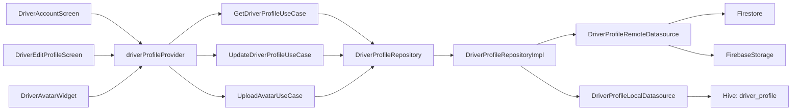

# SPEC-0005: Driver Profile

**Status:** APPROVED
**Author:** architect
**Date:** 2026-06-03
**Proposal:** [PROP-0005](../tech-proposals/0005-driver-profile.md)
**Figma:** `LIdE6qDQzKpV3L5bAbO24w` (same file as SPEC-0004, driver screens)
**Approved by:** Mew

---

## Overview

Introduce a dedicated `DriverProfile` domain entity, repository interface, Firestore-backed data layer, and Hive offline cache for the driver role. Expose the feature as two screens — `DriverAccountScreen` (read view) and `DriverEditProfileScreen` (edit form) — wired to the existing but non-functional bottom nav Account tab (index 2 of `_DriverBottomNav` in `driver_map_screen.dart`). Drivers can view and update their name, phone, vehicle type, licence plate, and emergency contact. Avatar upload targets Firebase Storage at `avatars/drivers/{uid}.jpg`; the resulting download URL is written back to the `users/{uid}` Firestore document. Profile data is cached in a `driver_profile` Hive box (type `dynamic`, key = uid) so the view screen renders meaningful content when the device is offline. UID and email are auth-managed and remain read-only in the UI. This is the first formal profile repository interface defined in the codebase — it establishes the pattern for any future role-scoped profile features.

---

## Architecture



---

## File Map

| Action | Path | Responsibility |
|---|---|---|
| Create | `lib/features/driver/domain/entities/driver_profile.dart` | Pure Dart Freezed entity — no Flutter or backend imports |
| Create | `lib/features/driver/domain/repositories/driver_profile_repository.dart` | Abstract interface — getProfile, updateProfile, uploadAvatar, getCachedProfile |
| Create | `lib/features/driver/domain/usecases/get_driver_profile_usecase.dart` | Fetch profile by uid from repository |
| Create | `lib/features/driver/domain/usecases/update_driver_profile_usecase.dart` | Persist a DriverProfile via repository |
| Create | `lib/features/driver/domain/usecases/upload_avatar_usecase.dart` | Delegate upload to repository, return download URL |
| Create | `lib/features/driver/data/models/driver_profile_model.dart` | Freezed + JSON model; fromEntity / toEntity mappers |
| Create | `lib/features/driver/data/datasources/driver_profile_remote_datasource.dart` | Firestore read/write + Firebase Storage upload |
| Create | `lib/features/driver/data/datasources/driver_profile_local_datasource.dart` | Hive read/write using `driver_profile` box |
| Create | `lib/features/driver/data/repositories/driver_profile_repository_impl.dart` | Remote-first strategy; Hive fallback on network error; writes cache on every successful remote operation |
| Create | `lib/features/driver/presentation/providers/driver_profile_provider.dart` | Riverpod `@riverpod` AsyncNotifier wrapping all three use cases |
| Create | `lib/features/driver/presentation/screens/driver_account_screen.dart` | Read-only view: avatar, name, phone, vehicle type, licence plate, emergency contact; offline-cached state |
| Create | `lib/features/driver/presentation/screens/driver_edit_profile_screen.dart` | Edit form for all editable fields; submit calls updateProfile; loading / error states |
| Create | `lib/features/driver/presentation/widgets/driver_avatar_widget.dart` | Displays avatar via CachedNetworkImage; tap affordance triggers UploadAvatarUseCase |
| Modify | `lib/app/router.dart` | Add `/driver/account` → `DriverAccountScreen` and `/driver/account/edit` → `DriverEditProfileScreen` as sub-routes under `/driver` |
| Modify | `lib/features/driver/presentation/screens/driver_map_screen.dart` | Extend `_DriverBottomNav.onDestinationSelected` to handle `i == 2` with `context.go('/driver/account')` |
| Modify | `lib/main.dart` | Add `Hive.openBox<dynamic>('driver_profile')` to the existing `Future.wait([...])` block |

---

## API Contracts

```dart
// ─── Domain Entity ───────────────────────────────────────────────────────────
// lib/features/driver/domain/entities/driver_profile.dart
//
// Pure Dart — zero Flutter or backend imports.
// Not Freezed: mirrors the DonorProfile pattern (plain Dart class with const
// constructor and final fields). Freezed is used at the data/models layer only.

class DriverProfile {
  const DriverProfile({
    required this.uid,
    required this.name,
    required this.email,
    this.phone,
    this.photoUrl,
    this.vehicleType,
    this.licensePlate,
    this.emergencyContact,
  });

  final String uid;
  final String name;
  final String email;
  final String? phone;
  final String? photoUrl;
  final String? vehicleType;
  final String? licensePlate;
  final String? emergencyContact;
}


// ─── Repository Interface ────────────────────────────────────────────────────
// lib/features/driver/domain/repositories/driver_profile_repository.dart

abstract class DriverProfileRepository {
  /// Fetches the driver profile from the remote datasource.
  /// Throws on network failure; callers catch and fall back to [getCachedProfile].
  Future<DriverProfile> getProfile(String uid);

  /// Persists all editable fields to the remote datasource and updates the
  /// local Hive cache.
  Future<void> updateProfile(DriverProfile profile);

  /// Uploads a local image file to Firebase Storage and returns the
  /// public download URL. Does NOT write the URL back to Firestore —
  /// callers must follow up with [updateProfile].
  Future<String> uploadAvatar(String uid, String localFilePath);

  /// Returns the last-cached profile from Hive, or null if the cache is empty.
  /// Never throws.
  Future<DriverProfile?> getCachedProfile(String uid);
}


// ─── Use Cases ───────────────────────────────────────────────────────────────
// lib/features/driver/domain/usecases/get_driver_profile_usecase.dart

class GetDriverProfileUseCase {
  const GetDriverProfileUseCase(this._repository);
  final DriverProfileRepository _repository;

  Future<DriverProfile> call(String uid) => _repository.getProfile(uid);
}

// lib/features/driver/domain/usecases/update_driver_profile_usecase.dart

class UpdateDriverProfileUseCase {
  const UpdateDriverProfileUseCase(this._repository);
  final DriverProfileRepository _repository;

  Future<void> call(DriverProfile profile) => _repository.updateProfile(profile);
}

// lib/features/driver/domain/usecases/upload_avatar_usecase.dart

class UploadAvatarUseCase {
  const UploadAvatarUseCase(this._repository);
  final DriverProfileRepository _repository;

  /// Returns the Firebase Storage download URL for the uploaded image.
  Future<String> call(String uid, String localFilePath) =>
      _repository.uploadAvatar(uid, localFilePath);
}


// ─── Data Model ──────────────────────────────────────────────────────────────
// lib/features/driver/data/models/driver_profile_model.dart

@freezed
class DriverProfileModel with _$DriverProfileModel {
  const factory DriverProfileModel({
    required String uid,
    required String name,
    required String email,
    String? phone,
    String? photoUrl,
    String? vehicleType,
    String? licensePlate,
    String? emergencyContact,
  }) = _DriverProfileModel;

  factory DriverProfileModel.fromJson(Map<String, dynamic> json) =>
      _$DriverProfileModelFromJson(json);

  // Mapper methods are defined as extension methods or a separate mapper class
  // (see implementation note below).
}

// Mappers live in the same file as extension methods on DriverProfileModel:
//   DriverProfileModel.fromEntity(DriverProfile e) → DriverProfileModel
//   DriverProfileModel.toEntity() → DriverProfile


// ─── Riverpod Provider ───────────────────────────────────────────────────────
// lib/features/driver/presentation/providers/driver_profile_provider.dart

@riverpod
class DriverProfileNotifier extends _$DriverProfileNotifier {
  @override
  Future<DriverProfile?> build() async {
    // Reads uid from auth state provider; returns cached profile as initial
    // value while the remote fetch is in-flight.
    // Returns null (empty state — not an error) if both remote and cache miss.
  }

  Future<void> updateProfile(DriverProfile profile) async { /* ... */ }

  Future<void> uploadAvatar(String localFilePath) async { /* ... */ }
}
```

---

## Data Schema

### Firestore

Driver profile fields are merged into the existing `users/{uid}` document. No separate collection is created.

```
users/{uid}
  uid:              string   — auth-managed, never written by this feature
  email:            string   — auth-managed, never written by this feature
  role:             string   — "driver"
  name:             string
  phone:            string?
  photoUrl:         string?  — Firebase Storage download URL; null until first upload
  vehicleType:      string?
  licensePlate:     string?
  emergencyContact: string?
  updatedAt:        Timestamp — server timestamp; written on every updateProfile call
```

Write strategy: `updateProfile` uses `set(..., SetOptions(merge: true))` so it only touches the fields listed above and does not overwrite unrelated fields on the document (e.g. `points`, `role`).

### Hive (offline cache)

```
Box name:  driver_profile
Box type:  dynamic  (opened as Hive.openBox<dynamic>('driver_profile'))
Key:       uid (String)
Value:     Map<String, dynamic>  — same field names as the Firestore document
```

Cache lifecycle:
- Written on every successful `getProfile` remote fetch.
- Written on every successful `updateProfile` call (using the post-write in-memory value, not a second remote read).
- Read by `getCachedProfile(uid)` when the remote fetch throws any exception.
- If the remote fetch fails and `getCachedProfile` returns null, the presentation layer surfaces a specific offline empty state widget — not a generic error.
- No TTL enforced in this spec. Stale cache is overwritten on the next successful remote fetch.

### Firebase Storage

```
avatars/drivers/{uid}.jpg
```

- Upload overwrites the same path on every avatar change (no versioning).
- After a successful upload, `UploadAvatarUseCase` returns the download URL.
- The caller (`DriverProfileNotifier.uploadAvatar`) constructs an updated `DriverProfile` with the new `photoUrl` and immediately calls `updateProfile` to persist the URL to Firestore.
- `CachedNetworkImage` is used for all avatar display — no raw `Image.network`.

---

## Test Plan

| Test file | Covers |
|---|---|
| `test/unit/features/driver/get_driver_profile_usecase_test.dart` | Returns remote profile on success; delegates to `getCachedProfile` when remote throws; use case propagates null from cache (empty state, not error) |
| `test/unit/features/driver/update_driver_profile_usecase_test.dart` | Calls `repository.updateProfile` with the correct entity; propagates `Exception` thrown by repository unchanged |
| `test/unit/features/driver/upload_avatar_usecase_test.dart` | Calls `repository.uploadAvatar(uid, filePath)`; returns the URL from the repository mock |
| `test/unit/features/driver/driver_profile_repository_impl_test.dart` | Remote-first: happy path writes Hive cache; offline path falls back to Hive; empty cache returns null; `uploadAvatar` calls remote datasource Storage method |
| `test/widget/features/driver/driver_account_screen_test.dart` | Renders name, phone, vehicle type, licence plate, emergency contact from a faked provider; shows offline-cached empty state when provider returns null; "Edit" navigation tap pushes `/driver/account/edit` |
| `test/widget/features/driver/driver_edit_profile_screen_test.dart` | Form validation rejects empty name; submit button calls `notifier.updateProfile`; loading indicator shown while AsyncValue is loading; error snackbar shown on failure |

All widget tests override providers via `ProviderScope(overrides: [...])` with stub implementations. No real Firestore or Hive I/O in widget tests.

---

## Out of Scope

- Driver onboarding / first-time registration flow — collecting vehicle info at sign-up is a separate feature.
- Admin-side profile editing — admins modify driver records via a separate admin console, not this screen.
- Push notifications triggered by profile changes.
- Profile visibility to donors or beneficiaries — drivers are currently anonymous to other roles in the app.
- Social or gamification elements on the profile screen (e.g. rating, badge count).
- Image cropping or resizing before upload — raw file is uploaded as-is in this iteration.
- Multiple vehicle support — `vehicleType` and `licensePlate` are single-value fields in this spec.

---

## Open Questions

All open questions from PROP-0005 are resolved.

- [x] **Editable fields:** name, phone, vehicleType, licensePlate, emergencyContact are driver-editable. uid and email are auth-managed and rendered read-only. Resolved by team before spec was written.
- [x] **Avatar storage backend:** Firebase Storage at `avatars/drivers/{uid}.jpg`. Natural companion to Firestore; no external CDN needed at this scale. Resolved by team before spec was written.
- [x] **Vehicle info scope:** vehicleType and licensePlate are included in `DriverProfile` in this spec. A separate driver-onboarding flow is out of scope. Resolved by team before spec was written.
- [x] **Hive box ownership:** `Hive.openBox<dynamic>('driver_profile')` is added to the `Future.wait([...])` block in `main.dart` alongside `donor_batches` and `donor_metrics`. No custom adapter required — value is `Map<String, dynamic>`. Resolved by team before spec was written.
