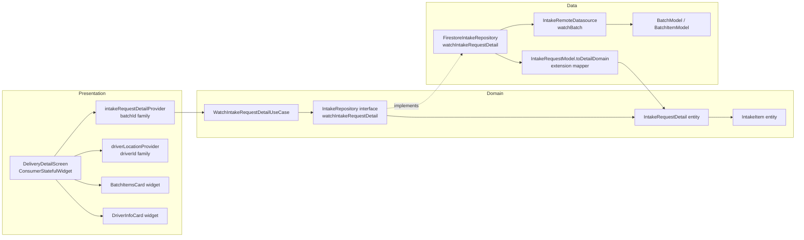

# SPEC-0006: Beneficiary Batch Detailed View

**Status:** ACCEPTED
**Author:** architect
**Date:** 2026-06-04
**Proposal:** [PROP-0006](../tech-proposals/0006-beneficiary-batches-detailed-view.md)
**Approved by:** nadi

---

## Overview

`DeliveryDetailScreen` is currently a stub that renders only the raw `batchId` string. When a beneficiary taps "View Details" on an `ActiveDeliveryCard`, they navigate to `/beneficiary/delivery/:batchId` and see nothing useful. This spec implements the full screen: item-level batch contents, driver name and ETA, an embedded live map centred on the driver's position, and a cancellation banner when the batch is cancelled. To avoid burdening the beneficiary dashboard's high-frequency `watchActiveDeliveries` stream with item-array allocation on every Firestore snapshot, a dedicated `IntakeRequestDetail` domain entity is introduced — carrying all scalar fields of `IntakeRequest` plus `List<IntakeItem> items` and `donorName` — alongside a matching use case, repository method, mapper extension, and Riverpod family provider. The existing `IntakeRequest` entity and the `watchActiveDeliveries` code path are untouched.

---

## Architecture



---

## File map

| Action     | Path (relative to `apps/mobile/lib/`)                                           | Responsibility                                                                                                                                                                             |
| ---------- | ------------------------------------------------------------------------------- | ------------------------------------------------------------------------------------------------------------------------------------------------------------------------------------------ |
| **Create** | `features/beneficiary/domain/entities/intake_item.dart`                         | Pure-Dart value type: `name`, `category`, `weightKg`                                                                                                                                       |
| **Create** | `features/beneficiary/domain/entities/intake_request_detail.dart`               | Pure-Dart detail entity: all `IntakeRequest` scalars + `items` + `donorName`                                                                                                               |
| **Create** | `features/beneficiary/domain/usecases/watch_intake_request_detail_usecase.dart` | Single-method use case delegating to `IntakeRepository.watchIntakeRequestDetail`                                                                                                           |
| **Modify** | `features/beneficiary/domain/repositories/intake_repository.dart`               | Add `Stream<IntakeRequestDetail?> watchIntakeRequestDetail(String batchId)`                                                                                                                |
| **Modify** | `features/beneficiary/data/models/intake_request_model.dart`                    | Add `toDetailDomain(BatchModel batch)` static mapper method (or standalone extension `IntakeRequestModelDetailX`) that maps `batch.items` → `List<IntakeItem>` and reads `batch.donorName` |
| **Modify** | `features/beneficiary/data/repositories/firestore_intake_repository.dart`       | Implement `watchIntakeRequestDetail` via `_datasource.watchBatch(batchId)` + mapper                                                                                                        |
| **Modify** | `features/beneficiary/presentation/providers/beneficiary_provider.dart`         | Add `watchIntakeRequestDetailUseCaseProvider` and `intakeRequestDetailProvider(batchId)` family                                                                                            |
| **Modify** | `features/beneficiary/presentation/screens/delivery_detail_screen.dart`         | Rewrite stub as `ConsumerStatefulWidget`; watch `intakeRequestDetailProvider(batchId)`                                                                                                     |
| **Create** | `features/beneficiary/presentation/widgets/driver_info_card.dart`               | Rounded card: embedded `GoogleMap` + driver avatar + name + ETA + "En route" chip                                                                                                          |
| **Create** | `features/beneficiary/presentation/widgets/batch_items_card.dart`               | Rounded card: origin/portions header + `ListView.builder` of `IntakeItem` rows                                                                                                             |
| **Create** | `test/unit/features/beneficiary/watch_intake_request_detail_usecase_test.dart`  | Unit test: delegation and stream passthrough                                                                                                                                               |
| **Create** | `test/unit/features/beneficiary/intake_request_detail_mapper_test.dart`         | Unit test: `BatchItemModel` list → `List<IntakeItem>`, empty list, `donorName` mapping                                                                                                     |
| **Create** | `test/widget/features/beneficiary/delivery_detail_screen_test.dart`             | Widget tests: loading, active-with-items, cancelled, null/not-found                                                                                                                        |

---

## API contracts

All code below is the exact Dart interface the implementation must match. No pseudocode.

### `intake_item.dart`

```dart
// features/beneficiary/domain/entities/intake_item.dart
// Pure Dart — zero Flutter or backend imports.

class IntakeItem {
  const IntakeItem({
    required this.name,
    required this.category,
    required this.weightKg,
  });

  final String name;
  final String category;
  final double weightKg;
}
```

### `intake_request_detail.dart`

```dart
// features/beneficiary/domain/entities/intake_request_detail.dart
// Pure Dart — zero Flutter or backend imports.

import 'package:saveameal/features/beneficiary/domain/entities/intake_item.dart';
import 'package:saveameal/features/beneficiary/domain/entities/intake_request.dart';

class IntakeRequestDetail {
  const IntakeRequestDetail({
    required this.batchId,
    required this.beneficiaryId,
    required this.donorId,
    required this.status,
    required this.portions,
    required this.weightKg,
    required this.items,
    this.donorName,
    this.volunteerId,
    this.volunteerName,
    this.estimatedArrivalMinutes,
    this.cancellationReason,
    this.createdAt,
    this.updatedAt,
  });

  final String batchId;
  final String beneficiaryId;
  final String donorId;
  final String? donorName;
  final IntakeStatus status;   // reuses the existing enum from intake_request.dart
  final int portions;
  final double weightKg;
  final List<IntakeItem> items;
  final String? volunteerId;   // same as driverId — used as the key for driverLocationProvider
  final String? volunteerName;
  final int? estimatedArrivalMinutes;
  final String? cancellationReason;
  final DateTime? createdAt;
  final DateTime? updatedAt;
}
```

### `watch_intake_request_detail_usecase.dart`

```dart
// features/beneficiary/domain/usecases/watch_intake_request_detail_usecase.dart
// Pure Dart — zero Flutter or backend imports.

import 'package:saveameal/features/beneficiary/domain/entities/intake_request_detail.dart';
import 'package:saveameal/features/beneficiary/domain/repositories/intake_repository.dart';

class WatchIntakeRequestDetailUseCase {
  const WatchIntakeRequestDetailUseCase(this._repository);

  final IntakeRepository _repository;

  Stream<IntakeRequestDetail?> call(String batchId) =>
      _repository.watchIntakeRequestDetail(batchId);
}
```

### `intake_repository.dart` — addition only

```dart
// Add to the existing IntakeRepository abstract class.
// Import IntakeRequestDetail at the top of the file.

Stream<IntakeRequestDetail?> watchIntakeRequestDetail(String batchId);
```

### `intake_request_model.dart` — mapper extension addition

```dart
// Add alongside the existing IntakeRequestModelX extension.
// This is a standalone extension so it can receive the original BatchModel
// (IntakeRequestModel.fromBatch() discards items during construction).

import 'package:saveameal/core/models/batch_model.dart';
import 'package:saveameal/core/models/batch_item_model.dart';
import 'package:saveameal/features/beneficiary/domain/entities/intake_item.dart';
import 'package:saveameal/features/beneficiary/domain/entities/intake_request_detail.dart';

// Declared outside any class — a module-level function is acceptable;
// alternatively name it IntakeRequestModelDetailX if an extension is preferred.
IntakeRequestDetail batchModelToDetailDomain(BatchModel batch) {
  final items = batch.items
      .map(
        (i) => IntakeItem(
          name: i.name,
          category: i.category,
          weightKg: i.weightKg,
        ),
      )
      .toList();

  return IntakeRequestDetail(
    batchId: batch.id,
    beneficiaryId: batch.beneficiaryId ?? '',
    donorId: batch.donorId,
    donorName: batch.donorName,
    status: IntakeRequestModelX.mapStatusPublic(batch.status.name),
    portions: items.length,
    weightKg: items.fold(0.0, (sum, i) => sum + i.weightKg),
    items: items,
    volunteerId: batch.driverId,
    volunteerName: batch.volunteerName,
    estimatedArrivalMinutes: null, // not stored on BatchModel; extend when available
    cancellationReason: null,      // not stored on BatchModel; extend when available
    createdAt: batch.createdAt,
    updatedAt: batch.updatedAt,
  );
}
```

> **Implementation note:** `IntakeRequestModelX._mapStatus` is currently private. The engineer must either make the method package-accessible (rename to `mapStatusPublic` and expose it, or move it to a shared location in `intake_request.dart`), or duplicate the switch in `batchModelToDetailDomain`. Either approach is acceptable; the architect recommends moving the switch to a top-level function in `intake_request.dart` so both mappers share one source of truth. Record this decision in a code comment.

### `firestore_intake_repository.dart` — method addition

```dart
@override
Stream<IntakeRequestDetail?> watchIntakeRequestDetail(String batchId) =>
    _datasource
        .watchBatch(batchId)
        .map((batch) => batch == null ? null : batchModelToDetailDomain(batch));
```

### `beneficiary_provider.dart` — provider additions

```dart
@riverpod
WatchIntakeRequestDetailUseCase watchIntakeRequestDetailUseCase(Ref ref) =>
    WatchIntakeRequestDetailUseCase(ref.watch(intakeRepositoryProvider));

@riverpod
Stream<IntakeRequestDetail?> intakeRequestDetail(Ref ref, String batchId) =>
    ref.watch(watchIntakeRequestDetailUseCaseProvider).call(batchId);
```

---

## Firestore schema

No Firestore schema changes are required for this feature. All fields consumed by `IntakeRequestDetail` already exist on documents in the `batches` collection:

| Field           | Firestore type | Notes                                                                                                                                                    |
| --------------- | -------------- | -------------------------------------------------------------------------------------------------------------------------------------------------------- |
| `items`         | `Array<Map>`   | Each element has `name` (String), `category` (String), `weightKg` (Number), `expiryTime` (Timestamp), `photoUrl?` (String). Mapped via `BatchItemModel`. |
| `donorName`     | `String?`      | Denormalised at batch creation. May be absent on older documents — map to `null`.                                                                        |
| `driverId`      | `String?`      | Used as `volunteerId` in the domain entity and as the key for `driverLocationProvider`.                                                                  |
| `volunteerName` | `String?`      | Denormalised when volunteer accepts job.                                                                                                                 |
| `status`        | `String`       | Firestore enum values: `open`, `claimed`, `pickedUp`, `delivered`, `closed`, `cancelled`. Mapped by `_mapStatus` to `IntakeStatus`.                      |
| `beneficiaryId` | `String?`      | Required logically; treat absent as empty string (matches existing `fromBatch` behaviour).                                                               |

`estimatedArrivalMinutes` and `cancellationReason` are not currently stored on `BatchModel`. Both fields are mapped to `null` by `batchModelToDetailDomain` in this iteration. When the backend adds these fields, the mapper is the only place that needs updating.

---

## UI layout

`DeliveryDetailScreen` is a `ConsumerStatefulWidget`. The root widget is a `Scaffold` with a custom `AppBar` and a `SingleChildScrollView` body. All spacing uses `Spacing.*` constants. All colours use `cs.*` or `ac.*`. All text styles use `Theme.of(context).textTheme.*`.

### AppBar

- Leading: `IconButton` with `Icons.arrow_back`, calls `context.pop()`.
- Actions: `IconButton` with `Icons.notifications_outlined`. No action needed for this iteration (no-op tap).
- No `title` widget — the page title lives in the body.

### Cancellation banner (conditional)

Shown **above all other body content** when `detail.status == IntakeStatus.cancelled`.

- `Container` with `ac.warning` background (or `ac.error` — team to confirm; use `ac.warning` as default).
- Padding: `Spacing.md` on all sides.
- Content: `Text("Delivery cancelled", style: textTheme.titleSmall?.copyWith(fontWeight: FontWeight.bold))` followed by, if `detail.cancellationReason != null`, `Text(detail.cancellationReason!, style: textTheme.bodySmall)`.
- Do NOT redirect or hide other content — items remain visible for reference.

### Page header

- `Text("Incoming Batch", style: textTheme.headlineMedium?.copyWith(fontWeight: FontWeight.bold))`.
- `Text("Real-time delivery tracking", style: textTheme.bodySmall?.copyWith(color: cs.onSurfaceVariant))`.
- Padding: `Spacing.md` horizontal, `Spacing.md` top.

### DriverInfoCard widget

Located at `features/beneficiary/presentation/widgets/driver_info_card.dart`. Receives `IntakeRequestDetail detail` and `DriverLocationModel? driverLocation`.

**Map section** (~200 dp height, clipped to rounded top corners of the card):

- When `detail.volunteerId != null`: render `GoogleMap` (`google_maps_flutter`) centred on `driverLocation?.latitude` / `driverLocation?.longitude` (if available) or a default position. Set `liteModeEnabled: true` on Android for a static bitmap render (avoids texture layer overhead in a scrollable list). Set `zoomGesturesEnabled: false`, `scrollGesturesEnabled: false`, `tiltGesturesEnabled: false`, `rotateGesturesEnabled: false` — the map is display-only.
- When `detail.volunteerId == null` or `driverLocation == null`: show a grey `Container` (`cs.surfaceContainerHigh` fill) with `Icons.local_shipping_outlined` centred in `cs.onSurfaceVariant`.
- "En route" chip overlay: shown **only** when `driverLocation != null`. Positioned bottom-left using `Stack` + `Positioned`. Chip uses `cs.primaryContainer` fill and `cs.onPrimaryContainer` text. Label: `"En route"`. Distance computation (haversine "X km away") is **deferred** — see Out of Scope.

**Driver row** (below map, inside same card, padding `Spacing.md`):

- Left: `CircleAvatar` radius 22 — attempt `CachedNetworkImage` with initials fallback. Initials derived from `detail.volunteerName` (same logic as `ActiveDeliveryCard`).
- Center: `Text(detail.volunteerName ?? "Volunteer", style: textTheme.bodyMedium?.copyWith(fontWeight: FontWeight.bold))`.
- Right: ETA column.
  - When `detail.estimatedArrivalMinutes != null`: `Text("ETA", style: textTheme.labelSmall)` + `Text("${detail.estimatedArrivalMinutes} min", style: textTheme.titleMedium?.copyWith(color: cs.primary))`.
  - When null: `Text("ETA unknown", style: textTheme.bodySmall?.copyWith(color: cs.onSurfaceVariant))`.
- Star rating: **omitted** — not in the domain schema.

### "Batch Details" section header

`Text("Batch Details", style: textTheme.titleMedium?.copyWith(fontWeight: FontWeight.bold))`. Padding: `Spacing.md` horizontal, `Spacing.sm` top.

### BatchItemsCard widget

Located at `features/beneficiary/presentation/widgets/batch_items_card.dart`. Receives `IntakeRequestDetail detail`.

**Header row** (padding `Spacing.md`):

- Left: rounded outline chip — `Container` with border `cs.outline`, `cs.surfaceContainerLow` fill, radius 20. Text: `"Origin: ${detail.donorName ?? 'Unknown'}"`, `textTheme.labelMedium`.
- Right: filled pill badge — `Container` with `cs.primary` fill, radius 20. Text: `"${detail.portions} Portions"`, `textTheme.labelMedium` with `cs.onPrimary`.

**Divider**: `Divider(height: 1, color: cs.outlineVariant)`.

**Item list**: `ListView.builder` with `shrinkWrap: true` and `physics: const NeverScrollableScrollPhysics()` over `detail.items`. Each row:

- Leading: `Icon(Icons.restaurant, color: cs.onSurfaceVariant)`. A single icon is used for all categories in this iteration — no per-category icon map. This is a documented deviation from a possible future enhancement.
- Title: `Text(item.name, style: textTheme.bodyMedium)`.
- Trailing: `Text("${item.weightKg.toStringAsFixed(1)} kg", style: textTheme.bodyMedium?.copyWith(fontWeight: FontWeight.bold))`.

**Figma deviation — weight vs count:** The Figma frame shows `"15x"` item counts per row. The domain schema stores `weightKg` (a continuous quantity), not a discrete count. This spec displays `weightKg` rounded to one decimal place (e.g. `"1.5 kg"`) instead of a count. This is a deliberate, documented deviation. If the product team decides counts are required, a new `quantity: int` field must be added to `BatchItemModel`, `IntakeItem`, and the mapper — that is out of scope here.

### "Recent Deliveries" section

Visible in Figma but **out of scope** for this spec. See Out of Scope section.

### Screen states

| State     | Trigger                               | Rendered UI                                                                                                                 |
| --------- | ------------------------------------- | --------------------------------------------------------------------------------------------------------------------------- |
| Loading   | `AsyncValue.loading`                  | `Center(child: CircularProgressIndicator())`                                                                                |
| Not found | Stream emits `null`                   | Centered `Column`: `Icons.search_off` icon + `Text("Delivery not found")` + `TextButton("Go back")` calling `context.pop()` |
| Active    | `status` is `pending` or `dispatched` | Full layout: page header, optional cancellation banner (not shown), `DriverInfoCard`, section header, `BatchItemsCard`      |
| Collected | `status` is `collected`               | Same as Active; ETA row in `DriverInfoCard` is hidden (ETA is irrelevant post-delivery)                                     |
| Cancelled | `status` is `cancelled`               | Cancellation banner rendered above page header; `DriverInfoCard` and `BatchItemsCard` still rendered for reference          |

---

## Test plan

| Test file                                                                      | Class / scenario covered                             | Key assertions                                                                                                                                                                                                                                                                                                                                                        |
| ------------------------------------------------------------------------------ | ---------------------------------------------------- | --------------------------------------------------------------------------------------------------------------------------------------------------------------------------------------------------------------------------------------------------------------------------------------------------------------------------------------------------------------------- |
| `test/unit/features/beneficiary/watch_intake_request_detail_usecase_test.dart` | `WatchIntakeRequestDetailUseCase`                    | Calls `repository.watchIntakeRequestDetail(batchId)` exactly once; returns the stream unmodified; does not throw when repository emits `null`                                                                                                                                                                                                                         |
| `test/unit/features/beneficiary/intake_request_detail_mapper_test.dart`        | `batchModelToDetailDomain` mapper                    | (1) Non-empty `BatchItemModel` list maps each item's `name`, `category`, `weightKg` to `IntakeItem`; (2) Empty `items` list maps to empty `List<IntakeItem>`; (3) `batch.donorName` maps to `detail.donorName`; (4) `batch.donorName == null` maps to `detail.donorName == null`; (5) `portions` equals `items.length`; (6) `weightKg` equals the sum of item weights |
| `test/widget/features/beneficiary/delivery_detail_screen_test.dart`            | `DeliveryDetailScreen` — loading state               | `CircularProgressIndicator` is visible; no other content rendered                                                                                                                                                                                                                                                                                                     |
| `test/widget/features/beneficiary/delivery_detail_screen_test.dart`            | `DeliveryDetailScreen` — dispatched state with items | `"Incoming Batch"` title present; volunteer name visible; item names visible in list; ETA text present when `estimatedArrivalMinutes` non-null; cancellation banner absent                                                                                                                                                                                            |
| `test/widget/features/beneficiary/delivery_detail_screen_test.dart`            | `DeliveryDetailScreen` — cancelled state             | Cancellation banner visible with `cancellationReason` text; items still rendered                                                                                                                                                                                                                                                                                      |
| `test/widget/features/beneficiary/delivery_detail_screen_test.dart`            | `DeliveryDetailScreen` — null stream (not found)     | `"Delivery not found"` text visible; `CircularProgressIndicator` absent                                                                                                                                                                                                                                                                                               |

Widget tests must mock `intakeRequestDetailProvider` using `ProviderScope` overrides. `GoogleMap` should be replaced with a `SizedBox` stub via dependency injection or conditional compilation to avoid requiring a real Google Maps SDK in the test environment.

---

## Out of scope

The following items are explicitly excluded from this spec. Each must be tracked as a separate feature or future spec:

- **"Recent Deliveries" history section** — visible in the Figma frame below `BatchItemsCard`. Requires a separate delivery history query not present in `IntakeRequestDetail`.
- **Haversine distance computation for "X km away" chip** — the chip shows `"En route"` in this iteration. Computing real distance from the beneficiary's location to the driver's location requires exposing beneficiary coordinates and implementing the haversine formula. Deferred to a future spec.
- **Driver phone / contact action** — `BatchModel` has no `volunteerPhone` field. Showing a "Call driver" button requires a Firestore schema addition and a `url_launcher` deep-link. Deferred.
- **Item photo thumbnails** — `BatchItemModel.photoUrl` is a nullable field not included in `IntakeItem`. Rendering per-item `CachedNetworkImage` thumbnails is deferred; the category icon placeholder (`Icons.restaurant`) is used instead.
- **Star rating display** — `BatchModel` has a `rating: int?` field but it is not part of the domain schema for this screen. Figma shows no star rating widget on this screen. Omitted entirely.
- **Implementing `WatchIncomingBatchUsecase` stub** — `apps/mobile/lib/features/beneficiary/domain/usecases/watch_incoming_batch_usecase.dart` exists as a stub referencing `BeneficiaryRepository`. This spec introduces a separate `WatchIntakeRequestDetailUseCase` backed by `IntakeRepository`. The existing stub must be left as-is — no changes, no deletion. Implementing or removing it is a separate decision requiring team discussion.
- **`estimatedArrivalMinutes` and `cancellationReason` from Firestore** — neither field currently exists on `BatchModel`. Both are mapped to `null` by the mapper. Populating them requires a backend schema addition and is deferred.

---

## Open questions

All four open questions from PROP-0006 are resolved as follows:

1. **Driver contact action** — RESOLVED: deferred to a future spec. `volunteerPhone` is not added to the Firestore schema in this iteration. This screen shows `volunteerName` and `estimatedArrivalMinutes` text only.

2. **Firestore offline persistence** — RESOLVED: no code change needed. Firestore SDK's default offline persistence (`persistenceEnabled: true`) is already active on iOS and Android. The app's Firebase initialisation does not explicitly disable it. The last-cached batch document will render without a live connection. If persistence is found to be disabled, re-enabling it is a one-line change in `FirebaseOptions` initialisation and is a separate task.

3. **Item photo display** — RESOLVED: deferred. `BatchItemModel.photoUrl` is excluded from `IntakeItem` in this iteration. All item rows display `Icons.restaurant` as a category placeholder. Photo thumbnails are added in a future spec once seed-data photo coverage is confirmed.

4. **Cancelled-batch screen reachability** — RESOLVED: render the cancellation summary, do NOT redirect. `DeliveryDetailScreen` renders a cancellation banner with `cancellationReason` (if non-null) above all other content and continues to show batch items for reference. No router guard or redirect rule is added. This decision is consistent with deep-link reachability — a beneficiary arriving via a push notification about a cancelled delivery should see the reason, not a blank screen.
