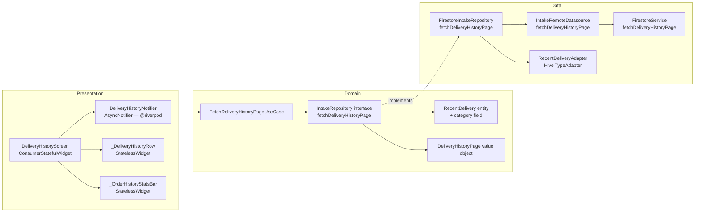

# SPEC-0007: Beneficiary Order History

**Status:** ACCEPTED
**Author:** architect
**Date:** 2026-06-04
**Proposal:** [PROP-0007](../tech-proposals/0007-beneficiary-order-history.md)
**Approved by:** nadi

---

## Overview

Beneficiaries currently see at most three completed deliveries in the `RecentDeliveriesSection` widget on the dashboard. The "View All" button in that widget is a no-op. This spec delivers a dedicated `DeliveryHistoryScreen` at `/beneficiary/history` that lists the full paginated delivery history for the signed-in beneficiary, supports offline reading of previously-loaded pages via a Hive page cache, and allows tapping any row to navigate to the existing `DeliveryDetailScreen`. The domain layer acquires one new method on `IntakeRepository` and one new use case; no existing domain types are removed or broken. The `RecentDelivery` entity gains a `category` field (see decision below).

---

## Architecture



---

## Key Design Decisions

### D1 — `category` field on `RecentDelivery`

**Problem.** The Figma shows each history card with a human-readable category label (e.g. "50 Hot Meals", "120 Baked Goods") and a per-category icon. No such field exists on the current `RecentDelivery` entity. `BatchModel` carries `items: List<BatchItemModel>`, and each `BatchItemModel` has a `category: String` field. The history query returns one row per batch — a batch may contain mixed categories. A representative category must be derived.

**Options.**

| #   | Option                                                                                                                                   | Upside                                                               | Downside                                                                    |
| --- | ---------------------------------------------------------------------------------------------------------------------------------------- | -------------------------------------------------------------------- | --------------------------------------------------------------------------- |
| A   | Add `category: String?` to `RecentDelivery`; mapper reads `batch.items.first?.category` (most-common category, or first item's category) | Single field, minimal entity growth, backwards-compatible (nullable) | Batches with mixed categories lose accuracy; first-item choice is arbitrary |
| B   | Add `categories: List<String>` to `RecentDelivery`; display first or comma-join                                                          | Accurate for mixed batches                                           | Entity grows; display logic becomes complex for one field                   |
| C   | Compute display label in the mapper as a formatted string (e.g. "50 Hot Meals") and store as `categoryLabel: String?`                    | Display-ready                                                        | Bakes display logic into the data layer; hard to localise                   |

**Decision: Option A.** Add `category: String?` to `RecentDelivery`. The mapper reads the first non-null `category` from `batch.items`. This is nullable so existing callers (`RecentDeliveriesSection`, `watchRecentDeliveries` stream path) are unaffected — they ignore the field. A majority-category approach is left as a possible future enhancement via a code comment in the mapper.

### D2 — Display identifier format ("Order #...")

**Problem.** The Figma shows "Order #SH-4092" — a short human-readable identifier. `BatchModel` has no `orderNumber` or `batchNumber` field; the only identifier is `id` (a full Firestore document ID, e.g. `"3Xk9mPqLrT2..."`).

**Options.**

| #   | Option                                                                                                    | Upside                  | Downside                                                                      |
| --- | --------------------------------------------------------------------------------------------------------- | ----------------------- | ----------------------------------------------------------------------------- |
| A   | Display `#${batchId.substring(0, 8).toUpperCase()}`                                                       | Zero schema change      | Looks like a hash, not a meaningful number; collisions theoretically possible |
| B   | Add `orderNumber: String?` to `BatchModel` and populate at batch-creation time in Cloud Functions         | Clean, human-memorable  | Schema addition + Cloud Functions change out of scope                         |
| C   | Display full `batchId` truncated to 8 chars with a `#` prefix, label the field "Ref" instead of "Order #" | Honest about what it is | Slightly different from Figma copy                                            |

**Decision: Option A** for MVP. The mapper sets `displayId = '#${batchId.substring(0, 8).toUpperCase()}'` inside `RecentDelivery`. No new field is added to `BatchModel`. This is a display-only concern — if the product team later ships sequential order numbers from Cloud Functions, `displayId` in `RecentDelivery` is updated in the mapper only. This is noted as an open question for tracking.

**Implementation note.** `RecentDelivery` does NOT gain a `displayId` field — the formatting is done inside `_DeliveryHistoryRow` in the presentation layer, receiving the raw `batchId`. This avoids encoding display logic in a domain entity. The row widget formats: `'#${delivery.batchId.substring(0, 8).toUpperCase()}'`.

### D3 — Aggregate stats (Total Meals, Deliveries count) on the stats bar

**Problem.** The Figma shows cumulative totals at the top of the screen. Options: (a) dedicated `beneficiaryStats` Firestore document, (b) a separate `COUNT` aggregate query, (c) compute from loaded pages only (approximate).

**Options.**

| #   | Option                                                                                               | Upside                                         | Downside                                                                                   |
| --- | ---------------------------------------------------------------------------------------------------- | ---------------------------------------------- | ------------------------------------------------------------------------------------------ |
| A   | Read from `beneficiaryStats` Firestore document (pre-aggregated by Cloud Functions on each delivery) | O(1) read, always accurate                     | Requires Cloud Functions write path; document may not exist for legacy beneficiaries       |
| B   | Firestore aggregate query `count()` + `sum(portions)` at screen open                                 | No Cloud Functions dependency; always accurate | Two extra Firestore reads per screen open; `sum()` aggregate requires Firestore v9.20+ SDK |
| C   | Sum `portions` and count rows across all loaded pages only                                           | Zero extra reads; purely client-side           | Inaccurate for unloaded pages; changes as more pages are loaded                            |

**Decision: Option C for MVP.** The stats bar computes `totalMeals` and `totalDeliveries` from the `items` list held by `DeliveryHistoryNotifier` at the time of render. This is explicitly an approximation of the full history total — it grows as more pages are loaded. The stats bar subtitle states "Showing loaded deliveries" when `hasMore == true` to make this approximation visible to the user. If the product team decides exact totals are required, Option A (Cloud Functions + `beneficiaryStats` document) is the correct upgrade path; it does not change the domain interface defined here, only the data source. This avoids adding a dependency on Cloud Functions existence for MVP. Marked as an open question.

### D4 — Status filter: delivered + closed only

The history query filters `status IN ['delivered', 'closed']`. The Figma shows an "In Transit" status chip on a history card. Per the proposal decision, in-progress batches are excluded from history. Both `delivered` and `closed` are mapped to the "Delivered" status chip (green, `ac.success`). The "In Transit" Figma card is treated as a design mock artefact, not a requirement. If the team later wants in-progress batches to appear in history, the status filter is the only change needed — the domain interface and notifier state are unaffected.

---

## File Map

| Action     | Path (relative to `apps/mobile/`)                                                   | Responsibility                                                                                                                                              |
| ---------- | ----------------------------------------------------------------------------------- | ----------------------------------------------------------------------------------------------------------------------------------------------------------- |
| **Modify** | `lib/features/beneficiary/domain/entities/recent_delivery.dart`                     | Add `category: String?` field                                                                                                                               |
| **Create** | `lib/features/beneficiary/domain/entities/delivery_history_page.dart`               | Value object: `List<RecentDelivery> items`, `bool hasMore`, `Object? nextCursor`                                                                            |
| **Modify** | `lib/features/beneficiary/domain/repositories/intake_repository.dart`               | Add `fetchDeliveryHistoryPage` abstract method                                                                                                              |
| **Create** | `lib/features/beneficiary/domain/usecases/fetch_delivery_history_page_usecase.dart` | Single-method use case delegating to `IntakeRepository.fetchDeliveryHistoryPage`                                                                            |
| **Modify** | `lib/features/beneficiary/data/datasources/intake_remote_datasource.dart`           | Add `fetchDeliveryHistoryPage` to the abstract class and `IntakeRemoteDatasourceImpl`                                                                       |
| **Modify** | `lib/features/beneficiary/data/repositories/firestore_intake_repository.dart`       | Implement `fetchDeliveryHistoryPage`; map `BatchModel` → `RecentDelivery` with `category`; advance Firestore cursor                                         |
| **Create** | `lib/features/beneficiary/data/models/recent_delivery_cache_entry.dart`             | Plain Dart class with `toJson`/`fromJson` for Hive serialisation (no Freezed — avoids codegen dependency for a simple cache model)                          |
| **Modify** | `lib/features/beneficiary/presentation/providers/beneficiary_provider.dart`         | Add `fetchDeliveryHistoryPageUseCaseProvider`; add `deliveryHistoryNotifierProvider` family                                                                 |
| **Create** | `lib/features/beneficiary/presentation/providers/delivery_history_notifier.dart`    | `DeliveryHistoryNotifier` — `AsyncNotifier<DeliveryHistoryState>` with `loadNextPage()`                                                                     |
| **Create** | `lib/features/beneficiary/presentation/screens/delivery_history_screen.dart`        | `DeliveryHistoryScreen` at `/beneficiary/history`; `ConsumerStatefulWidget`                                                                                 |
| **Create** | `lib/features/beneficiary/presentation/widgets/delivery_history_row.dart`           | `_DeliveryHistoryRow` — single card with left accent border, date, order ref, portions+category, donor                                                      |
| **Create** | `lib/features/beneficiary/presentation/widgets/order_history_stats_bar.dart`        | `_OrderHistoryStatsBar` — two stat tiles (Total Meals, Deliveries) computed from loaded pages                                                               |
| **Modify** | `lib/features/beneficiary/presentation/widgets/recent_deliveries_section.dart`      | Wire "View All" `TextButton.onPressed` from `() {}` to `() => context.push('/beneficiary/history')` — this button is rendered inside `DeliveryDetailScreen` |
| **Modify** | `lib/app/router.dart`                                                               | Add `GoRoute(path: 'history', ...)` under `/beneficiary` subtree                                                                                            |
| **Modify** | `firestore.indexes.json` (repo root)                                                | Add composite index: `batches — beneficiaryId ASC, deliveredAt DESC`                                                                                        |
| **Create** | `test/unit/features/beneficiary/fetch_delivery_history_page_usecase_test.dart`      | Unit test: delegation, argument forwarding                                                                                                                  |
| **Create** | `test/unit/features/beneficiary/delivery_history_notifier_test.dart`                | Unit test: first load, append, `hasMore` false when page < pageSize                                                                                         |
| **Create** | `test/widget/features/beneficiary/delivery_history_screen_test.dart`                | Widget tests: loading, populated, empty, error+retry, load-more visible/hidden                                                                              |

---

## API Contracts

All signatures below are the exact Dart interfaces the implementation must match.

### `recent_delivery.dart` — modified entity

```dart
// lib/features/beneficiary/domain/entities/recent_delivery.dart
// Pure Dart — zero Flutter or backend imports.

class RecentDelivery {
  const RecentDelivery({
    required this.batchId,
    required this.deliveredAt,
    required this.portions,
    this.donorName,
    this.category,        // NEW — nullable for backwards compatibility
  });

  final String batchId;
  final DateTime deliveredAt;
  final int portions;
  final String? donorName;
  final String? category; // First item category from BatchItemModel; null for legacy rows
}
```

### `delivery_history_page.dart` — new value object

```dart
// lib/features/beneficiary/domain/entities/delivery_history_page.dart
// Pure Dart — zero Flutter or backend imports.

import 'package:saveameal/features/beneficiary/domain/entities/recent_delivery.dart';

/// Returned by FetchDeliveryHistoryPageUseCase.
/// [nextCursor] is an opaque handle (DocumentSnapshot in practice) kept as Object?
/// so the domain layer holds no Firestore types.
class DeliveryHistoryPage {
  const DeliveryHistoryPage({
    required this.items,
    required this.hasMore,
    this.nextCursor,
  });

  final List<RecentDelivery> items;
  final bool hasMore;
  final Object? nextCursor; // null on the first page or when hasMore == false
}
```

### `intake_repository.dart` — addition only

```dart
// Add to the existing IntakeRepository abstract class.
// Add import at the top: delivery_history_page.dart

/// Fetches a single page of completed deliveries for [beneficiaryId].
///
/// [pageSize]  — number of records to return; use kDeliveryHistoryPageSize.
/// [cursor]    — opaque cursor returned by the previous page's DeliveryHistoryPage.nextCursor.
///               Pass null for the first page.
Future<DeliveryHistoryPage> fetchDeliveryHistoryPage({
  required String beneficiaryId,
  required int pageSize,
  Object? cursor,
});
```

### `fetch_delivery_history_page_usecase.dart` — new use case

```dart
// lib/features/beneficiary/domain/usecases/fetch_delivery_history_page_usecase.dart
// Pure Dart — zero Flutter or backend imports.

import 'package:saveameal/features/beneficiary/domain/entities/delivery_history_page.dart';
import 'package:saveameal/features/beneficiary/domain/repositories/intake_repository.dart';

/// Page size constant — defined here so both use case and notifier share one value.
const int kDeliveryHistoryPageSize = 20;

class FetchDeliveryHistoryPageUseCase {
  const FetchDeliveryHistoryPageUseCase(this._repository);

  final IntakeRepository _repository;

  Future<DeliveryHistoryPage> call({
    required String beneficiaryId,
    Object? cursor,
  }) => _repository.fetchDeliveryHistoryPage(
        beneficiaryId: beneficiaryId,
        pageSize: kDeliveryHistoryPageSize,
        cursor: cursor,
      );
}
```

### `intake_remote_datasource.dart` — addition

```dart
// Add to IntakeRemoteDatasource abstract class and IntakeRemoteDatasourceImpl.

/// Returns (items, lastDocumentSnapshot?) for cursor advancement.
/// The raw DocumentSnapshot is returned as Object? to avoid exposing
/// cloud_firestore types outside the datasource layer.
Future<(List<BatchModel>, Object? nextCursor)> fetchDeliveryHistoryPage({
  required String beneficiaryId,
  required int pageSize,
  Object? cursor,
});
```

### `firestore_intake_repository.dart` — method addition

```dart
@override
Future<DeliveryHistoryPage> fetchDeliveryHistoryPage({
  required String beneficiaryId,
  required int pageSize,
  Object? cursor,
}) async {
  final (batches, nextCursor) = await _datasource.fetchDeliveryHistoryPage(
    beneficiaryId: beneficiaryId,
    pageSize: pageSize,
    cursor: cursor,
  );

  final items = batches.map((b) => RecentDelivery(
    batchId: b.id,
    deliveredAt: b.deliveredAt ?? b.updatedAt ?? DateTime.now(),
    portions: b.items.length,
    donorName: b.donorName,
    category: b.items.isNotEmpty ? b.items.first.category : null,
  )).toList();

  return DeliveryHistoryPage(
    items: items,
    hasMore: batches.length == pageSize,
    nextCursor: batches.length == pageSize ? nextCursor : null,
  );
}
```

### `delivery_history_notifier.dart` — new notifier

```dart
// lib/features/beneficiary/presentation/providers/delivery_history_notifier.dart

import 'package:riverpod_annotation/riverpod_annotation.dart';
import 'package:saveameal/features/beneficiary/domain/entities/recent_delivery.dart';
import 'package:saveameal/features/beneficiary/domain/usecases/fetch_delivery_history_page_usecase.dart';
// ... additional imports for Hive cache, use case provider

part 'delivery_history_notifier.g.dart';

/// Immutable state for DeliveryHistoryNotifier.
class DeliveryHistoryState {
  const DeliveryHistoryState({
    required this.items,
    required this.hasMore,
    required this.isLoadingMore,
    this.loadMoreError,
    this.cursor,
  });

  final List<RecentDelivery> items;
  final bool hasMore;
  final bool isLoadingMore;        // true only during subsequent page loads
  final Object? loadMoreError;     // non-null when a loadNextPage() call failed
  final Object? cursor;            // opaque Firestore DocumentSnapshot

  DeliveryHistoryState copyWith({
    List<RecentDelivery>? items,
    bool? hasMore,
    bool? isLoadingMore,
    Object? loadMoreError,
    Object? cursor,
  }) => DeliveryHistoryState(
    items: items ?? this.items,
    hasMore: hasMore ?? this.hasMore,
    isLoadingMore: isLoadingMore ?? this.isLoadingMore,
    loadMoreError: loadMoreError,
    cursor: cursor ?? this.cursor,
  );

  static const empty = DeliveryHistoryState(
    items: [],
    hasMore: true,
    isLoadingMore: false,
  );
}

/// Family parameter: beneficiaryId.
@riverpod
class DeliveryHistoryNotifier extends _$DeliveryHistoryNotifier {
  /// Initialises the notifier: load from Hive cache, then fire first network page.
  @override
  Future<DeliveryHistoryState> build(String beneficiaryId) async { ... }

  /// Loads the next page. No-op if [state.hasMore] is false or a load is in progress.
  Future<void> loadNextPage() async { ... }

  /// Clears the Hive cache and reloads from page 0. Called on pull-to-refresh.
  Future<void> refresh() async { ... }
}

/// Convenience provider wiring the use case.
@riverpod
FetchDeliveryHistoryPageUseCase fetchDeliveryHistoryPageUseCase(Ref ref) =>
    FetchDeliveryHistoryPageUseCase(ref.watch(intakeRepositoryProvider));
```

**State machine:**

| State                         | `AsyncValue` wrapper                      | `DeliveryHistoryState` fields                             | Notes                                                           |
| ----------------------------- | ----------------------------------------- | --------------------------------------------------------- | --------------------------------------------------------------- |
| Initial load in progress      | `AsyncLoading`                            | —                                                         | Shown as `CircularProgressIndicator`                            |
| Cached data loaded (offline)  | `AsyncData`                               | `items` non-empty from cache; `hasMore: true`             | Screen renders immediately; network load fires in background    |
| Loaded (first page)           | `AsyncData`                               | `items` populated; `hasMore` depends on page count        | Normal state after first successful fetch                       |
| Loading more                  | `AsyncData` with `isLoadingMore: true`    | Previous items retained; "Load More" button shows spinner | Subsequent pages do NOT replace `AsyncData` with `AsyncLoading` |
| Load-more error               | `AsyncData` with `loadMoreError` non-null | Previous items retained                                   | Error shown inline below list; retry calls `loadNextPage()`     |
| Initial load error (no cache) | `AsyncError`                              | —                                                         | Full-screen error widget with retry                             |
| Empty                         | `AsyncData`                               | `items: []`; `hasMore: false`                             | Empty-state illustration shown                                  |
| All pages loaded              | `AsyncData`                               | `hasMore: false`                                          | "Load More" button hidden                                       |

---

## Firestore Schema

### Query pattern

```
Collection: batches
Filter:     beneficiaryId == <beneficiaryId>
Filter:     status IN ['delivered', 'closed']
Order:      deliveredAt DESC
Limit:      kDeliveryHistoryPageSize (20)
Cursor:     startAfterDocument(<lastDocumentSnapshot>) on page N+1
```

### Required composite index

Add the following entry to the `indexes` array in `firestore.indexes.json` at the repository root:

```json
{
  "collectionGroup": "batches",
  "queryScope": "COLLECTION",
  "fields": [
    { "fieldPath": "beneficiaryId", "order": "ASCENDING" },
    { "fieldPath": "status", "arrayConfig": "CONTAINS" },
    { "fieldPath": "deliveredAt", "order": "DESCENDING" }
  ]
}
```

> **Note on status + whereIn.** Firestore requires a composite index when combining an `arrayContains`/`in` filter with an `orderBy` on a different field. The `arrayConfig: "CONTAINS"` entry in the index definition covers the `whereIn` filter on `status`. Failure to add this index causes a runtime Firestore exception on the first query.

### Fields consumed per document

| Field              | Firestore type | Mapped to                                                                               |
| ------------------ | -------------- | --------------------------------------------------------------------------------------- |
| `id` (document ID) | String         | `RecentDelivery.batchId`                                                                |
| `deliveredAt`      | Timestamp      | `RecentDelivery.deliveredAt`                                                            |
| `items`            | Array\<Map\>   | `RecentDelivery.portions` (length), `RecentDelivery.category` (first item's `category`) |
| `donorName`        | String?        | `RecentDelivery.donorName`                                                              |
| `beneficiaryId`    | String         | Query filter — not stored in entity                                                     |
| `status`           | String         | Query filter — not stored in entity                                                     |

---

## Hive Cache Schema

### Box name

`delivery_history_cache`

### Key format

```
${beneficiaryId}_page_${pageIndex}
```

Example: `"abc123_page_0"`, `"abc123_page_1"`.

Page indices are 0-based and correspond to the order in which pages were loaded by the notifier, not to Firestore document offsets.

### Serialised value

Each cache entry is a JSON-encoded `List<Map<String, dynamic>>` where each map represents one `RecentDelivery`. The `RecentDeliveryCacheEntry` class (in `data/models/recent_delivery_cache_entry.dart`) provides `toJson`/`fromJson`. Hive stores the encoded string as a `String` value — no custom `TypeAdapter` is required; `Hive.box<String>` is used.

```dart
// Stored as: jsonEncode(entries.map((e) => e.toJson()).toList())
class RecentDeliveryCacheEntry {
  const RecentDeliveryCacheEntry({
    required this.batchId,
    required this.deliveredAtMs,  // millisecondsSinceEpoch
    required this.portions,
    this.donorName,
    this.category,
  });

  final String batchId;
  final int deliveredAtMs;
  final int portions;
  final String? donorName;
  final String? category;

  RecentDelivery toDomain() => RecentDelivery(
    batchId: batchId,
    deliveredAt: DateTime.fromMillisecondsSinceEpoch(deliveredAtMs),
    portions: portions,
    donorName: donorName,
    category: category,
  );

  Map<String, dynamic> toJson() => {
    'batchId': batchId,
    'deliveredAtMs': deliveredAtMs,
    'portions': portions,
    if (donorName != null) 'donorName': donorName,
    if (category != null) 'category': category,
  };

  factory RecentDeliveryCacheEntry.fromJson(Map<String, dynamic> json) =>
      RecentDeliveryCacheEntry(
        batchId: json['batchId'] as String,
        deliveredAtMs: json['deliveredAtMs'] as int,
        portions: json['portions'] as int,
        donorName: json['donorName'] as String?,
        category: json['category'] as String?,
      );
}
```

### Cache lifecycle

- **Write:** after each successful `fetchDeliveryHistoryPage` network call, the notifier writes the page to Hive keyed by `${beneficiaryId}_page_${pageIndex}`.
- **Read on startup:** in `DeliveryHistoryNotifier.build()`, before firing the first network request, the notifier reads all keys matching `${beneficiaryId}_page_*` in page-index order and populates `state.items`. The screen renders immediately. The network request fires concurrently.
- **Invalidation on refresh:** `refresh()` deletes all keys matching `${beneficiaryId}_page_*` from the box, then calls `loadNextPage()` from index 0.
- **No TTL for MVP.** Cached entries are stale until pull-to-refresh. `BatchModel` documents with `status == delivered` or `closed` are effectively immutable, so stale reads are unlikely in practice. A TTL may be added in a future iteration if donor-name corrections become common.

---

## UI Specification

### Navigation entry points

- **Primary entry point:** The `RecentDeliveriesSection` widget is embedded in `DeliveryDetailScreen` (`lib/features/beneficiary/presentation/screens/delivery_detail_screen.dart`, line 134). The "View All" `TextButton` in that widget currently has `onPressed: () {}` (no-op). This spec wires it to `context.push('/beneficiary/history')`.
- Future: could be added to Account tab navigation, but the Figma shows the Account tab selected — this spec does NOT add an Account tab entry. History is reachable solely via the "View All" button on `DeliveryDetailScreen`.

### Screen: `DeliveryHistoryScreen`

Root widget: `Scaffold` with a `CustomScrollView` (enables `SliverAppBar` + `SliverList` composition). All spacing via `Spacing.*`. All colours via `cs.*` / `ac.*`. All text via `Theme.of(context).textTheme.*`.

#### AppBar

```
Leading:  BackButton → context.pop()
Title:    "Order History"   — textTheme.titleLarge
Actions:  IconButton(Icons.notifications_outlined, tooltip: 'Notifications')
           → context.push('/notifications')
```

#### Subtitle row (below AppBar, inside scroll body)

```
Padding: Spacing.md horizontal, Spacing.sm top
Text: "Review past deliveries to [orgName]."
      — textTheme.bodyMedium, color: cs.onSurfaceVariant
      orgName: read from the current AppUser.organisationName (or beneficiary profile)
```

The `orgName` is the signed-in beneficiary's organisation name. The screen receives `beneficiaryId` as a constructor parameter. The notifier does not fetch the org name — the screen reads it from `authStateProvider` (`currentUser.organisationName`) or a beneficiary profile provider already present in the codebase. If unavailable, display `"your organisation"` as fallback.

#### `_OrderHistoryStatsBar` widget

Located below the subtitle. Two stat tiles side by side in a `Row`, separated by a `VerticalDivider`.

**Receives:** `DeliveryHistoryState state`.

**Tile layout (each tile):**

```
Column(crossAxisAlignment: CrossAxisAlignment.center):
  Icon(...)  — size 20, color: ac.brand
  SizedBox(height: Spacing.xs)
  Text(value, style: textTheme.titleLarge, fontWeight: bold)
  Text(label, style: textTheme.labelSmall, color: cs.onSurfaceVariant)
```

**Left tile — Total Meals:**

- Icon: `Icons.restaurant_menu_outlined`
- Value: `state.items.fold(0, (sum, d) => sum + d.portions).toString()`
- Label: `"Total Meals"`

**Right tile — Deliveries:**

- Icon: `Icons.local_shipping_outlined`
- Value: `state.items.length.toString()`
- Label: `"Deliveries"`

**Approximate-total disclaimer:**
When `state.hasMore == true`, show below the stats row:

```
Text("*Showing totals for loaded deliveries",
     style: textTheme.labelSmall, color: cs.onSurfaceVariant)
```

**Coloured underline tab indicator (Figma):** Render as a `Container` of height 3, width: full tile width, color: `ac.brand`, `borderRadius: BorderRadius.circular(2)`, aligned to bottom of each tile. This is a static decoration — no tab switching behaviour in this screen.

#### Delivery history list

`SliverList.builder` (inside `CustomScrollView`) over `state.items`.

Each item: `_DeliveryHistoryRow(delivery: state.items[index])`.

Padding: `EdgeInsets.symmetric(horizontal: Spacing.md, vertical: Spacing.xs)`.

#### `_DeliveryHistoryRow` widget

**Card structure:**

```
Card(
  elevation: 0,
  shape: RoundedRectangleBorder(borderRadius: BorderRadius.circular(12)),
  color: cs.surfaceContainerLow,
  child: IntrinsicHeight(
    child: Row(
      children: [
        // Left accent border
        Container(width: 4, color: accentColor, borderRadius: left corners),
        // Card content
        Expanded(child: _RowContent(...)),
      ],
    ),
  ),
)
```

**Accent border colour:**

- `delivered` or `closed` → `ac.success`
- (future in-transit statuses) → `ac.warning`
- Since only `delivered`/`closed` are ever returned in this spec, the accent is always `ac.success`.

**Card content layout:**

```
Padding(padding: EdgeInsets.all(Spacing.md)):
  Row(mainAxisAlignment: spaceBetween):
    Column(crossAxisAlignment: start):
      // Top row: date + status chip
      Row:
        Text(formattedDate, style: textTheme.bodySmall, color: cs.onSurfaceVariant)
        SizedBox(width: Spacing.sm)
        _StatusChip(status: 'Delivered')   ← always 'Delivered' for this spec

      SizedBox(height: Spacing.xs)

      // Order number
      Text('#${delivery.batchId.substring(0, 8).toUpperCase()}',
           style: textTheme.titleSmall, fontWeight: bold)

      SizedBox(height: Spacing.xs)

      // Portions + category
      Row:
        _CategoryIcon(category: delivery.category)   ← see below
        SizedBox(width: Spacing.xs)
        Text('${delivery.portions} ${_categoryLabel(delivery.category)}',
             style: textTheme.bodyMedium)

      SizedBox(height: Spacing.xs)

      // Donor name
      Text('From: ${delivery.donorName ?? "Unknown donor"}',
           style: textTheme.bodySmall, color: cs.onSurfaceVariant)

    // Trailing chevron
    Icon(Icons.chevron_right, color: cs.onSurfaceVariant)
```

**`_StatusChip`:**

```
Container(
  padding: EdgeInsets.symmetric(horizontal: Spacing.sm, vertical: 2),
  decoration: BoxDecoration(
    color: ac.success.withOpacity(0.12),
    borderRadius: BorderRadius.circular(20),
  ),
  child: Row:
    Icon(Icons.check_circle_outline, size: 12, color: ac.success)
    SizedBox(width: 2)
    Text('Delivered', style: textTheme.labelSmall, color: ac.success)
)
```

**`_CategoryIcon`** — circular icon, size 28:

- `null` or unrecognised → `Icons.inventory_2_outlined`, `ac.brand`
- Contains "meal" or "hot" (case-insensitive) → `Icons.restaurant`, `ac.success`
- Contains "baked" or "bread" → `Icons.bakery_dining`, `Color(0xFFF57F17)` (`ac.warning`)
- Contains "produce" or "fresh" or "vegetable" → `Icons.eco`, `ac.success`
- Category icon matching is a best-effort display helper in the widget layer; no domain logic involved.

**`_categoryLabel(String? category)`:**

- `null` → `"Portions"`
- Otherwise → capitalise first letter of each word and pass through (e.g. `"hot meals"` → `"Hot Meals"`).

**Date format:** `"MMM dd, yyyy"` — e.g. "Oct 24, 2023". Use `intl` package `DateFormat('MMM dd, yyyy').format(delivery.deliveredAt)`.

> If `intl` is already a transitive dependency (it is, via `flutter_localizations`), no new `pubspec.yaml` entry is needed. The engineer must confirm this before adding a new dependency.

**Row tap:** `onTap: () => context.push('/beneficiary/delivery/${delivery.batchId}')`.

#### "Load More History" button

Shown as the last item in the `SliverList` when `state.hasMore == true`:

```
Padding(padding: EdgeInsets.symmetric(horizontal: Spacing.md, vertical: Spacing.sm)):
  OutlinedButton.icon(
    onPressed: state.isLoadingMore ? null : () => notifier.loadNextPage(),
    icon: state.isLoadingMore
        ? SizedBox(width: 16, height: 16,
            child: CircularProgressIndicator(strokeWidth: 2, color: cs.primary))
        : Icon(Icons.expand_more, color: cs.primary),
    label: Text('Load More History',
                style: textTheme.labelLarge?.copyWith(color: cs.primary)),
    style: OutlinedButton.styleFrom(
      side: BorderSide(color: cs.primary),
      minimumSize: const Size(double.infinity, 48),
    ),
  )
```

When `state.hasMore == false`, this widget is replaced by:

```
Padding(padding: EdgeInsets.all(Spacing.lg)):
  Center(child: Text('All deliveries loaded',
                     style: textTheme.bodySmall, color: cs.onSurfaceVariant))
```

#### Inline load-more error

When `state.loadMoreError != null`, show below the last loaded row (before the "Load More" button slot):

```
Padding(padding: EdgeInsets.symmetric(horizontal: Spacing.md)):
  Row:
    Icon(Icons.error_outline, color: ac.danger, size: 16)
    SizedBox(width: Spacing.xs)
    Text('Failed to load more. ',
         style: textTheme.bodySmall, color: cs.onSurfaceVariant)
    TextButton(
      onPressed: () => notifier.loadNextPage(),
      child: Text('Retry', style: textTheme.labelSmall, color: cs.primary),
    )
```

#### Screen states

| State                    | Condition                                    | Rendered UI                                                                                                |
| ------------------------ | -------------------------------------------- | ---------------------------------------------------------------------------------------------------------- |
| Initial loading          | `AsyncLoading`                               | `Center(child: CircularProgressIndicator())` — full screen                                                 |
| Loaded with data         | `AsyncData`, `items` non-empty               | AppBar + subtitle + stats bar + list + load-more button/end text                                           |
| Empty                    | `AsyncData`, `items` empty, `hasMore: false` | AppBar + illustration + `Text("Your delivery history will appear here")` centred                           |
| Initial error (no cache) | `AsyncError`                                 | Full-screen: `Icon(Icons.cloud_off)` + error text + `ElevatedButton("Retry")` calling `notifier.refresh()` |
| Load-more error          | `AsyncData` with `loadMoreError != null`     | List visible; inline error row below last item                                                             |
| Refreshing               | Pull-to-refresh gesture → `refresh()`        | `RefreshIndicator` spinner; existing items remain visible                                                  |

#### `RefreshIndicator`

Wrap the `CustomScrollView` in a `RefreshIndicator`. `onRefresh` calls `ref.read(deliveryHistoryNotifierProvider(beneficiaryId).notifier).refresh()`.

---

## GoRouter Change

Add the following `GoRoute` inside the `/beneficiary` subtree in `lib/app/router.dart`, alongside the existing `delivery/:batchId`, `impact`, and `tracking` sub-routes:

```dart
GoRoute(
  path: 'history',
  builder: (context, state) {
    final currentUser = ref.read(authStateProvider).asData?.value;
    if (currentUser == null) return const BeneficiaryHomeScreen();
    return DeliveryHistoryScreen(beneficiaryId: currentUser.uid);
  },
),
```

Import `DeliveryHistoryScreen` at the top of `router.dart`.

---

## Test Plan

| Test file                                                                      | Scenario                                      | Key assertions                                                                                                                           |
| ------------------------------------------------------------------------------ | --------------------------------------------- | ---------------------------------------------------------------------------------------------------------------------------------------- |
| `test/unit/features/beneficiary/fetch_delivery_history_page_usecase_test.dart` | Delegation to repository                      | `repository.fetchDeliveryHistoryPage` called with correct `beneficiaryId`, `pageSize == 20`, `cursor == null` on first call              |
| `test/unit/features/beneficiary/fetch_delivery_history_page_usecase_test.dart` | Cursor forwarding                             | On second call, use case passes the `nextCursor` returned by the first page                                                              |
| `test/unit/features/beneficiary/fetch_delivery_history_page_usecase_test.dart` | Return passthrough                            | Use case returns `DeliveryHistoryPage` unchanged from repository mock                                                                    |
| `test/unit/features/beneficiary/delivery_history_notifier_test.dart`           | First `loadNextPage` populates list           | `state.items` equals page 1 items; `hasMore` reflects `items.length == 20`                                                               |
| `test/unit/features/beneficiary/delivery_history_notifier_test.dart`           | Second `loadNextPage` appends                 | `state.items` = page 1 + page 2 combined list                                                                                            |
| `test/unit/features/beneficiary/delivery_history_notifier_test.dart`           | `hasMore == false` when page < pageSize       | When page returns 15 items (< 20), `state.hasMore == false`                                                                              |
| `test/unit/features/beneficiary/delivery_history_notifier_test.dart`           | `loadNextPage` no-op when `hasMore == false`  | Repository not called a second time after `hasMore` is false                                                                             |
| `test/unit/features/beneficiary/delivery_history_notifier_test.dart`           | `refresh()` clears cache and reloads          | Hive box for `beneficiaryId` is cleared; page index resets to 0                                                                          |
| `test/widget/features/beneficiary/delivery_history_screen_test.dart`           | Initial loading state                         | `CircularProgressIndicator` visible; no list items; no load-more button                                                                  |
| `test/widget/features/beneficiary/delivery_history_screen_test.dart`           | Populated list                                | List rows rendered; order ref `#${batchId.substring(0,8).toUpperCase()}` visible; donor name visible; chevron visible                    |
| `test/widget/features/beneficiary/delivery_history_screen_test.dart`           | Empty state                                   | Illustration present; `"Your delivery history will appear here"` text present; no list items; no load-more button                        |
| `test/widget/features/beneficiary/delivery_history_screen_test.dart`           | Error state (no cache)                        | Error icon visible; retry button visible; no list items                                                                                  |
| `test/widget/features/beneficiary/delivery_history_screen_test.dart`           | Load-more button visible when `hasMore: true` | `"Load More History"` button is findable                                                                                                 |
| `test/widget/features/beneficiary/delivery_history_screen_test.dart`           | Load-more button hidden when `hasMore: false` | `"Load More History"` button absent; `"All deliveries loaded"` text present                                                              |
| `test/widget/features/beneficiary/delivery_history_screen_test.dart`           | Row tap navigates                             | Tap first row triggers `GoRouter` push to `/beneficiary/delivery/<batchId>` (verify via `GoRouter` mock or `GoRouterNavigationObserver`) |

Widget tests must override `deliveryHistoryNotifierProvider` using `ProviderScope` overrides. The `GoRouter` instance must be injected via a `MockGoRouter` or a `GoRouter` constructed with `navigatorKey` to allow navigation assertions.

---

## Out of Scope

- Real-time live-updating history list (stream-based pagination is not architecturally sound — see PROP-0007 Option C rejection).
- Filtering or searching history records.
- Editing, disputing, or annotating delivery records.
- Nutrition / CO2 analytics per row (belongs to `BeneficiaryImpactScreen`).
- Exporting or sharing history data.
- In-progress batches in the history list (status filter restricted to `delivered`/`closed`).
- Exact full-history aggregate totals (stats bar shows loaded-page totals only for MVP — see D3).
- Adding a History entry to the bottom navigation bar (entry point is "View All" from dashboard only for MVP).
- Sequential human-readable order numbers (requires Cloud Functions write path — see D2).
- `orgName` in the subtitle sourced from a Firestore beneficiary profile document (reads from `AppUser` only; profile screen fetch is a separate concern).
- `intl` package `pubspec.yaml` addition — engineer must confirm `intl` is already available as a transitive dependency before use.

---

## Open Questions

- [ ] **OQ-1 — Order number format.** The Figma shows "Order #SH-4092". This spec uses `#${batchId.substring(0, 8).toUpperCase()}` as a display-only format. **Recommended resolution:** Accept the hash-prefix format for MVP. If the product team decides sequential order numbers are needed, add an `orderNumber: String` field to `BatchModel` populated by a Cloud Functions trigger — the mapper then reads `batch.orderNumber` instead. No domain interface change is required; only the repository mapper is updated.

- [ ] **OQ-2 — Aggregate stats accuracy.** The stats bar shows totals computed from loaded pages only (Decision D3). **Recommended resolution:** Accept approximate totals for MVP. If the product team requires exact totals, implement a `beneficiaryStats` Firestore document (pre-aggregated by Cloud Functions) and add a `watchBeneficiaryStats(beneficiaryId)` method to `BeneficiaryRepository`. The stats bar widget is then refactored to read from that provider instead of `DeliveryHistoryState.items`.

- [ ] **OQ-3 — `intl` package availability.** `DateFormat('MMM dd, yyyy')` requires `package:intl/intl.dart`. **Recommended resolution:** Run `flutter pub deps | grep intl` to confirm it is already a transitive dependency of `flutter_localizations` (it is in all standard Flutter projects). If confirmed transitive, no `pubspec.yaml` change is needed — just add the import. If not, add `intl: ^0.19.0` to `pubspec.yaml` and flag for team approval per the CLAUDE.md rule on new dependencies.

- [ ] **OQ-4 — `beneficiaryId` vs `currentUser.uid`.** `DeliveryHistoryScreen` receives `beneficiaryId` as a constructor parameter (sourced from `currentUser.uid` in the router). Confirm that `currentUser.uid` is always the correct Firestore document ID for the `batches.beneficiaryId` field — i.e., that the Firebase Auth UID and the Firestore `beneficiaryId` on batch documents are always the same value. If they differ (e.g. a separate Firestore `beneficiaries` collection uses a different ID), the router must look up the correct ID before pushing to `/beneficiary/history`.

- [ ] **OQ-5 — Hive box opening.** `delivery_history_cache` Hive box must be opened (via `Hive.openBox<String>('delivery_history_cache')`) before the notifier reads from it. **Recommended resolution:** Open the box in `main.dart` alongside other Hive initialisations (check `lib/main.dart` for existing `openBox` calls). If Hive box opening is lazy (opened on first use inside the notifier), add appropriate error handling for the `HiveError` that occurs if the box is opened twice.

- [ ] **OQ-6 — `FirestoreService.fetchDeliveryHistoryPage` signature.** The existing `FirestoreService` class must grow a new `fetchDeliveryHistoryPage` method. This class is not listed in the file map above because its path was not confirmed during spec drafting. The engineer must locate `lib/services/firestore_service.dart` and add the method there, returning `(List<BatchModel>, DocumentSnapshot?)`. The `DocumentSnapshot?` is then cast to `Object?` at the datasource boundary.
